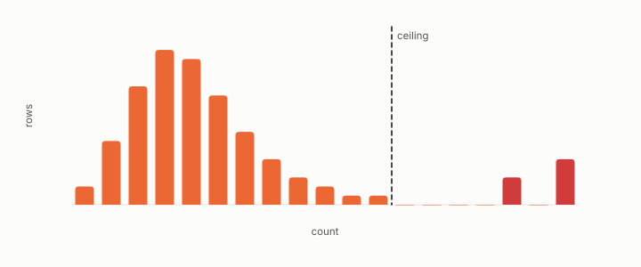

# hubness

**id.** hubness
**kind.** result

## definition

The excess of a few rows in the nearest-neighbour lists of many queries over what the Poisson ceiling allows, measured by the busiest count and the Robin Hood index, a property of the queries. Chapter 3 section 3.5 and chapter 10.

**Example.** The busiest row's count fell from 287 to 213 and the skew from 3.970 to 3.177 when the query coupling was removed.

## equation

Book equation 0.17.

    \Pr[X\ge c]=1-\sum_{i<c}e^{-\mu}\frac{\mu^{i}}{i!},\qquad c^{\star}=\max\{c:\ n\Pr[X\ge c]\ge 1\},\qquad \mu=\frac{n_q\,k}{n}.

Book equation 0.35.

    \mathrm{RH}=\sum_i\max\!\Big(0,\ \frac{N_i}{\sum_j N_j}-\frac1n\Big).

Book equation 10.3.

    N_k(x\mid Q)=\big|\{q\in Q:\ x\in\operatorname{top}_k(q)\}\big|,\qquad \text{anti-hub}:\ N_k(x)=0.

## conditions

- A hub is a row retrieved as a nearest neighbour far more often than the Poisson null allows, and the ceiling of that null is derived from the query count, the neighbourhood size, and the corpus size.
- Hubness is measured against a query workload and belongs to it. The two corpus-side mechanisms that were registered to explain it were refuted under seal.
- Anti-hubs come in kinds, and one kind is manufactured by the query budget through the pigeonhole floor, so a count of never-retrieved rows changes with the number of slots per row.

Conditions are curated in `entries.toml` rather than read from a record.

## ledger

- *measures.* NEG-15 (Bell boundary) `[demonstrated]`. *Query-conditioned hubness supplies a mechanism for Bell-inequality violation without action at a distance.* Refuted as a mechanism; the settings-as-queries reframing survives only as vocabulary. [`geometric-observation/claims/LEDGER.md:93`](https://github.com/ahb-sjsu/geometric-observation/blob/b2626a6/claims/LEDGER.md#L93).
- *refutes or corrects.* GO-5 `[refuted]`. An α=1 density/hubness quotient restores invariant fidelity in ≥1 non-spectral domain. [`geometric-observation/claims/LEDGER.md:67`](https://github.com/ahb-sjsu/geometric-observation/blob/b2626a6/claims/LEDGER.md#L67).
- *refutes or corrects.* NEG-11 `[refuted]`. (GO-5, prospective ×4) The α=1 density/hubness quotient decisively and density-specifically restores invariant fidelity in a non-spectral domain. [`geometric-observation/claims/LEDGER.md:104`](https://github.com/ahb-sjsu/geometric-observation/blob/b2626a6/claims/LEDGER.md#L104).

## first stated

Radovanović, Nanopoulos, and Ivanović for the phenomenon. The observation program's reading, that hubness is almost entirely a property of the queries and the reader rather than the corpus, in openvector-bench and turboquant-pro, and in chapter 3 section 3.5 and chapter 10 of *Data Mining as Observation*.

## measurements

| Where the book states it | Numbers, as the book's sources table records them | Source |
|---|---|---|
| chapter 2 section 2.6 | ball-growth heat a missing-mean artifact, eleven campaigns, 3 of 12 to 11 of 12 cells | `openvector-bench/README.md:160-170`; `openvector-bench/results/RC13_VERDICT.md:1-20` |
| chapter 3 section 3.5 | Poisson null, hub excess, budget parameter | `openvector-bench/openvector_bench/hubness.py:41-100` |
| chapter 3 section 3.5 | query mass best single feature at every K for all four responses, seven features add at most 20 percent, threshold 1.25 on three of four, zero of four, 1000 real queries, 1024 dimensions | `openvector-bench/results/R13_STAGE0_RESULT.md:40-50`; `openvector-bench/results/R13_STAGE1_RESULT.md:1-40` |
| chapter 3 section 3.6 | Bell audit, max S 2.00000 across 72 configurations, d 3 to 128, correlation negative 0.036, post-selected 2.7308, controls 2.748, 2.386, 3.174, seed 20260817, sealed at 6e825d8 | [`geometric-observation/articles/2026-08-03-hubness-does-not-weaken-bell.md:1-60`](https://github.com/ahb-sjsu/geometric-observation/blob/b2626a6/articles/2026-08-03-hubness-does-not-weaken-bell.md#L1-L60); [`geometric-observation/claims/LEDGER.md`](https://github.com/ahb-sjsu/geometric-observation/blob/b2626a6/claims/LEDGER.md) row NEG-15; [`geometric-observation/results/GO-bell-geometry-audit.json`](https://github.com/ahb-sjsu/geometric-observation/blob/b2626a6/results/GO-bell-geometry-audit.json) |
| chapter 8 section 8.1 | G1 339.9 vs 71.9 same corpus, real about 61, rounds 1 to 4 at 300 to 420, three families falsified | `openvector-bench/results/QUERY_COUPLING_ARTIFACT.md:1-20` |
| chapter 8 section 8.4 | gate meta-rule, relative contrast discriminates nothing | `openvector-bench/openvector_bench/score_rc1.py:1-14`; [`turboquant-pro/docs/RESEARCH_ROADMAP.md:133-160`](https://github.com/ahb-sjsu/turboquant-pro/blob/856c4cb/docs/RESEARCH_ROADMAP.md#L133-L160) |
| chapter 8 section 8.7 | RC-7 five of ten, band 0.076 vs 0.19, gate missed by 0.007, 2.4 times, eight-block rule | `openvector-bench/paper/profile/PROFILE_PAPER.md:576-598`; `openvector-bench/results/RC7_VERDICT.md` |
| chapter 10 section 10.2 | five kinds, balanced accuracy 0.611, 0.718, 0.684, the category table, per-category 0.57 to 0.82, the sweep, pigeonhole floor | `openvector-bench/results/R13_STAGE1_RESULT.md:40-75` |
| chapter 10 section 10.2 | half 2 failed, at most 1.28 times against 2, withdrawal and its scope | `openvector-bench/results/R13_STAGE1_RESULT.md:75-110` |
| chapter 10 section 10.4 | area map, boundary rule, hash, refuse not warn, intra and transit counts, area classes, abstention rule | [`turboquant-pro/docs/STRATA_RFC.md:24-98`](https://github.com/ahb-sjsu/turboquant-pro/blob/856c4cb/docs/STRATA_RFC.md#L24-L98) |
| chapter 10 section 10.4 | second prediction inverted, transit 0.389 vs 0.291, centrality difference signs, share 0.473 vs 0.391, seven of thirteen backbone | [`turboquant-pro/docs/RESULTS_multilingual_strata.md:55-90`](https://github.com/ahb-sjsu/turboquant-pro/blob/856c4cb/docs/RESULTS_multilingual_strata.md#L55-L90); [`turboquant-pro/docs/STRATA_RFC.md:98-130`](https://github.com/ahb-sjsu/turboquant-pro/blob/856c4cb/docs/STRATA_RFC.md#L98-L130) |
| chapter 11 section 11.4 | 0.999 against own ranking vs 0.592 against fp32 truth, three truth layers, difficulty strata | `openvector-bench/README.md:60-96` |
| chapter 11 section 11.4 | R80 table, 25x probe depth, 92 percent own cell, one third cross-article, 0.53 matches same-article share, relative contrast discriminates nothing | `openvector-bench/results/R80_ANN.md:1-40`; [`turboquant-pro/docs/RESEARCH_ROADMAP.md:133-160`](https://github.com/ahb-sjsu/turboquant-pro/blob/856c4cb/docs/RESEARCH_ROADMAP.md#L133-L160) |
| chapter 11 section 11.6 | query mass best single feature at every K for all four responses, seven features add at most 20 percent at 12 leaves, threshold 1.25 on three of four, zero of four, 1000 real queries, 1024 dimensions | `openvector-bench/results/R13_STAGE0_RESULT.md:40-50`; `openvector-bench/results/R13_STAGE1_RESULT.md:1-40` |
| chapter 12 section 12.2 | recall 0.999 vs 0.592, the derived death point within 6 percent across fourteen corpora | `openvector-bench/README.md:60-96`; [`geometric-observation/claims/LEDGER.md`](https://github.com/ahb-sjsu/geometric-observation/blob/b2626a6/claims/LEDGER.md) row GO-3 |
| chapter 13 section 13.1 | one hundred billion vectors on a preemptible fleet, systems result not a tier, corpus rejected by the admission battery | `openvector-bench/README.md:250-263` |
| chapter 13 section 13.1 | twelve-figure corpus about 128 TB, kilobyte manifest | `openvector-bench/README.md:60-80` |

## failures and corrections

- GO-5, `[refuted]`. An α=1 density/hubness quotient restores invariant fidelity in ≥1 non-spectral domain. [`geometric-observation/claims/LEDGER.md:67`](https://github.com/ahb-sjsu/geometric-observation/blob/b2626a6/claims/LEDGER.md#L67).
- NEG-11, `[refuted]`. (GO-5, prospective ×4) The α=1 density/hubness quotient decisively and density-specifically restores invariant fidelity in a non-spectral domain. [`geometric-observation/claims/LEDGER.md:104`](https://github.com/ahb-sjsu/geometric-observation/blob/b2626a6/claims/LEDGER.md#L104).

## invariance envelope

**Survived.**

- OD:observer-family, change of observer within a declared family: read operators of declared spectrum, coordinate subsets, coarsenings, and learned consumers' recovered read operators. Claim: A change of the observer's spectrum changes the hub sets more than a change of its orientation at a fixed spectrum (hub-set Jaccard overlap across orientations above that across spectra). `experiments/OD/D2/grade.json P1`. Witness: in all 26 worlds, Gaussian, uniform, heavy-tailed, mixture, Wikipedia and SIFT, at N from 2000 to 16000: overlap 0.19 to 0.45 across orientations against 0.03 to 0.29 across spectra. Absorbed by: .
- OD:observer-family, change of observer within a declared family: read operators of declared spectrum, coordinate subsets, coarsenings, and learned consumers' recovered read operators. Claim: Hub sets overlap more across orientations than across spectra, and the cross-observer matrix is low-rank against its shuffled null, in every family, corpus and size. `experiments/OD/D2v2/grade.json P1, X1`. Witness: 44 of 44 worlds for both: overlap gap at least 0.08; rank ratios 0.09 to 0.69, the largest on the sphere and the balls. Absorbed by: .
- OD:world-transfer, transfer of a law frozen on synthetic worlds to embedding corpora, ANN corpora, and dynamical state spaces without retuning. Claim: Across three registrations with one declared feature family and one search, the law discovered depends on the discovery set alone: Gaussian clouds give a concentration law, seven full-dimensional families give a shape-blind spectral law, manifold worlds give an intrinsic-dimension law that fits real embeddings. `experiments/OD/D2/law.json, experiments/OD/D2v2/law.json, experiments/OD/D2v3/law.json`. Witness: the frozen laws of D2, D2v2 and D2v3 and their errors on the same real corpora: 5.3 and 4.1 (D2), 2.5 and 2.3 (D2v2), 1.0 and 0.2 (D2v3) on the two Wikipedia slices of each run. Absorbed by: .

**Boundary measured.**

- OD:observer-family, change of observer within a declared family: read operators of declared spectrum, coordinate subsets, coarsenings, and learned consumers' recovered read operators. Claim: The cross-observer hubness matrix has effective rank at most 0.48 of its column-shuffled null. `experiments/OD/D2/grade.json X1`. Boundary: ratios 0.10 to 0.30 in 23 of 26 worlds; 0.44 and 0.59 for the 64- and 128-dimensional uniform balls and 0.42 for the Wikipedia scale cell, the least concentrated clouds. Witness: the limit was fixed from Gaussian pilots (largest ratio 0.31 times 1.5); the latent structure is present everywhere and weakest where the cloud is roundest. Absorbed by: declaration. Revision: not registered, and what a successor changes is the bar rather than the claim: the 0.48 limit was declared from Gaussian pilots and all three exceedances are the least concentrated clouds, so a successor sets the limit from a pilot that includes balls and a sphere, or declares it per family. The low-rank claim itself is not at issue, the latent structure being present in all 26 worlds.
- OD:budget, change of the observation budget B at fixed consumer and output metric. Claim: Coarsening the observer's resolution changes hub polarity monotonically in the resolution, and a resolution of a tenth of the nearest-neighbour distance changes little (exploratory, reported). `experiments/OD/D2/grade.json B1`. Boundary: monotone in all four sweeps; at a tenth of the neighbour distance 12 percent of Gaussian points and 6 percent of Wikipedia points change polarity under the isotropic observer, at a quarter 24 and 79 percent, against 4 to 7 percent under the anisotropic observer. Witness: the finite budget is a first-order effect on real embeddings under an isotropic reader; not graded, as declared. Absorbed by: declaration. Revision: not registered, and nothing here was refuted: the clause that a tenth of the neighbour distance changes little carried no bar, the test having been declared exploratory and reported ungraded, so there is no commitment to revise. A successor would register a threshold on the fraction of points changing polarity, and this sweep says that threshold has to be declared per reader, the isotropic reader moving 12 percent of Gaussian points where the anisotropic moves 4 to 7.
- OD:world-transfer, transfer of a law frozen on synthetic worlds to embedding corpora, ANN corpora, and dynamical state spaces without retuning. Claim: The hubness law frozen on seven synthetic families, log(1 + skew) = 2.811 + 0.0047 d_ent - 0.0928 / cv_d - 2.461 sqrt(top_share), predicts hubness on families it was not discovered on, on real embeddings and at larger N within declared multiples of its pilot error, and beats the nominal-dimension formula and the frozen D2 law. `experiments/DISCOVERY-TRACK.md, D2v2 record; experiments/OD/D2v2/grade.json`. Boundary: survives on all eight unseen synthetic families (0.37 to 1.41 against 1.84), on SIFT base and queries (1.27, 0.75) and within 3 REF on Wikipedia (2.54, 2.37 against 2.77); misses the heavy-tail and Wikipedia scale cells (2.26, 2.55 against 1.84) and loses to a constant in k and N on the Wikipedia slices (1.41, 1.29); beats the D2 law in 14 of 16 transfer worlds and both competitors pooled (1.45 against 2.20 and 2.85). Witness: Wikipedia embeddings have TwoNN intrinsic dimension 8 to 20 at entropy dimension up to 320 and skewness at most 1.5; the intrinsic dimension was in the declared pool and the search dropped it, since on full-dimensional discovery families it duplicates the spectral dimension. Absorbed by: declaration. Revision: D2v3 would put clouds on embedded manifolds into the discovery families so that the intrinsic dimension becomes informative; not registered here.
- OD:world-transfer, transfer of a law frozen on synthetic worlds to embedding corpora, ANN corpora, and dynamical state spaces without retuning. Claim: The hubness law frozen on eleven families including four manifold families, log(1 + skew) = -1.463 - 0.013 / cv_knn + 0.748 log(id_twonn) + 0.069 sqrt(d_eff), predicts hubness on unseen families and manifolds, on real embeddings and at larger N within declared multiples of its pilot error, and beats the nominal formula and the frozen D2 and D2v2 laws. `experiments/DISCOVERY-TRACK.md, D2v3 record; experiments/OD/D2v3/grade.json`. Boundary: real corpora within REF for the first time (Wikipedia 1.00 and 0.21, SIFT 0.44 and 0.37 against 2.24); eight of ten unseen worlds within 1.49 and the group pooled at 1.18 against 1.12; Laplace (1.93) and the 256-dimensional cube (2.69) outside; heavy tails at N = 16000 at 1.91 against 1.49; beats all three competitors pooled (1.05 against 3.58, 2.77, 1.69) and within every group. Witness: the intrinsic dimension became the law's main term once the discovery set held clouds whose intrinsic dimension sits below their spectral one; the misses are where TwoNN leaves its calibrated regime (125 on a 4,000-point cube in 256 dimensions) or where tails outrun every training family. Absorbed by: declaration. Revision: a D2v4 would bound the intrinsic-dimension term or add full-dimensional worlds at d = 256 and heavier tails to the discovery set; not registered here.
- OD:world-transfer, transfer of a law frozen on synthetic worlds to embedding corpora, ANN corpora, and dynamical state spaces without retuning. Claim: The hubness law frozen with full-dimensional clouds at d = 256 and heavy tails in the discovery set, log(1 + skew) = -1.094 + 0.169 cv_r sqrt(d_eff) - 0.032 log(d_nom) log(k) + 0.701 log(id_twonn), predicts hubness at d = 512, on heavier tails, on fresh real slices and at larger N, and beats the nominal formula and the frozen D2, D2v2 and D2v3 laws. `experiments/DISCOVERY-TRACK.md, D2v4 record; experiments/OD/D2v4/grade.json`. Boundary: clouds at d = 512 within the limit (1.30, 1.79 against 2.13); real slices 0.16 to 0.64 against 3.20; Student t with 3 degrees at N = 16000 at 0.47; ten of twelve unseen worlds within 2.13; Student t with 4 degrees at d = 256 (3.52) and Laplace at d = 192 (4.75) outside, the unseen group pooled at 1.95 against 1.60; Student t with 5 degrees at N = 16000 at 2.19 against 2.13; beats all four competitors pooled (1.62 against 3.18, 3.47, 2.38, 1.77) and within every group. Witness: what the discovery set holds, the law extrapolates from: d = 256 carried to d = 512, t with 3 degrees carried to N = 16000; what it lacks, heavier tails at higher dimension, no law of this feature family reaches, since the family's only tail variable is a coordinate kurtosis the observer rescales and the search never chose. Absorbed by: declaration. Revision: a D2v5 would add a tail variable measured on the neighbour distances, or place heavy tails at the transfer dimensions in the discovery set; not registered here.
- OD:world-transfer, transfer of a law frozen on synthetic worlds to embedding corpora, ANN corpora, and dynamical state spaces without retuning. Claim: With four scale-free tail variables measured on the neighbour distances in the feature pool and heavy tails at d = 128 and 192 in the discovery set, the search chooses a tail variable and the frozen law predicts hubness on heavier tails at d = 192 and 256, on fresh real slices and at larger N, beating the nominal formula and the frozen D2, D2v2, D2v3 and D2v4 laws. `experiments/DISCOVERY-TRACK.md, D2v5 record; experiments/OD/D2v5/grade.json; experiments/OD/D2v5/tail_check.json`. Boundary: the search declined every tail variable (best model with one 0.75 held-out against 0.71, worse on five of eight heavy-tailed pilot worlds) and froze skew = -2.80 - 0.51 / cv_d + 1.19 log(id_twonn) + 1.07 sqrt(d_eff); on the run the law halves D2v4's misses (t with 4 degrees at d = 256 2.28, Laplace at d = 192 2.36 against 3.52, 4.75) but stays outside 1.76 there and on t with 2.5 degrees at d = 128 (2.30) and the log-normal at d = 192 (3.24); real slices 0.19 to 0.70 against 2.64; d = 512 clouds 1.75, 1.69; heavy tails at N = 12000 to 16000 outside (2.49 to 3.13); beats all five competitors pooled (1.55 against 12.01, 4.15, 2.17, 2.25, 1.99) and within the unseen and scale groups, the D2v3 law edging it on the real slices (0.47 against 0.50). Witness: the tail of the neighbour distances, measured scale-free, rises with the observer's exponent in every world, so it carries the reader as much as the family and adds nothing to a linear law that already holds the concentration and dimension terms; the family's largest errors sit where the target skewness exceeds 12, where a linear law in either transform is the wrong shape. Absorbed by: declaration. Revision: D2v6 registers the second repair named by D2v4's record, heavy tails placed at the transfer dimensions in the discovery set, bracketing the unseen heavy-tailed worlds.
- OD:world-transfer, transfer of a law frozen on synthetic worlds to embedding corpora, ANN corpora, and dynamical state spaces without retuning. Claim: With the log Poisson hub excess as the target on D2v6's world, the frozen law log(excess) = -1.103 - 0.025 / cv_knn + 0.167 log(d_eff) + 0.434 sqrt(id_twonn) predicts hubness on the bracketed heavy tails, on the d = 512 clouds, on fresh real slices and at larger N, and beats the nominal-only law and the chance level. `experiments/DISCOVERY-TRACK.md, D2v7 record; experiments/OD/D2v7/grade.json`. Boundary: every heavy-tailed unseen world inside the limit (t with 4 degrees at d = 256 0.18, Laplace at d = 224 0.19, t with 2.5 degrees at d = 128 0.11, log-normal at d = 192 0.14, t with 6 degrees at d = 192 0.18, RMS log ratios against 0.66); the Gaussian at d = 512 0.58 inside, the cube at d = 512 0.82 outside; real slices 0.19 to 0.45 against 0.98; seven of eight scale cells inside, Laplace at N = 12000 at 0.656 against 0.655; fresh seeds 0.29 against 0.49; the law at 0.35 pooled on the transfer groups against 1.64 (nominal) and 1.70 (chance) and inside every group. Witness: the same family, pool, search and worlds that put the heavy tails at d = 256 and the clouds at d = 512 on opposite sides of a limit in skewness hold both in log excess, because the skewness saturates where the excess keeps counting; the target, not the family and not the set, was the limit the skew registrations met. Absorbed by: declaration. Revision: the cube at d = 512 remains the one world beyond the training dimensions the law over-predicts (a factor of 2.3); a D2v8 would add full-dimensional worlds at d = 384 to 512 to the discovery set under this target, and is the coverage repair that D2v6 showed does not work for the skewness.
- OD:world-transfer, transfer of a law frozen on synthetic worlds to embedding corpora, ANN corpora, and dynamical state spaces without retuning. Claim: Inside a declared scope, rows whose k-th neighbour-distance concentration cv_knn on the observed data is at least 0.015, the frozen D2v7 law log(excess) = -1.103 - 0.025 / cv_knn + 0.167 log(d_eff) + 0.434 sqrt(id_twonn) predicts the log Poisson hub excess on fresh worlds, fresh real slices and larger N within D2v7's bars and beats the nominal-only law and the chance level; outside the scope it is not claimed and its pooled error exceeds the in-scope limit. `experiments/DISCOVERY-TRACK.md, D2v9 record; experiments/OD/D2v9/grade.json; experiments/OD/D2v9_explore/README.md`. Boundary: in scope: all eighteen unseen worlds inside 0.64 (balls at d = 256 and 384 at 0.43 and 0.44, cube at d = 640 at 0.37, heavy tails 0.12 to 0.27), pooled 0.31 against 0.48; real slices 0.12 to 0.41 against 0.96; seven of eight scale cells inside, Laplace at d = 64 and N = 12000 at 0.67 against 0.64, the cell the registration named in advance; the law at 0.34 pooled on in-scope transfer rows against 1.63 (nominal) and 1.64 (chance) and inside every group; out of scope: 180 rows in twelve worlds at 1.19 against 0.64, the balls under-predicted (to -0.84 median residual), the cubes over-predicted (to +1.37), the torus and the sphere fitted anyway (0.14, 0.08). Witness: the D2v7 law's failures on this world are where the registration said they are: a regime of unreliability of the reciprocal concentration term on over-concentrated rows under near-isotropic readers, declared before the run at 0.015 and confirmed by the out-of-scope error; inside it the law holds on every world no earlier registration held together; the one in-scope miss is the Laplace family at N = 12000, where the law has no term in N, at 0.656, 0.917 and 0.67 on three seeds against limits of 0.655, 0.73 and 0.64. Absorbed by: declaration. Revision: the standing law of the track is the D2v7 law with this scope; its second boundary, in N for the Laplace family, is on record and not declared; a registration that declared it would need a term in N, a change of family, and is not registered.

**Failed, with witness.**

- OD:world-transfer, transfer of a law frozen on synthetic worlds to embedding corpora, ANN corpora, and dynamical state spaces without retuning. Claim: The hubness law frozen on Gaussian clouds, skew = -0.026 + 0.421 / cv_d + 0.817 sqrt(d_eff) / k, predicts hubness on distributions it was not discovered on, on real embeddings and at larger N, within declared multiples of its pilot error. `experiments/DISCOVERY-TRACK.md, D2 record; experiments/OD/D2/grade.json`. Witness: fresh seeds of the discovery family replicate (0.93 against 1.19) but uniform balls (error up to 4.5, the law over-predicting by up to 2.8), Student t (under-predicting by up to 2.4) and Wikipedia embeddings (5.3, measured skewness at most 1.1 at effective dimension 156 where the law says 10) fail; the nominal-dimension competitor is worse pooled (14.8 against 2.9) and better on the unseen synthetic group alone (1.74 against 2.45). Absorbed by: representation. Revision: not proposed here: a successor would need a shape variable that separates tails and roundness from the spectrum and a discovery set of more than one family.
- OD:world-transfer, transfer of a law frozen on synthetic worlds to embedding corpora, ANN corpora, and dynamical state spaces without retuning. Claim: With heavy-tailed clouds placed in the discovery set at the transfer dimensions (Student t with 3 and 5 degrees at d = 256, Laplace at d = 192 and 256) bracketing the unseen worlds, the frozen law predicts hubness on the bracketed heavy tails, on D2v5's other unseen families, on fresh real slices and at larger N, and beats the nominal formula and the frozen D2 to D2v5 laws. `experiments/DISCOVERY-TRACK.md, D2v6 record; experiments/OD/D2v6/grade.json`. Boundary: every bracketed heavy-tailed unseen world inside the limit and below every competitor (t with 4 degrees at d = 256 1.64, Laplace at d = 224 1.18, t with 6 degrees at d = 192 1.04, t with 2.5 degrees at d = 128 0.74, log-normal at d = 192 0.68); real slices 0.21 to 0.63; the d = 512 clouds lost relative to D2v5 (cube 4.65 outside the per-world limit of 2.91, Gaussian 2.64 inside it, against D2v5's 1.09 and 2.54); t with 4 degrees at d = 128 and N = 12000 at 3.31; pooled over the transfer groups the frozen D2v5 law at 1.45 beats the law's 1.51, the fail clause. Witness: coverage moves the family's error between the heavy tails at d = 256 and the light-tailed clouds at d = 512 and does not remove it; the pilot recorded before the run that the family, not the set, is the limit, and the run confirmed it; the largest errors of every law of the track sit where the hubness skewness exceeds 12. Absorbed by: declaration. Revision: not another discovery set: a D2v7 changes the target (Poisson hub excess or tail share instead of skewness) or the functional shape, and is a new family and a new registration.
- OD:world-transfer, transfer of a law frozen on synthetic worlds to embedding corpora, ANN corpora, and dynamical state spaces without retuning. Claim: With full-dimensional clouds at d = 384 and 512 in the discovery set under the log hub-excess target, the frozen law log(excess) = -0.950 - 0.010 / hill_rk + 0.219 log(d_eff) + 0.366 sqrt(id_twonn) predicts hubness on the bracketed clouds, on a cube one step beyond, on the heavy tails, on fresh real slices and at larger N, and beats the nominal law, the chance level and the frozen D2v7 law. `experiments/DISCOVERY-TRACK.md, D2v8 record; experiments/OD/D2v8/grade.json`. Boundary: the clouds beyond d = 256 all inside the limit and better than D2v7 (cube at d = 448 0.53, Gaussian at d = 512 0.50, cube at d = 640 0.65 against 0.73); real slices 0.14 to 0.24, the best of the track; heavy tails inside the limit but worse than D2v7 on every world (t with 4 degrees at d = 256 0.25 against 0.14); Laplace at N = 12000 at 0.96 outside 0.73; the unseen ball at d = 384 at 1.44, outside and worse than chance; pooled over the transfer groups the frozen D2v7 law at 0.44 beats the law's 0.47, the fail clause. Witness: coverage of the clouds beyond d = 256 moves the excess family's error onto the heavy tails and the ball, the sign D2v6 found for the skewness family at about a third of the size; the first law to take a neighbour-distance tail variable misreads the lightest-tailed family, the uniform ball, where the reciprocal Hill term is largest; the D2v7 law, frozen without the clouds, stands as the track's law. Absorbed by: declaration. Revision: not registered: a change of shape, a term carrying the dimension and the neighbour-distance tail together rather than either alone, is the one repair of D2v6's list not yet tried; D2v7's law is the standing law until a registration beats it on the transfer groups.

## machine checked

[`lean/DataMiningAsObservation/Hubness.lean`](https://github.com/ahb-sjsu/observation-data-mining/blob/f3914f0/lean/DataMiningAsObservation/Hubness.lean), theorems `sum_count`, `sum_count_eq`, `count_congr`, `antiHub_iff`, at observation-data-mining f3914f0; what the check covers is stated in the book's [appendix C](https://github.com/ahb-sjsu/observation-data-mining/blob/f3914f0/chapters/machine_checked.md).

[`lean/DataMiningAsObservation/Hub.lean`](https://github.com/ahb-sjsu/observation-data-mining/blob/f3914f0/lean/DataMiningAsObservation/Hub.lean), theorems `card_hubs_le`, `hubs_congr`, `hubs_anti`, `hubs_empty`, at observation-data-mining f3914f0; what the check covers is stated in the book's [appendix C](https://github.com/ahb-sjsu/observation-data-mining/blob/f3914f0/chapters/machine_checked.md).

## used in

*Data Mining as Observation* chapters 0, 1, 3, 5, 10, 11, 12, 13.

## related

hub, anti-hub, poisson-ceiling, quotient, certificate, rank-certificate, min-over-strata

## see also

none

## status

Generated 2026-09-12 by `encyclopedia/generate.py`; book at observation-data-mining f3914f0; the commit of every record is listed in the encyclopedia's provenance.
