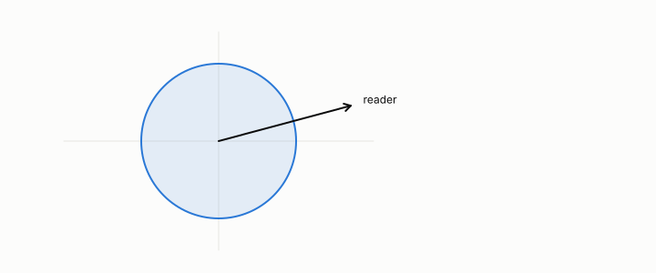

# identity reader

**id.** identity-reader
**kind.** concept

## definition

The consumer whose read operator is the identity, for which read distortion is mean squared error. Every consumer-blind metric assumes it. Chapter 0 section 0.5.

**Example.** The identity reader charges 0.3 + 1.7 = 2.0 for either of the two codes and cannot tell them apart.

## equation

Book equation 0.10.

    d_O=\operatorname{tr}(P_C\,M_\delta)=\mathbb E\!\left[\delta^{\top}P_C\,\delta\right],\qquad M_\delta=\mathbb E\!\left[\delta\delta^{\top}\right],\qquad P_C=I\ \Rightarrow\ d_O=\operatorname{tr}M_\delta.

Book equation 1.2.

    d_O=\operatorname{tr}(P_C\,M_\delta),\qquad \big(d_O=\operatorname{tr}M_\delta\ \text{ for every admissible } M_\delta\big)\ \Longleftrightarrow\ P_C=I.

## conditions

- Read distortion equals the trace of the error's second moment for every admissible error exactly when the read operator is the identity. A particular error can make the two agree by accident.
- Explained variance and the rule of picking rank at 95 percent are the identity reader's criteria, and the book records them as the benchmark's rules rather than its own.

Conditions are curated in `entries.toml` rather than read from a record.

## ledger

none

## first stated

Volume 14, chapter 2, `geometric-observation/chapters/ch02_failure_of_observer_free_measurement.md`, DOI 10.5281/zenodo.21776291, where reconstruction error is the distortion of the reader that reads every direction equally.

## measurements

none

## failures and corrections

none

## invariance envelope

none declared

## machine checked

[`lean/DataMiningAsObservation/ReadDistortion.lean`](https://github.com/ahb-sjsu/observation-data-mining/blob/c149a10/lean/DataMiningAsObservation/ReadDistortion.lean), theorems `read_distortion`, `identity_reader`, `quad_one`, at observation-data-mining c149a10; what the check covers is stated in the book's [appendix C](https://github.com/ahb-sjsu/observation-data-mining/blob/c149a10/chapters/machine_checked.md).

## used in

*Data Mining as Observation* chapters 0, 1, 2, 3, 4, 8, 9, 10, 12, 13.

## related

read-operator, read-distortion, flip, quotient

## see also

Book equations stated beside the entry's terms, not defining it: 4.1.

Ledger rows that cite the entry's records without naming it: GO-2 (neg. half: not reconstruction).

Sources-table rows that share a record with the entry without naming it: chapter 1 section 1.4, chapter 4 section 4.3, chapter 4 section 4.5.

## status

Generated 2026-09-09 by `encyclopedia/generate.py`; book at observation-data-mining c149a10; the commit of every record is listed in the encyclopedia's provenance.
