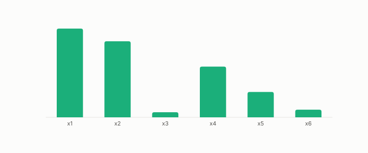

# importance

**id.** importance
**kind.** instrument

## definition

A per-feature score of how much a classifier reads it. For a tree it counts splits, which is the right sensitivity for a reader that is flat within leaves. Permutation importance and partial dependence answer related questions. Chapter 7 and chapter 14.

**Example.** A tree that splits on x1 twice and on x3 once and never on x2 gives importances 2, 0, and 1.

## equation

none

## conditions

- A per-feature score of how much a classifier reads it. For a gradient reader the averaged squared sensitivity is the read operator's diagonal, and for a tree, whose finite difference is zero at every row that does not straddle a split, counting splits is the right sensitivity.
- Permutation importance averages the consumer over rows that may never occur together, and partial dependence reads it at inputs it was never trained on, so the three answer different questions and the report names which.

Conditions are curated in `entries.toml` rather than read from a record.

## ledger

none

## first stated

Breiman, random forests, 2001, as chapter 7 section 7.1 and chapter 14 section 14.5 of *Data Mining as Observation* read it, with the selection-consumer regime in `readscope/readscope/regimes.py:1-60`.

## measurements

| Where the book states it | Numbers, as the book's sources table records them | Source |
|---|---|---|
| chapter 7 section 7.1 | bagging variance, out-of-bag estimation, random forests, importances, AdaBoost | Hastie, Tibshirani, Friedman, ESL 2e chapters 15 and 10.1; TSK 2e 4.10 |

## failures and corrections

none

## invariance envelope

none declared

## machine checked

[`lean/DataMiningAsObservation/Attribution.lean`](https://github.com/ahb-sjsu/observation-data-mining/blob/95af30c/lean/DataMiningAsObservation/Attribution.lean), theorems `attr_sum_affine`, `attr_unread`, `sq_sensitivity_eq_readOp_diag`, at observation-data-mining 95af30c; what the check covers is stated in the book's [appendix C](https://github.com/ahb-sjsu/observation-data-mining/blob/95af30c/chapters/machine_checked.md).

[`lean/DataMiningAsObservation/DecisionTree.lean`](https://github.com/ahb-sjsu/observation-data-mining/blob/95af30c/lean/DataMiningAsObservation/DecisionTree.lean), theorems `stump_flat_left`, `stump_flat_right`, `split_reads_one_axis`, `gini_le_half`, `gini_eq_zero_iff`, at observation-data-mining 95af30c; what the check covers is stated in the book's [appendix C](https://github.com/ahb-sjsu/observation-data-mining/blob/95af30c/chapters/machine_checked.md).

## used in

*Data Mining as Observation* chapters 0, 4, 6, 7, 14.

## related

attribution, decision-tree, sensitivity, read-operator, ensemble

## see also

Book equations stated beside the entry's terms, not defining it: 14.5, 0.9, 6.1.

Ledger rows that cite the entry's records without naming it: GO-EC-3.

Sources-table rows that share a record with the entry without naming it: chapter 2 section 2.3, chapter 6 section 6.1, chapter 14 section 14.5.

## status

Generated 2026-09-08 by `encyclopedia/generate.py`; book at observation-data-mining 95af30c; the commit of every record is listed in the encyclopedia's provenance.
