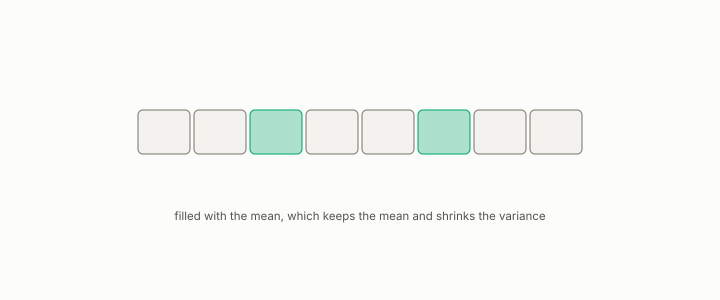

# imputation

**id.** imputation
**kind.** instrument

## definition

Writing a value into a missing cell that the consumer will read. Mean imputation leaves the column mean unchanged and shrinks its variance. Chapter 2.

**Example.** Filling three missing cells of a column with mean 5 leaves the mean at 5 and shrinks the variance.

## equation

Book equation 2.1.

    P_{C_2\circ C_1}(x)=J_1(x)^{\top}\,P_{C_2}\big(C_1(x)\big)\,J_1(x),\qquad \operatorname{rank}P_{C_2\circ C_1}(x)\le\operatorname{rank}P_{C_2}\big(C_1(x)\big)\quad\text{at each row } x.

## conditions

- Writing a value into a missing cell that the consumer will read. Mean imputation leaves the column mean unchanged, the filled cells add nothing to the sum of squared deviations, and the variance shrinks because the same sum of squares is spread over more rows.
- An imputation is a claim about the mechanism that produced the gap, and it is fit inside the fold and stated in the preregistration, because an imputation fit on all rows leaks the test fold into the training fold.

Conditions are curated in `entries.toml` rather than read from a record.

## ledger

none

## first stated

Chapter 2 section 2.3 of *Data Mining as Observation*, with the missing-data rule as a required preregistration field in `observation-theory-campaigns/experiments/PREREG-TEMPLATE.md:47-52`.

## measurements

| Where the book states it | Numbers, as the book's sources table records them | Source |
|---|---|---|
| chapter 2 section 2.3 | MCAR, MAR, MNAR and the remedies, imputation before splitting | TSK 2e section 2.2; instructor working documents, not public [@bond2026course], `ECE_514-01_FA26_session-outlines.md:64-72` |

## failures and corrections

none

## invariance envelope

none declared

## machine checked

[`lean/DataMiningAsObservation/Imputation.lean`](https://github.com/ahb-sjsu/observation-data-mining/blob/95af30c/lean/DataMiningAsObservation/Imputation.lean), theorems `mean_imputed`, `sum_sq_imputed`, `variance_imputed_le`, at observation-data-mining 95af30c; what the check covers is stated in the book's [appendix C](https://github.com/ahb-sjsu/observation-data-mining/blob/95af30c/chapters/machine_checked.md).

## used in

*Data Mining as Observation* chapters 1, 2, 8.

## related

standardization, read-operator, leakage, preregistration

## see also

Book equations stated beside the entry's terms, not defining it: 0.9.

Sources-table rows that share a record with the entry without naming it: chapter 2 section 2.3.

## status

Generated 2026-09-09 by `encyclopedia/generate.py`; book at observation-data-mining 95af30c; the commit of every record is listed in the encyclopedia's provenance.
