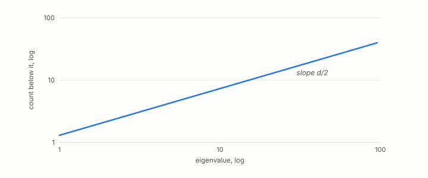

# intrinsic dimension

**id.** intrinsic-dimension
**kind.** concept

## definition

The number of directions a dataset varies along locally, whatever the number of its coordinates and whatever the number of its covariance directions. Chapter 0 section 0.10.

## equation

Book equation 0.31.

    N(\lambda)=\#\{k:\lambda_k\le\lambda\}\ \sim\ C_d\,\lambda^{d/2}.

Book equation 9.2.

    N(\lambda)=\#\{k:\lambda_k\le\lambda\}\ \sim\ C_d\,\lambda^{d/2}\qquad\Rightarrow\qquad d=2\,\frac{d\log N}{d\log\lambda}.

## conditions

- The number of directions a dataset varies along locally, whatever its number of coordinates. Read from the slope of the Laplacian eigenvalue count on log axes by Weyl's law, it is an asymptotic estimate that depends on the graph's construction and the range of eigenvalues fitted. It is not the number of covariance directions, since a circle has intrinsic dimension one and two covariance directions.
- The recognizer reads dimension before shape, and the battery's dimensions of 1.81, 2.80, and 1.74 were read against sealed bars on templates built for the purpose.

Conditions are curated in `entries.toml` rather than read from a record.

## ledger

none

## first stated

Weyl's law, 1911, as chapter 0 section 0.15 states it, applied in the recognizer of Volume 14 chapter 11, `geometric-observation/chapters/ch11_the_recognizer.md:1-95`, and chapter 9 section 9.2 of *Data Mining as Observation*.

## measurements

| Where the book states it | Numbers, as the book's sources table records them | Source |
|---|---|---|
| chapter 9 section 9.2 | the recognizer's mechanism, low multiplets and angular distances, dimension before shape by Weyl's law, refusal, the growth gotcha | [`geometric-observation/chapters/ch11_the_recognizer.md:1-95`](https://github.com/ahb-sjsu/geometric-observation/blob/d1f8988/chapters/ch11_the_recognizer.md#L1-L95) |

## failures and corrections

none

## machine checked

`lean/DataMiningAsObservation/IntrinsicDimension.lean`, theorems `log_weyl`, `dimension_from_slope`, `weyl_double`, at observation-data-mining 08b4794.

## used in

*Data Mining as Observation* chapters 0, 3, 8, 9, 11.

## related

recognizer, effective-rank, distance-concentration, vacuity-threshold

## see also

Book equations stated beside the entry's terms, not defining it: 0.7.

Ledger rows that cite the entry's records without naming it: GO-3.

Sources-table rows that share a record with the entry without naming it: chapter 3 section 3.3, chapter 9 section 9.1, chapter 9 section 9.2, chapter 9 section 9.4, chapter 11 section 11.1, chapter 14 section 14.3, chapter 14 section 14.5, chapter 14 section 14.7.

## status

Generated 2026-09-06 by `encyclopedia/generate.py`; book at observation-data-mining 08b4794; the commit of every record is listed in the encyclopedia's provenance.
