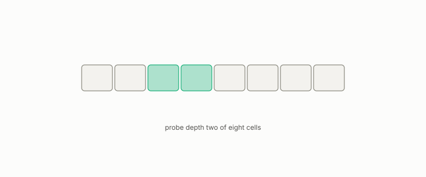

# inverted file

**id.** inverted-file
**kind.** instrument

## definition

An index that partitions vectors into cells by k-means and answers a query by searching only the cells nearest to it. The number of cells searched is the probe count. Chapter 11.

**Example.** A million vectors in 1024 cells, probing 8 cells, scores about 8000 candidates per query.

## equation

none

## conditions

- An index that partitions vectors into cells by k-means and searches only the cells nearest the query. Probing more cells never loses a candidate, a neighbour is found exactly when its cell is probed, the scanned fraction is the probed cells' size over the corpus, and with equal cells it is the probe count over the cell count.
- The recall at one probe against eight in the chapter's table is a measurement, and the vacuity threshold of the certificate predicts where single-stage retrieval dies, which is the ledger's demonstrated row.

Conditions are curated in `entries.toml` rather than read from a record.

## ledger

none

## first stated

Sivic and Zisserman's video Google and the IVF index of Jégou, Douze, and Schmid, as chapter 11 section 11.3 of *Data Mining as Observation* presents them, with the program's probe sweeps in openvector-bench.

## measurements

| Where the book states it | Numbers, as the book's sources table records them | Source |
|---|---|---|
| chapter 14 section 14.8 | quantum falsified, 320 probes, contextuality zero, DOI 10.5281/zenodo.20660110 | `non-abelian-sqnd/README.md:5-22`; `sqnd-probe/README.md:12-20`; `sqnd-probe/CITATION.cff:16` |

## failures and corrections

none

## invariance envelope

none declared

## machine checked

[`lean/DataMiningAsObservation/InvertedFile.lean`](https://github.com/ahb-sjsu/observation-data-mining/blob/f3914f0/lean/DataMiningAsObservation/InvertedFile.lean), theorems `scanned_mono`, `found_iff`, `scannedFraction_mem_unit`, `equal_cells`, `scanned_univ`, at observation-data-mining f3914f0; what the check covers is stated in the book's [appendix C](https://github.com/ahb-sjsu/observation-data-mining/blob/f3914f0/chapters/machine_checked.md).

## used in

*Data Mining as Observation* chapters 0, 11, 13, 14.

## related

recall-at-k, product-quantization, vacuity-threshold, anti-hub

## see also

Book equations stated beside the entry's terms, not defining it: 11.3, 11.4.

Ledger rows that cite the entry's records without naming it: GO-3, NEG-14.

Sources-table rows that share a record with the entry without naming it: chapter 11 section 11.2, chapter 11 section 11.7, chapter 12 section 12.3.

## status

Generated 2026-09-09 by `encyclopedia/generate.py`; book at observation-data-mining f3914f0; the commit of every record is listed in the encyclopedia's provenance.
