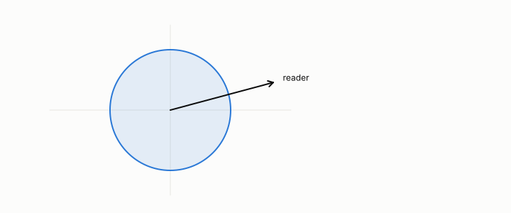

# isotropic

**id.** isotropic
**kind.** concept

## definition

Of a covariance, having the same variance in every direction. Chapter 0.

**Example.** Covariance diag(1, 1) is isotropic, and a reader at any angle sees variance 1.

## equation

none

## conditions

- An isotropic covariance has the same variance in every direction, so every unit reader reads it the same and no flip is possible. An anisotropic one has different variances in different directions, and two unit readers can read it differently.
- The flip needs anisotropy. Two codes with the variances exchanged are read the same by every reader exactly when the two variances agree, which is the boundary the coupling null names from the other side.

Conditions are curated in `entries.toml` rather than read from a record.

## ledger

none

## first stated

Chapter 0 section 0.3 and chapter 3 section 3.2 of *Data Mining as Observation*, with the isotropic-Gaussian control of chapter 10.

## measurements

none

## failures and corrections

none

## invariance envelope

none declared

## machine checked

[`lean/DataMiningAsObservation/Isotropy.lean`](https://github.com/ahb-sjsu/observation-data-mining/blob/f3914f0/lean/DataMiningAsObservation/Isotropy.lean), theorems `isotropic_reads_same`, `isotropic_no_flip`, `anisotropic_readers_differ`, `flip_iff_anisotropic`, at observation-data-mining f3914f0; what the check covers is stated in the book's [appendix C](https://github.com/ahb-sjsu/observation-data-mining/blob/f3914f0/chapters/machine_checked.md).

## used in

*Data Mining as Observation* chapters 0, 2, 3, 4, 7, 9, 10, 11, 12.

## related

flip, coupling-null, covariance-matrix, alignment

## see also

Book equations stated beside the entry's terms, not defining it: 3.1, 4.6.

Ledger rows that cite the entry's records without naming it: GO-2 (neg. half: not reconstruction).

## status

Generated 2026-09-12 by `encyclopedia/generate.py`; book at observation-data-mining f3914f0; the commit of every record is listed in the encyclopedia's provenance.
