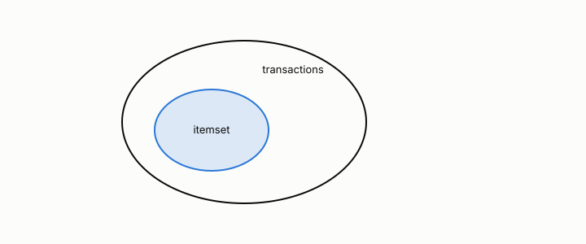

# itemset

**id.** itemset
**kind.** concept

## definition

A set of items that appear together in a transaction. A closed itemset has no superset with the same support and a maximal one has no frequent superset. Chapter 5.

**Example.** Bread and butter together is an itemset, and its support is the number of baskets holding both.

## equation

Book equation 5.1.

    s(X)=\frac{\sigma(X)}{N},\qquad c(X\to Y)=\frac{\sigma(X\cup Y)}{\sigma(X)}=\frac{s(X\cup Y)}{s(X)}.

Book equation 5.3.

    X\subseteq Y\ \Longrightarrow\ s(X)\ge s(Y).

## conditions

- A set of items that appear together in a transaction. Its support lies in the unit interval, the empty itemset has support one, a superset has support at most that of a subset, and the support of a union is at most the smaller of the two supports.
- A closed itemset has no strict superset with the same support and a maximal frequent itemset has no frequent strict superset, and every maximal frequent itemset is closed, since a superset with the same support would be frequent too.

Conditions are curated in `entries.toml` rather than read from a record.

## ledger

none

## first stated

Agrawal, Imieliński, and Swami, mining association rules, 1993, as TSK chapter 5 presents it and chapter 5 section 5.1 of *Data Mining as Observation* states it.

## measurements

| Where the book states it | Numbers, as the book's sources table records them | Source |
|---|---|---|
| chapter 5 section 5.1 to 5.3, 5.5 | support, confidence, lift, the Apriori principle, FP-growth, closed and maximal itemsets, objective measures, Simpson's paradox, cross-support | TSK 2e chapter 5 |

## failures and corrections

none

## invariance envelope

none declared

## machine checked

[`lean/DataMiningAsObservation/ItemSet.lean`](https://github.com/ahb-sjsu/observation-data-mining/blob/a0db6a8/lean/DataMiningAsObservation/ItemSet.lean), theorems `supportFrac_mem_unit`, `supportFrac_empty`, `supportFrac_anti`, `supportFrac_union_le`, `closed_of_maximal`, at observation-data-mining a0db6a8; what the check covers is stated in the book's [appendix C](https://github.com/ahb-sjsu/observation-data-mining/blob/a0db6a8/chapters/machine_checked.md).

## used in

*Data Mining as Observation* chapters 5.

## related

support, apriori, safe-pruning, confidence

## see also

none

## status

Generated 2026-09-09 by `encyclopedia/generate.py`; book at observation-data-mining a0db6a8; the commit of every record is listed in the encyclopedia's provenance.
