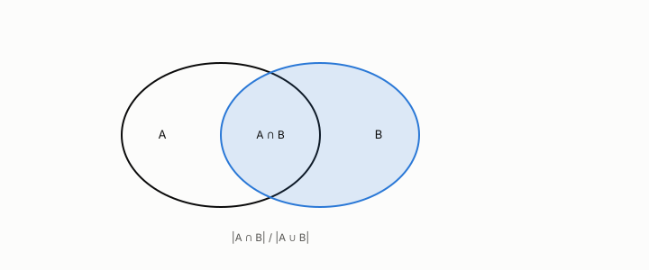

# Jaccard

**id.** jaccard
**kind.** concept

## definition

The size of the intersection of two sets over the size of their union, between zero and one, zero exactly when the sets are disjoint, which discards joint absence. Chapter 0 section 0.6 and chapter 3.

**Example.** Sets {a, b, c} and {b, c, d} share 2 of 4 elements, a Jaccard coefficient of 0.5.

## equation

none

## conditions

- The size of the intersection of two sets over the size of their union, between zero and one, one for a nonempty set against itself, symmetric, and zero exactly when the sets are disjoint. A subset's coefficient is its share of the larger set.
- It reads nothing outside the union, so its distance lives on the quotient that discards joint absence, which is the right quotient for a consumer that reads presence and the wrong one for a consumer that reads counts.

Conditions are curated in `entries.toml` rather than read from a record.

## ledger

none

## first stated

Jaccard, the distribution of the flora in the alpine zone, 1912, as chapter 0 section 0.6 and chapter 3 section 3.1 of *Data Mining as Observation* read it.

## measurements

none

## failures and corrections

none

## invariance envelope

none declared

## machine checked

[`lean/DataMiningAsObservation/Jaccard.lean`](https://github.com/ahb-sjsu/observation-data-mining/blob/6aebdf3/lean/DataMiningAsObservation/Jaccard.lean), theorems `jaccard_nonneg`, `jaccard_le_one`, `jaccard_self`, `jaccard_comm`, `jaccard_eq_zero_iff`, `jaccard_subset`, at observation-data-mining 6aebdf3; what the check covers is stated in the book's [appendix C](https://github.com/ahb-sjsu/observation-data-mining/blob/6aebdf3/chapters/machine_checked.md).

## used in

*Data Mining as Observation* chapters 0, 3.

## related

cosine, quotient, bag-of-words, euclidean-distance, itemset

## see also

Book equations stated beside the entry's terms, not defining it: 0.1, 3.1.

Sources-table rows that share a record with the entry without naming it: chapter 3 section 3.2.

## status

Generated 2026-09-09 by `encyclopedia/generate.py`; book at observation-data-mining 6aebdf3; the commit of every record is listed in the encyclopedia's provenance.
