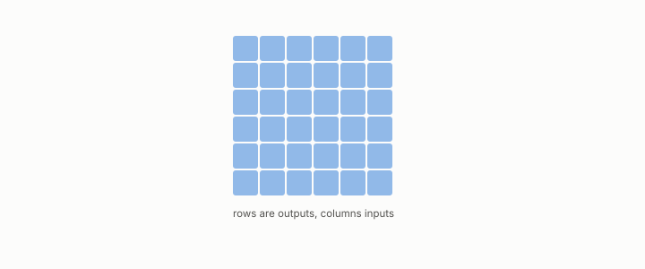

# Jacobian

**id.** jacobian
**kind.** concept

## definition

The matrix of partial derivatives of a vector-valued consumer, whose transpose times itself averages to the read operator. A discrete stage has none. Chapter 0 section 0.5 and chapter 12.

## equation

Book equation 2.1.

    P_{C_2\circ C_1}(x)=J_1(x)^{\top}\,P_{C_2}\big(C_1(x)\big)\,J_1(x),\qquad \operatorname{rank}P_{C_2\circ C_1}(x)\le\operatorname{rank}P_{C_2}\big(C_1(x)\big)\quad\text{at each row } x.

Book equation 0.11.

    P_C(x)=J(x)^{\top}G\big(C(x)\big)\,J(x),\qquad J(x)=\frac{\partial C}{\partial x}(x),\qquad \bar P_{C,\mu}=\mathbb E_{\mu}\!\left[P_C(x)\right].

## conditions

- The matrix of partial derivatives of a vector-valued consumer, whose transpose times itself averages to the read operator. Along a chain of stages the rank of the composed operator is at most the rank of either stage, and a stage that identifies two inputs identifies them for every stage after it.
- Chunking and indexing have no Jacobian, since a document goes to a set of pieces and a query to a candidate list, and what survives without a derivative is the statement about distinctions.

Conditions are curated in `entries.toml` rather than read from a record.

## ledger

none

## first stated

Chapter 0 section 0.5 and chapter 2 section 2.2 of *Data Mining as Observation*, with the pullback composition and the rank bound in `geometric-observation/chapters/ch06_mathematical_preliminaries.md:10-27`.

## measurements

none

## failures and corrections

none

## machine checked

`lean/DataMiningAsObservation/Pipeline.lean`, theorems `quotient_inherited`, `quotient_inherited_chain`, `rank_comp_le_first`, `rank_comp_le_second`, at observation-data-mining 08b4794.

`lean/DataMiningAsObservation/ReadOperator.lean`, theorems `rank_one_reads_one_direction`, `readOp_mulVec`, `quad_readOp`, `quad_readOp_nonneg`, `readOp_mulVec_eq_zero_iff`, `readOp_diag`, `readOp_offdiag`, `readOp_symm`, `readOp_neg`, `affine_const_along_nuisance`, `readOp_affine`, `readOp_sqLength_basis`, at observation-data-mining 08b4794.

## used in

*Data Mining as Observation* chapters 0, 2, 12.

## related

read-operator, pipeline, sensitivity, hessian, retrieval-augmented-pipeline

## see also

Book equations stated beside the entry's terms, not defining it: 0.9.

Ledger rows that cite the entry's records without naming it: OT-7.

Sources-table rows that share a record with the entry without naming it: chapter 2 section 2.2, chapter 12 section 12.2.

## status

Generated 2026-09-06 by `encyclopedia/generate.py`; book at observation-data-mining 08b4794; the commit of every record is listed in the encyclopedia's provenance.
