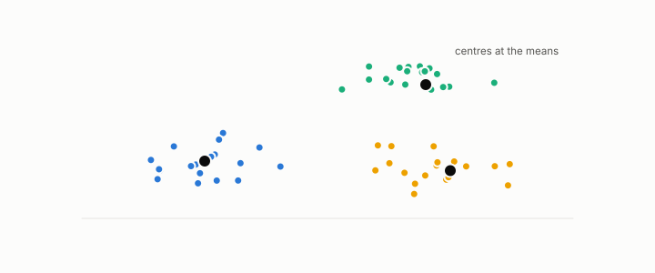

# k-means

**id.** k-means
**kind.** instrument

## definition

A clustering that minimizes the sum of squared errors to the cluster centres. The mean minimizes each cluster's error and assigning each row to its nearest centre never raises the total, so it is the identity reader's clustering. Chapter 9.

**Example.** Points 1, 2, and 6 with two centres settle at 1.5 and 6, with sum of squared errors 0.5.

## equation

Book equation 9.1.

    \mathrm{SSE}=\sum_{k=1}^{K}\sum_{i\in\mathcal C_k}\|x_i-c_k\|^{2},\qquad\text{the }P_C=I\text{ distortion summed within clusters}.

## conditions

- A clustering that minimizes the sum of squared errors to the cluster centres. The error about any centre is the error about the mean plus the row count times the squared distance between the two, so the mean minimizes each cluster's error, and assigning each row to its nearest centre never raises the total.
- It is the identity reader's clustering. It weighs every direction equally, and a direction with large variance and no group structure pulls its centres exactly as variance-based reduction pulls its components.

Conditions are curated in `entries.toml` rather than read from a record.

## ledger

none

## first stated

Lloyd, least squares quantization in PCM, 1957, as chapter 9 section 9.1 of *Data Mining as Observation* reads it.

## measurements

none

## failures and corrections

none

## invariance envelope

none declared

## machine checked

[`lean/DataMiningAsObservation/KMeans.lean`](https://github.com/ahb-sjsu/observation-data-mining/blob/f3914f0/lean/DataMiningAsObservation/KMeans.lean), theorems `sse_decomposition`, `mean_minimizes`, `assign_nearest`, at observation-data-mining f3914f0; what the check covers is stated in the book's [appendix C](https://github.com/ahb-sjsu/observation-data-mining/blob/f3914f0/chapters/machine_checked.md).

## used in

*Data Mining as Observation* chapters 0, 9, 10, 11.

## related

identity-reader, validity-index, silhouette, inverted-file, dbscan

## see also

Book equations stated beside the entry's terms, not defining it: 0.30, 4.2.

Ledger rows that cite the entry's records without naming it: GO-3.

Sources-table rows that share a record with the entry without naming it: chapter 9 section 9.4, chapter 10 section 10.1.

## status

Generated 2026-09-09 by `encyclopedia/generate.py`; book at observation-data-mining f3914f0; the commit of every record is listed in the encyclopedia's provenance.
