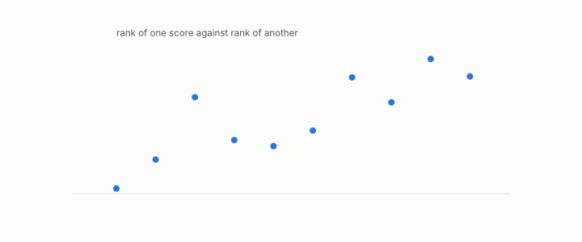

# Kendall correlation

**id.** kendall-correlation
**kind.** concept

## definition

The fraction of item pairs two rankings order the same way, minus the fraction they order differently. Equation 0.15.

**Example.** Rankings (1, 2, 3) and (1, 3, 2) agree on two pairs and disagree on one, Kendall tau one third.

## equation

Book equation 0.15.

    \tau=\frac{\#\{\text{concordant pairs}\}-\#\{\text{discordant pairs}\}}{n(n-1)/2}.

## conditions

- The fraction of item pairs two rankings order the same way minus the fraction they order differently. It lies between minus one and one, it is one when no pair disagrees, and since it depends only on the orderings a strictly increasing transform of either score leaves it unchanged.
- It is the rank-agreement statistic the rank certificate bounds from below, and a floor on it is a floor on the consumer's rankings, not on any distance.

Conditions are curated in `entries.toml` rather than read from a record.

## ledger

none

## first stated

Kendall, a new measure of rank correlation, 1938, as chapter 0 section 0.9 states it, and the rank certificate's statistic in readscope and openvector-bench.

## measurements

none

## failures and corrections

none

## invariance envelope

none declared

## machine checked

[`lean/DataMiningAsObservation/Kendall.lean`](https://github.com/ahb-sjsu/observation-data-mining/blob/6aebdf3/lean/DataMiningAsObservation/Kendall.lean), theorems `not_both`, `card_add_le`, `tau_mem`, `concordant_comp`, `discordant_comp`, `tau_comp`, `discordant_self`, at observation-data-mining 6aebdf3; what the check covers is stated in the book's [appendix C](https://github.com/ahb-sjsu/observation-data-mining/blob/6aebdf3/chapters/machine_checked.md).

## used in

*Data Mining as Observation* chapters 0, 1, 8, 11.

## related

rank-certificate, rank-faithful, monotone-invariance, recall-at-k

## see also

Book equations stated beside the entry's terms, not defining it: 11.2.

Ledger rows that cite the entry's records without naming it: GO-B-Llama, GO-B-Llama-rematch.

## status

Generated 2026-09-09 by `encyclopedia/generate.py`; book at observation-data-mining 6aebdf3; the commit of every record is listed in the encyclopedia's provenance.
