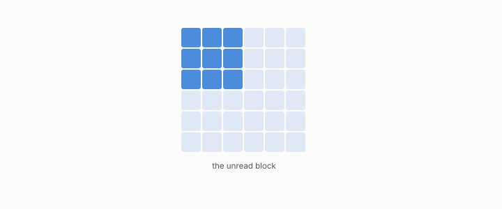

# kernel

**id.** kernel
**kind.** concept

## definition

The directions a matrix sends to zero. The kernel of the read operator is the nuisance. Chapter 0 section 0.5.

**Example.** The read operator of the consumer x1 + x2 sends (1, −1) to zero, so (1, −1) is in its kernel.

## equation

Book equation 0.9.

    P_C=\mathbb E\!\left[g\,g^{\top}\right],\qquad g=\nabla C(x).

Book equation 0.12b.

    x\sim_{\bar P_{C,\mu}} x'\quad\Longleftrightarrow\quad x-x'\in\ker\bar P_{C,\mu}.

## conditions

- The directions a matrix sends to zero. The kernel of the read operator is the nuisance, the directions the consumer never reads, and a direction is in it exactly when every row's sensitivity is orthogonal to it. The kernel's dimension is the dimension less the rank.
- The reconstruction coder spends bits on the kernel and the output coder does not, and the gap between them is governed by the share of the error's entropy that lies in the kernel.

Conditions are curated in `entries.toml` rather than read from a record.

## ledger

none

## first stated

Chapter 0 section 0.5 and section 0.6 of *Data Mining as Observation*, with the kernel entropy share in `geometric-observation/claims/LEDGER.md` row GO-6.

## measurements

none

## failures and corrections

none

## invariance envelope

none declared

## machine checked

[`lean/DataMiningAsObservation/ReadOperator.lean`](https://github.com/ahb-sjsu/observation-data-mining/blob/f3914f0/lean/DataMiningAsObservation/ReadOperator.lean), theorems `rank_one_reads_one_direction`, `readOp_mulVec`, `quad_readOp`, `quad_readOp_nonneg`, `readOp_mulVec_eq_zero_iff`, `readOp_diag`, `readOp_offdiag`, `readOp_symm`, `readOp_neg`, `affine_const_along_nuisance`, `readOp_affine`, `readOp_sqLength_basis`, at observation-data-mining f3914f0; what the check covers is stated in the book's [appendix C](https://github.com/ahb-sjsu/observation-data-mining/blob/f3914f0/chapters/machine_checked.md).

[`lean/DataMiningAsObservation/Rank.lean`](https://github.com/ahb-sjsu/observation-data-mining/blob/f3914f0/lean/DataMiningAsObservation/Rank.lean), theorems `rank_le_width`, `rank_le_height`, `rank_outer_le_one`, `rank_mul_le`, `rank_zero`, `rank_transpose`, at observation-data-mining f3914f0; what the check covers is stated in the book's [appendix C](https://github.com/ahb-sjsu/observation-data-mining/blob/f3914f0/chapters/machine_checked.md).

## used in

*Data Mining as Observation* primer L, chapters 0, 1, 2, 4, 6, 11.

## related

nuisance, read-operator, read-subspace, quotient, rank

## see also

Book equations stated beside the entry's terms, not defining it: 0.12a.

Ledger rows that cite the entry's records without naming it: OT-7, GO-6.

Sources-table rows that share a record with the entry without naming it: chapter 2 section 2.2, chapter 4 section 4.2.

## status

Generated 2026-09-10 by `encyclopedia/generate.py`; book at observation-data-mining f3914f0; the commit of every record is listed in the encyclopedia's provenance.
