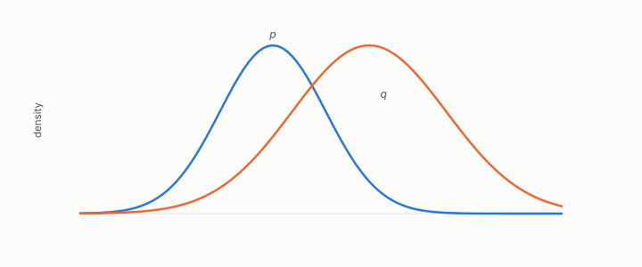

# KL divergence

**id.** kl-divergence
**kind.** concept

## definition

A measure of how far one probability distribution is from another, zero when they are identical. Equation 0.24.

**Example.** A fair coin coded as if heads had probability 0.9 costs about 0.74 bits of divergence per toss.

## equation

Book equation 0.24.

    \mathrm{KL}(p\,\|\,q)=\sum_i p_i\ln\frac{p_i}{q_i}\ \ge 0.

Book equation 0.22.

    \mathrm{PPL}=2^{H},\qquad H=-\frac1T\sum_{t=1}^{T}\log_2 p\big(w_t\mid w_{<t}\big).

## conditions

- The expected log ratio of two distributions' masses under the first. It is nonnegative by Gibbs' inequality, zero when the distributions agree, and not symmetric, so the direction of the comparison is part of the claim.
- The book's use is through perplexity. A reconstruction at cosine 0.995 raised the perplexity by three orders of magnitude, which is the case that reconstruction error is not the consumer's error.

Conditions are curated in `entries.toml` rather than read from a record.

## ledger

none

## first stated

Kullback and Leibler, on information and sufficiency, 1951, as chapter 0 section 0.11 states it beside perplexity, with the program's case in `turboquant-pro/docs/KV_KEYS_FINDING.md:1-49`.

## measurements

| Where the book states it | Numbers, as the book's sources table records them | Source |
|---|---|---|
| chapter 1 section 1.4 | cosine 0.995 and perplexity of order ten thousand, the recalibration negative | [`geometric-observation/chapters/ch02_failure_of_observer_free_measurement.md:40-60`](https://github.com/ahb-sjsu/geometric-observation/blob/0792c84/chapters/ch02_failure_of_observer_free_measurement.md#L40-L60); [`geometric-observation/chapters/ch16_honest_negatives.md`](https://github.com/ahb-sjsu/geometric-observation/blob/0792c84/chapters/ch16_honest_negatives.md) NEG-2 and NEG-4; [`turboquant-pro/docs/KV_KEYS_FINDING.md:1-49`](https://github.com/ahb-sjsu/turboquant-pro/blob/856c4cb/docs/KV_KEYS_FINDING.md#L1-L49) |
| chapter 8 section 8.2 | cosine 0.995, perplexity near 1e4 | [`turboquant-pro/docs/KV_KEYS_FINDING.md:1-49`](https://github.com/ahb-sjsu/turboquant-pro/blob/856c4cb/docs/KV_KEYS_FINDING.md#L1-L49); [`geometric-observation/chapters/ch16_honest_negatives.md`](https://github.com/ahb-sjsu/geometric-observation/blob/0792c84/chapters/ch16_honest_negatives.md) NEG-2 |

## failures and corrections

none

## machine checked

[`lean/DataMiningAsObservation/KL.lean`](https://github.com/ahb-sjsu/observation-data-mining/blob/95af30c/lean/DataMiningAsObservation/KL.lean), theorems `kl_nonneg`, `kl_self`, `kl_not_symm`, at observation-data-mining 95af30c; what the check covers is stated in the book's [appendix C](https://github.com/ahb-sjsu/observation-data-mining/blob/95af30c/chapters/machine_checked.md).

## used in

*Data Mining as Observation* chapters 0, 1, 8, 11.

## related

identity-reader, read-distortion, calibration, flip

## see also

Ledger rows that cite the entry's records without naming it: NEG-2.

Sources-table rows that share a record with the entry without naming it: chapter 2 section 2.5, chapter 3 section 3.2, chapter 11 section 11.1, chapter 11 section 11.2.

## status

Generated 2026-09-07 by `encyclopedia/generate.py`; book at observation-data-mining 95af30c; the commit of every record is listed in the encyclopedia's provenance.
