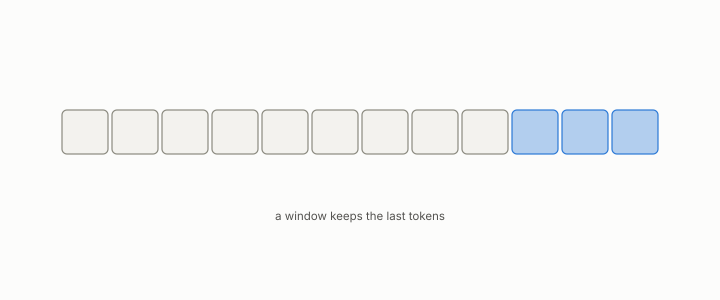

# KV cache

**id.** kv-cache
**kind.** concept

## definition

The stored keys and values of earlier tokens, kept so they need not be recomputed. Compressing it is where several of the book's examples go wrong. Chapters 0 and 11.

**Example.** Serving 14000 tokens with 32 heads keeps 14000 keys and values per head for the next token to read.

## equation

Book equation 0.23.

    \operatorname{softmax}(z)_i=\frac{e^{z_i}}{\sum_j e^{z_j}},\qquad \text{output}=\sum_i\operatorname{softmax}\!\Big(\frac{q\cdot k_i}{\sqrt{d}}\Big)_{\!i}\,v_i.

## conditions

- The stored keys and values of every earlier token for every layer, so its size is the product of layers, tokens, two, the head width, and the bits per number. Compressing it changes the keys the heads read.
- A compression that preserves every query-key score preserves every head output, and one that preserves the keys' cosine need not, since two keys of the same direction and different lengths have cosine one and different scores. That is the attention-key finding in one sentence.

Conditions are curated in `entries.toml` rather than read from a record.

## ledger

- *measures.* GO-2/GO-12/GO-13 operational (KV serving, 077) `[demonstrated]`. Consumer-relative access width measured on a production serving stack (Qwen2.5-7B KV-cache eviction, matched budget): task quality tracks measured predictive uncertainty u about the consumer's future reads, not nominal scorer width — the … [`geometric-observation/claims/LEDGER.md:81`](https://github.com/ahb-sjsu/geometric-observation/blob/aec4c97/claims/LEDGER.md#L81).

## first stated

Chapter 0 section 0.11 and chapter 11 section 11.1 of *Data Mining as Observation*, with the program's measurements in `turboquant-pro/docs/KV_KEYS_FINDING.md:1-49` and the serving-stack ledger row.

## measurements

none

## failures and corrections

none

## invariance envelope

none declared

## machine checked

[`lean/DataMiningAsObservation/KVCache.lean`](https://github.com/ahb-sjsu/observation-data-mining/blob/95af30c/lean/DataMiningAsObservation/KVCache.lean), theorems `cacheBits_tokens`, `cacheBits_half`, `ratios`, `output_of_scores_preserved`, `cosine_not_score`, at observation-data-mining 95af30c; what the check covers is stated in the book's [appendix C](https://github.com/ahb-sjsu/observation-data-mining/blob/95af30c/chapters/machine_checked.md).

## used in

*Data Mining as Observation* chapters 0, 11.

## related

attention, eviction, flip, budget

## see also

Book equations stated beside the entry's terms, not defining it: 11.1.

Ledger rows that cite the entry's records without naming it: NEG-2.

Sources-table rows that share a record with the entry without naming it: chapter 1 section 1.4, chapter 2 section 2.5, chapter 3 section 3.2, chapter 8 section 8.2, chapter 8 section 8.9, chapter 11 section 11.1, chapter 11 section 11.2.

## status

Generated 2026-09-09 by `encyclopedia/generate.py`; book at observation-data-mining 95af30c; the commit of every record is listed in the encyclopedia's provenance.
