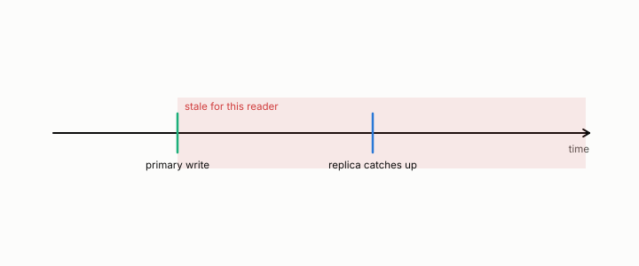

# lag

**id.** lag
**kind.** concept

## definition

How far a replica trails the primary. The same lag gives two readers two staleness rates. Chapter 0 section 0.13 and chapter 13.

**Example.** A replica 50 writes behind the primary is fresh for a reader that touches none of those 50 rows and stale for one that does.

## equation

none

## conditions

- How far a replica trails the primary, in writes or in time. A read of the replica is stale for a consumer whose footprint the lag has touched and fresh for one it has not, so the same lag gives two readers two staleness rates, and a mixed workload's rate lies between them.
- Postgres read 0.50 to 0.06, MongoDB 0.47 to 0.03, and production Postgres 0.47 to 0.02 across readers on the same lag, with disjoint seeds.

Conditions are curated in `entries.toml` rather than read from a record.

## ledger

none

## first stated

Chapter 0 section 0.13 of *Data Mining as Observation*, with the replica measurements in `observation-theory-campaigns/experiments/DATABASE-FRESHNESS-TRACK.md`.

## measurements

none

## failures and corrections

none

## invariance envelope

none declared

## machine checked

[`lean/DataMiningAsObservation/Replica.lean`](https://github.com/ahb-sjsu/observation-data-mining/blob/c149a10/lean/DataMiningAsObservation/Replica.lean), theorems `stale_mono`, `stale_zero`, `naive_certificate`, `witnessed_certificate`, `witnessed_coverage`, at observation-data-mining c149a10; what the check covers is stated in the book's [appendix C](https://github.com/ahb-sjsu/observation-data-mining/blob/c149a10/chapters/machine_checked.md).

[`lean/DataMiningAsObservation/Freshness.lean`](https://github.com/ahb-sjsu/observation-data-mining/blob/c149a10/lean/DataMiningAsObservation/Freshness.lean), theorems `disagree`, `mixedRate_between`, `mixedRate_eq_left_iff`, `stale_for_all`, at observation-data-mining c149a10; what the check covers is stated in the book's [appendix C](https://github.com/ahb-sjsu/observation-data-mining/blob/c149a10/chapters/machine_checked.md).

## used in

*Data Mining as Observation* chapters 13.

## related

replica, freshness, coherence-time, false-clear-rate, footprint

## see also

Book equations stated beside the entry's terms, not defining it: 0.26, 13.2, 0.25.

Ledger rows that cite the entry's records without naming it: OT-11.

Sources-table rows that share a record with the entry without naming it: chapter 13 section 13.2, chapter 13 section 13.3.

## status

Generated 2026-09-09 by `encyclopedia/generate.py`; book at observation-data-mining c149a10; the commit of every record is listed in the encyclopedia's provenance.
