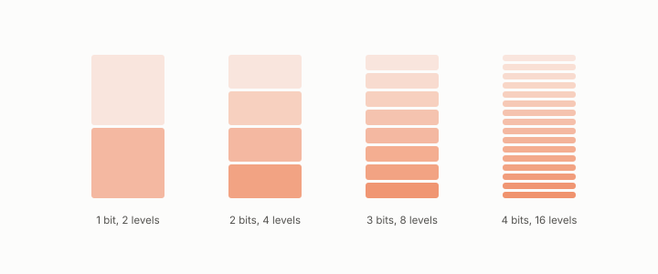

# Landauer's principle

**id.** landauers-principle
**kind.** result

## definition

Erasing one bit costs at least Boltzmann's constant times the absolute temperature times the natural log of two. Equation 0.27.

**Example.** Erasing one bit at 300 kelvin costs at least 2.87 times 10 to the minus 21 joules.

## equation

Book equation 0.27.

    E_{\min}=k_B\,T\ln 2\ \approx\ 2.87\times10^{-21}\ \text{J at }300\ \text{K}.

Book equation 13.3.

    W_{\mathrm{reset}}\ \ge\ k_BT\ln2\ \cdot\ H(M\mid S),\qquad H(M\mid S)\le H(M).

## conditions

- Erasing one bit costs at least Boltzmann's constant times the absolute temperature times the natural logarithm of two, 2.87 times ten to the minus twenty-one joules at 300 kelvin. The reset bound of chapter 13 charges that price per bit of the record's conditional entropy given what the consumer keeps.
- Conditioning cannot raise entropy, so the consumer-relative bound is never above the consumer-free one, and a record that keeps nothing about the erased part costs nothing to reset. The entropies themselves are the ledger's measurements, two source families and six codebooks.

Conditions are curated in `entries.toml` rather than read from a record.

## ledger

- *measures.* GO-7 `[replicated]`. A stored description's description rate and its conditional Landauer reset content are operationally separate resources: the same finite-$n$ code index needing $\hat R\approx0.67$ bits/symbol to describe is fully recoverable from retained … [`geometric-observation/claims/LEDGER.md:69`](https://github.com/ahb-sjsu/geometric-observation/blob/fc6b378/claims/LEDGER.md#L69).
- *measures.* GO-8 `[replicated]`. On two independent source families (binary Markov; Gaussian AR(1)), a fixed stored record's operational reset threshold rises with the age of the retained side information exactly as the staleness–work complement prices it: same record, … [`geometric-observation/claims/LEDGER.md:71`](https://github.com/ahb-sjsu/geometric-observation/blob/fc6b378/claims/LEDGER.md#L71).
- *measures.* GO-9 `[replicated]`. Coordinated reset is operationally cheaper than independent reset by the records' shared-structure information: with two consumer records sharing a component, recovering either record's bin residual with the *other record intact* lowers … [`geometric-observation/claims/LEDGER.md:73`](https://github.com/ahb-sjsu/geometric-observation/blob/fc6b378/claims/LEDGER.md#L73).

## first stated

Landauer, irreversibility and heat generation in the computing process, 1961, as chapter 0 section 0.13 states it, and its consumer-relative form in Volume 14 and the rate-work paper of ledger rows GO-7 to GO-9.

## measurements

| Where the book states it | Numbers, as the book's sources table records them | Source |
|---|---|---|
| chapter 4 section 4.2 | GO-6, d 8 and r 4, output at or below surrogate at or below reconstruction at every rate, about 500 times, gap 0.41 to 0.005, isotropic control collapses | [`geometric-observation/claims/LEDGER.md`](https://github.com/ahb-sjsu/geometric-observation/blob/fc6b378/claims/LEDGER.md) row GO-6; [`geometric-observation/chapters/ch07_cost.md`](https://github.com/ahb-sjsu/geometric-observation/blob/fc6b378/chapters/ch07_cost.md) |
| chapter 4 section 4.4 | GO-4 budget inversion, fixed m 10 rises, matched m 121, 126, 159 collapses, 3 seeds | [`geometric-observation/claims/LEDGER.md`](https://github.com/ahb-sjsu/geometric-observation/blob/fc6b378/claims/LEDGER.md) row GO-4 |
| chapter 6 section 6.2 | planted probe, overlap 0.936 vs 0.059, twelve of twelve, reconstruction 0.40, five of five | [`geometric-observation/claims/LEDGER.md`](https://github.com/ahb-sjsu/geometric-observation/blob/fc6b378/claims/LEDGER.md) row GO-1 |
| chapter 7 section 7.2 | curvature reader, identical reconstruction 0.298, flip twelve of twelve both, projected variance twelve of twelve, reconstruction Spearman negative 0.20, identity curvature tie | [`geometric-observation/experiments/GO2-gradient-curvature-NOTES.md:1-40`](https://github.com/ahb-sjsu/geometric-observation/blob/fc6b378/experiments/GO2-gradient-curvature-NOTES.md#L1-L40); [`geometric-observation/claims/LEDGER.md`](https://github.com/ahb-sjsu/geometric-observation/blob/fc6b378/claims/LEDGER.md) row GO-B |
| chapter 7 section 7.2 | real logistic model, exact Hessian, anti 300 of 300, flip 82 of 300, coupling diagnosis, bound not refutation | [`geometric-observation/claims/LEDGER.md`](https://github.com/ahb-sjsu/geometric-observation/blob/fc6b378/claims/LEDGER.md) row GO-B-optim-D4 |
| chapter 9 section 9.3 | the margin certificate, mu crit as the expected maximum of N minus 1 standard normals, rho, death at 0.948 within 6 percent, Spearman 0.991 vs 0.873, fourteen corpora, six gates, the v1 to v3 path, the standing correction | [`geometric-observation/experiments/GO3-certificate-vacuity-v3-NOTES.md:1-60`](https://github.com/ahb-sjsu/geometric-observation/blob/fc6b378/experiments/GO3-certificate-vacuity-v3-NOTES.md#L1-L60); [`geometric-observation/claims/LEDGER.md`](https://github.com/ahb-sjsu/geometric-observation/blob/fc6b378/claims/LEDGER.md) row GO-3 |
| chapter 11 section 11.7 | GO-1 overlap 0.936 vs 0.059, flip 12 of 12, reconstruction 0.40 | [`geometric-observation/claims/LEDGER.md`](https://github.com/ahb-sjsu/geometric-observation/blob/fc6b378/claims/LEDGER.md) row GO-1; [`geometric-observation/chapters/ch10_the_blind_probe.md:34-52`](https://github.com/ahb-sjsu/geometric-observation/blob/fc6b378/chapters/ch10_the_blind_probe.md#L34-L52) |
| chapter 12 section 12.2 | recall 0.999 vs 0.592, the derived death point within 6 percent across fourteen corpora | `openvector-bench/README.md:60-96`; [`geometric-observation/claims/LEDGER.md`](https://github.com/ahb-sjsu/geometric-observation/blob/fc6b378/claims/LEDGER.md) row GO-3 |
| chapter 12 section 12.3 | uncompressed 0.79, centred 0.84 | [`geometric-observation/claims/LEDGER.md`](https://github.com/ahb-sjsu/geometric-observation/blob/fc6b378/claims/LEDGER.md) row GO-B-legal |
| chapter 12 section 12.3 | 041 non-oracle, frozen LSA TF-IDF to SVD 100 train-only, AUROC 0.975 vs 0.910, flip tied, magnitude overshot, partial | [`geometric-observation/chapters/ch10_the_blind_probe.md:100-118`](https://github.com/ahb-sjsu/geometric-observation/blob/fc6b378/chapters/ch10_the_blind_probe.md#L100-L118); [`geometric-observation/claims/LEDGER.md`](https://github.com/ahb-sjsu/geometric-observation/blob/fc6b378/claims/LEDGER.md) row GO-B-blind 041 |
| chapter 13 section 13.5 | GO-7, 0.67 bits per symbol, bin rate 0.26 equals 0.39, error 1.00 without side information, two families, six codebooks | [`geometric-observation/claims/LEDGER.md`](https://github.com/ahb-sjsu/geometric-observation/blob/fc6b378/claims/LEDGER.md) row GO-7 |
| chapter 13 section 13.5 | GO-8, 0.10 to 0.55 across ages 0 to 64, flip probability 0.05, 1 percent to 100 percent at age 32, Gaussian pass 5 of 5, the control-statistic caveat | [`geometric-observation/claims/LEDGER.md`](https://github.com/ahb-sjsu/geometric-observation/blob/fc6b378/claims/LEDGER.md) row GO-8; [`geometric-observation/experiments/GO-landauer-gaussian-secondsettings-NOTES.md`](https://github.com/ahb-sjsu/geometric-observation/blob/fc6b378/experiments/GO-landauer-gaussian-secondsettings-NOTES.md) |
| chapter 13 section 13.6 | attempt three, windows 1024, 256, 32, uncertainty 0.982 to 0.892, 5 of 6, 0.4375 with SE 0.070 at 5 percent keep vs 0.30, 97 percent eviction, oracle-miss 0.370 vs 0.25, V4 0.078 vs 0.0625, contrast 0.359 with SE 0.068, n 64, seed 20260812, 89 duty cycles | [`geometric-observation/claims/LEDGER.md`](https://github.com/ahb-sjsu/geometric-observation/blob/fc6b378/claims/LEDGER.md) row GO-2/GO-12/GO-13 operational; [`geometric-observation/prereg/GO-P-2026-077-kv-consumer-relative.md`](https://github.com/ahb-sjsu/geometric-observation/blob/fc6b378/prereg/GO-P-2026-077-kv-consumer-relative.md); [`geometric-observation/results/GO13-kvaw2-governed.json`](https://github.com/ahb-sjsu/geometric-observation/blob/fc6b378/results/GO13-kvaw2-governed.json) |

## failures and corrections

none

## invariance envelope

none declared

## machine checked

[`lean/DataMiningAsObservation/Landauer.lean`](https://github.com/ahb-sjsu/observation-data-mining/blob/f3914f0/lean/DataMiningAsObservation/Landauer.lean), theorems `eMin_300`, `resetBound_le`, `resetBound_zero`, at observation-data-mining f3914f0; what the check covers is stated in the book's [appendix C](https://github.com/ahb-sjsu/observation-data-mining/blob/f3914f0/chapters/machine_checked.md).

## used in

*Data Mining as Observation* chapters 13.

## related

budget, certificate, read-operator, coherence-time

## see also

none

## status

Generated 2026-09-10 by `encyclopedia/generate.py`; book at observation-data-mining f3914f0; the commit of every record is listed in the encyclopedia's provenance.
