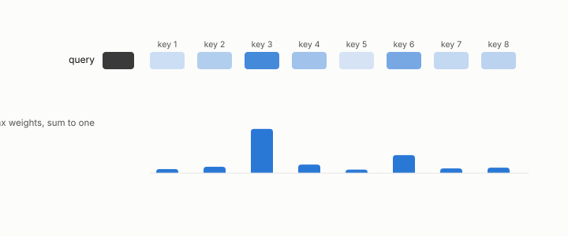

# language model

**id.** language-model
**kind.** concept

## definition

A model that reads a sequence of tokens and outputs a probability for the next one, scored by perplexity. Chapter 0 section 0.11.

**Example.** A model with perplexity 12 on a text is as uncertain, per token, as a fair choice among 12 tokens.

## equation

Book equation 0.22.

    \mathrm{PPL}=2^{H},\qquad H=-\frac1T\sum_{t=1}^{T}\log_2 p\big(w_t\mid w_{<t}\big).

## conditions

- A model that reads a sequence of tokens and outputs a probability for the next one. Its perplexity is two to the power of the average bits per token, at least one and equal to the vocabulary size for a uniform guess, and its attention weights are a softmax, positive and summing to one.
- A seven-billion-parameter model served passage retrieval over contexts of fourteen thousand tokens across three registered attempts, and a key quantizer with reconstruction cosine 0.995 broke it to a perplexity near ten thousand.

Conditions are curated in `entries.toml` rather than read from a record.

## ledger

none

## first stated

Chapter 0 section 0.11 of *Data Mining as Observation*, with the serving measurements in `geometric-observation/experiments/GO-kv-serving-flip-NOTES.md`.

## measurements

none

## failures and corrections

none

## machine checked

[`lean/DataMiningAsObservation/Perplexity.lean`](https://github.com/ahb-sjsu/observation-data-mining/blob/95af30c/lean/DataMiningAsObservation/Perplexity.lean), theorems `bits_nonneg`, `one_le_perplexity`, `perplexity_uniform`, `perplexity_mono`, `bits_of_finding`, at observation-data-mining 95af30c; what the check covers is stated in the book's [appendix C](https://github.com/ahb-sjsu/observation-data-mining/blob/95af30c/chapters/machine_checked.md).

[`lean/DataMiningAsObservation/Softmax.lean`](https://github.com/ahb-sjsu/observation-data-mining/blob/95af30c/lean/DataMiningAsObservation/Softmax.lean), theorems `denom_pos`, `softmax_pos`, `softmax_sum`, `softmax_shift`, `softmax_lt_iff`, at observation-data-mining 95af30c; what the check covers is stated in the book's [appendix C](https://github.com/ahb-sjsu/observation-data-mining/blob/95af30c/chapters/machine_checked.md).

## used in

*Data Mining as Observation* chapters 0, 1, 4, 6, 8, 11, 12, 13.

## related

token, perplexity, attention, kv-cache, softmax

## see also

Book equations stated beside the entry's terms, not defining it: 0.23, 11.1.

Ledger rows that cite the entry's records without naming it: NEG-16 (KV serving, end-task), NEG-2.

Sources-table rows that share a record with the entry without naming it: chapter 1 section 1.4, chapter 2 section 2.5, chapter 8 section 8.2, chapter 11 section 11.2, chapter 13 section 13.6.

## status

Generated 2026-09-07 by `encyclopedia/generate.py`; book at observation-data-mining 95af30c; the commit of every record is listed in the encyclopedia's provenance.
