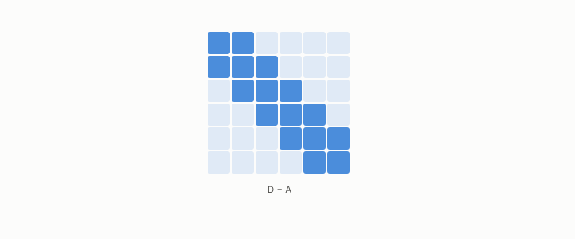

# Laplacian

**id.** laplacian
**kind.** concept

## definition

A matrix built from a graph's edges whose eigenvectors, from the smallest eigenvalue up, are the smoothest functions on the graph. The unnormalized form is zero on the constant vector, and the normalized form of equation 0.19 is zero on the square root of the degree. Equation 0.19.

**Example.** A path of three nodes has unnormalized Laplacian with rows (1, −1, 0), (−1, 2, −1), and (0, −1, 1), which is zero on (1, 1, 1).

## equation

Book equation 0.19.

    L=I-D^{-1/2}AD^{-1/2},\qquad D=\operatorname{diag}(d_1,\dots,d_n),\qquad L\,u_k=\lambda_k u_k,\ \ 0=\lambda_1\le\lambda_2\le\cdots.

Book equation 0.20.

    \Psi_i=\left(\frac{u_k(i)}{\sqrt{\lambda_k\,d_i}}\right)_{k\ge2},\qquad \|\Psi_i-\Psi_j\|^{2}=R(i,j)=\frac{C(i,j)}{\operatorname{vol}(G)}.

## conditions

- The unnormalized Laplacian, the degree matrix less the adjacency, has quadratic form the sum over edges of the squared difference, so it is positive semidefinite, zero on the constant vector, and positive across any edge. The normalized form of equation 0.19 has the same ordering of eigenvalues, but its zero-eigenvalue vector is the square root of the degree times the constant vector, not the constant vector.
- The Lean file checks the unnormalized form. The embedding of equation 0.20 divides each eigenvector entry by the square root of the degree, which is the scaling that carries the normalized eigenvectors back to the unnormalized ones.

Conditions are curated in `entries.toml` rather than read from a record.

## ledger

none

## first stated

Chapter 0 section 0.10 of *Data Mining as Observation*, with the program's spectral work in Volume 14 chapter 9 and the-angular-observer.

## measurements

none

## failures and corrections

none

## invariance envelope

none declared

## machine checked

[`lean/DataMiningAsObservation/Laplacian.lean`](https://github.com/ahb-sjsu/observation-data-mining/blob/f3914f0/lean/DataMiningAsObservation/Laplacian.lean), theorems `quad_eq`, `quad_nonneg`, `quad_const`, `quad_pos_of_edge`, at observation-data-mining f3914f0; what the check covers is stated in the book's [appendix C](https://github.com/ahb-sjsu/observation-data-mining/blob/f3914f0/chapters/machine_checked.md).

## used in

*Data Mining as Observation* primer L, chapters 0, 3, 4, 9, 11.

## related

intrinsic-dimension, recognizer, rank-faithful, bi-lipschitz

## see also

Book equations stated beside the entry's terms, not defining it: 9.2.

Ledger rows that cite the entry's records without naming it: NEG-1.

Sources-table rows that share a record with the entry without naming it: chapter 3 section 3.2, chapter 3 section 3.3, chapter 9 section 9.1, chapter 9 section 9.2, chapter 9 section 9.4, chapter 11 section 11.1, chapter 14 section 14.3, chapter 14 section 14.5, chapter 14 section 14.7.

## status

Generated 2026-09-12 by `encyclopedia/generate.py`; book at observation-data-mining f3914f0; the commit of every record is listed in the encyclopedia's provenance.
