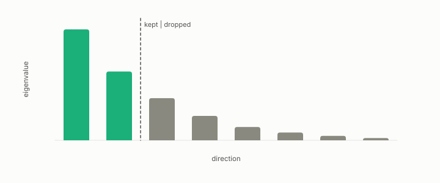

# latent semantic analysis

**id.** latent-semantic-analysis
**kind.** instrument

## definition

The truncated singular value decomposition of the term-document matrix, ordinarily uncentred, which coincides with principal components on documents only after centring. Chapter 12.

**Example.** A term-document matrix of 20000 terms by 5000 documents reduced to 100 singular components gives each document 100 coordinates.

## equation

none

## conditions

- The truncated singular value decomposition of the term-document matrix, ordinarily uncentred, with the top components kept. It coincides with principal components on documents only after the matrix is centred, or under an explicitly uncentred convention, and the fraction of squared singular values kept grows with the components kept and reaches one at full rank.
- It is the identity reader on term-document variance, and the components it keeps are the directions of largest variance whether or not the consumer reads them. The non-oracle test fit a frozen embedding of 100 components on the training split only and recovered the reader blind.

Conditions are curated in `entries.toml` rather than read from a record.

## ledger

none

## first stated

Deerwester, Dumais, Furnas, Landauer, and Harshman, indexing by latent semantic analysis, 1990, as chapter 12 section 12.1 of *Data Mining as Observation* reads it, with the program's frozen embedding in `geometric-observation/chapters/ch10_the_blind_probe.md:100-118`.

## measurements

| Where the book states it | Numbers, as the book's sources table records them | Source |
|---|---|---|
| chapter 12 section 12.3 | 041 non-oracle, frozen LSA TF-IDF to SVD 100 train-only, AUROC 0.975 vs 0.910, flip tied, magnitude overshot, partial | [`geometric-observation/chapters/ch10_the_blind_probe.md:100-118`](https://github.com/ahb-sjsu/geometric-observation/blob/fc6b378/chapters/ch10_the_blind_probe.md#L100-L118); [`geometric-observation/claims/LEDGER.md`](https://github.com/ahb-sjsu/geometric-observation/blob/fc6b378/claims/LEDGER.md) row GO-B-blind 041 |

## failures and corrections

none

## invariance envelope

none declared

## machine checked

[`lean/DataMiningAsObservation/PCA.lean`](https://github.com/ahb-sjsu/observation-data-mining/blob/f3914f0/lean/DataMiningAsObservation/PCA.lean), theorems `varAlong_basis`, `varAlong_le`, `varAlong_ge`, `dropped_eq`, `dropped_nonneg`, at observation-data-mining f3914f0; what the check covers is stated in the book's [appendix C](https://github.com/ahb-sjsu/observation-data-mining/blob/f3914f0/chapters/machine_checked.md).

[`lean/DataMiningAsObservation/ExplainedVariance.lean`](https://github.com/ahb-sjsu/observation-data-mining/blob/f3914f0/lean/DataMiningAsObservation/ExplainedVariance.lean), theorems `explained_mem_unit`, `explained_mono`, `explained_full`, `retained_identity`, `retained_example`, at observation-data-mining f3914f0; what the check covers is stated in the book's [appendix C](https://github.com/ahb-sjsu/observation-data-mining/blob/f3914f0/chapters/machine_checked.md).

[`lean/DataMiningAsObservation/TFIDF.lean`](https://github.com/ahb-sjsu/observation-data-mining/blob/f3914f0/lean/DataMiningAsObservation/TFIDF.lean), theorems `weight_everywhere`, `weight_nonneg`, `weight_antitone`, `tf_mem_unit`, at observation-data-mining f3914f0; what the check covers is stated in the book's [appendix C](https://github.com/ahb-sjsu/observation-data-mining/blob/f3914f0/chapters/machine_checked.md).

## used in

*Data Mining as Observation* primer L, chapters 0, 12.

## related

tf-idf, principal-component-analysis, explained-variance, bag-of-words, blind-probe

## see also

Book equations stated beside the entry's terms, not defining it: 0.36, 0.5, 4.2.

Ledger rows that cite the entry's records without naming it: GO-B-legal (035→036).

## status

Generated 2026-09-10 by `encyclopedia/generate.py`; book at observation-data-mining f3914f0; the commit of every record is listed in the encyclopedia's provenance.
