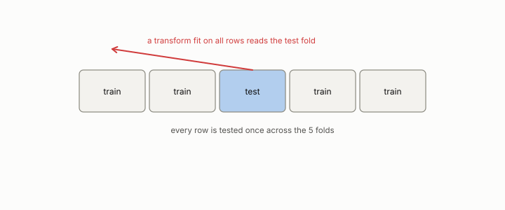

# leakage

**id.** leakage
**kind.** concept

## definition

Any information in the training data that could only be known after the decision, or any identifier that lets the model recognize a row it will be tested on. Chapter 8.

**Example.** An imputation fit on all 1000 rows before the split has read the 100 test rows.

## equation

Book equation 8.1.

    O_{\mathrm{harness}}=\big(C_{\mathrm{score}},\ G_{\mathrm{metric}},\ B=\text{folds}\times\text{samples}\times\text{seeds}\big).

## conditions

- Leakage is any information in the training data that could only be known after the decision, or any identifier that lets the model recognize a row it will be tested on. It is a property of the harness's read subspace, not of the model.
- Selecting features on the whole data and then cross-validating leaks the test fold into the selection, and the reported error can fall from the true rate to a fraction of it, as the ESL example shows.
- Coupling between the queries and the corpus of a retrieval benchmark is leakage of the same kind, and the program's hubness numbers moved by a factor of several when the coupling was removed.

Conditions are curated in `entries.toml` rather than read from a record.

## ledger

none

## first stated

Chapter 8 section 8.1 of *Data Mining as Observation*, with the ESL example of selection before the split, Hastie, Tibshirani, and Friedman, section 7.10.2.

## measurements

none

## failures and corrections

none

## invariance envelope

none declared

## machine checked

[`lean/DataMiningAsObservation/Leakage.lean`](https://github.com/ahb-sjsu/observation-data-mining/blob/6aebdf3/lean/DataMiningAsObservation/Leakage.lean), theorems `errors_lookup_eq_zero`, `lookup_default`, at observation-data-mining 6aebdf3; what the check covers is stated in the book's [appendix C](https://github.com/ahb-sjsu/observation-data-mining/blob/6aebdf3/chapters/machine_checked.md).

## used in

*Data Mining as Observation* chapters 1, 2, 4, 8.

## related

harness, preregistration, sealed, hubness

## see also

Ledger rows that cite the entry's records without naming it: NEG-2.

Sources-table rows that share a record with the entry without naming it: chapter 4 section 4.7, chapter 8 section 8.1.

## status

Generated 2026-09-09 by `encyclopedia/generate.py`; book at observation-data-mining 6aebdf3; the commit of every record is listed in the encyclopedia's provenance.
