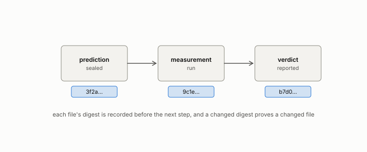

# ledger class

**id.** ledger-class
**kind.** concept

## definition

One of six labels every headline claim carries, proved, demonstrated, replicated, predicted, exploratory, or refuted, defined in the evidence ledger of Volume 14. Chapter 1.

**Example.** GO-1 is demonstrated, NEG-2 is refuted, and a row whose bar the null passed is void.

## equation

none

## conditions

- Every headline claim carries one of six labels, proved, demonstrated, replicated, predicted, exploratory, or refuted. A claim's class can only rise by a sealed pass on held-out data and only fall by a sealed miss, and a refuted claim is reported at the prominence of a pass.
- A number produced without a sealed bar is exploratory whatever its size. It may motivate a claim and may not carry one.
- The authority for a claim's class is the ledger, and a chapter or an encyclopedia entry that disagrees with it is rebuilt.

Conditions are curated in `entries.toml` rather than read from a record.

## ledger

none

## first stated

Volume 14, `geometric-observation/PROTOCOL.md:58-75` and `geometric-observation/OBSERVATION.md:43-45`, DOI 10.5281/zenodo.21776291, with the ledger itself at `geometric-observation/claims/LEDGER.md`.

## measurements

none

## failures and corrections

none

## invariance envelope

none declared

## machine checked

[`lean/DataMiningAsObservation/Ledger.lean`](https://github.com/ahb-sjsu/observation-data-mining/blob/c149a10/lean/DataMiningAsObservation/Ledger.lean), theorems `step_none`, `step_miss_le`, `step_pass_ge`, `step_miss_refuted`, `exploratory_stays`, at observation-data-mining c149a10; what the check covers is stated in the book's [appendix C](https://github.com/ahb-sjsu/observation-data-mining/blob/c149a10/chapters/machine_checked.md).

## used in

*Data Mining as Observation* chapters 8, 11.

## related

preregistration, sealed, certificate, false-clear-rate

## see also

Book equations stated beside the entry's terms, not defining it: 1.1.

Ledger rows that cite the entry's records without naming it: OT-11, GO-2 (neg. half: not reconstruction), NEG-15 (Bell boundary).

Sources-table rows that share a record with the entry without naming it: chapter 1 section 1.5, chapter 8 section 8.3, chapter 8 section 8.8, chapter 8 section 8.10, chapter 11 section 11.5.

## status

Generated 2026-09-09 by `encyclopedia/generate.py`; book at observation-data-mining c149a10; the commit of every record is listed in the encyclopedia's provenance.
