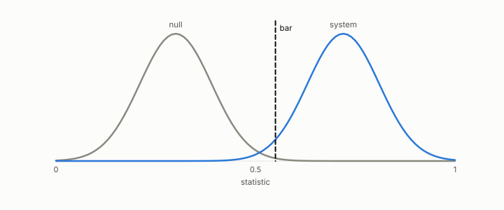

# licensed, not licensed

**id.** licensed
**kind.** concept

## definition

A claim is licensed when it is a theorem checked in Lean in appendix C, or a measurement sealed with its commit hash before the run that survived its registered null and bar, and a chapter may rest on it. A claim is not licensed when it is exploratory, a retrospective fit, a single seed, or posited, and a chapter may mention it and not lean on it. How to use this book, and chapter 8 section 8.10.

**Example.** The flip across twelve domains is licensed, sealed and survived its bars; the alignment law's retrospective fit is not licensed, since it is an exploratory row.

## equation

none

## conditions

- A claim is licensed when it is a theorem checked in Lean, or a measurement sealed with its commit hash before the run that survived its registered null and bar, so that a changed digest would prove a changed prediction and the bar discriminated the system from the null. A chapter may rest its thesis on a licensed claim.
- A claim is not licensed when it is exploratory, a retrospective fit, a single seed, or posited, and a chapter may mention it and may not lean on it. The classes between, demonstrated, replicated, and predicted, are defined in chapter 8, and a row of the table names which one each claim carries.

Conditions are curated in `entries.toml` rather than read from a record.

## ledger

none

## first stated

The table in how to use this book, and chapter 8 section 8.10 of *Data Mining as Observation*, with the six classes in `geometric-observation/PROTOCOL.md:58-75`.

## measurements

none

## failures and corrections

none

## invariance envelope

none declared

## machine checked

[`lean/DataMiningAsObservation/Bar.lean`](https://github.com/ahb-sjsu/observation-data-mining/blob/6aebdf3/lean/DataMiningAsObservation/Bar.lean), theorems `passes_anti`, `passes_mono`, `discriminates_iff`, `no_bar_of_null_ge`, `exists_bar_of_lt`, `vacuous_of_null_passes`, at observation-data-mining 6aebdf3; what the check covers is stated in the book's [appendix C](https://github.com/ahb-sjsu/observation-data-mining/blob/6aebdf3/chapters/machine_checked.md).

[`lean/DataMiningAsObservation/Seal.lean`](https://github.com/ahb-sjsu/observation-data-mining/blob/6aebdf3/lean/DataMiningAsObservation/Seal.lean), theorems `changed_of_hash_ne`, `hash_eq_of_eq`, `exists_collision`, at observation-data-mining 6aebdf3; what the check covers is stated in the book's [appendix C](https://github.com/ahb-sjsu/observation-data-mining/blob/6aebdf3/chapters/machine_checked.md).

## used in

none

## related

ledger-class, sealed, bar, posited-versus-measured, registered

## see also

Book equations stated beside the entry's terms, not defining it: 8.3.

Ledger rows that cite the entry's records without naming it: OT-11, GO-2 (neg. half: not reconstruction).

Sources-table rows that share a record with the entry without naming it: chapter 1 section 1.5, chapter 8 section 8.10.

## status

Generated 2026-09-09 by `encyclopedia/generate.py`; book at observation-data-mining 6aebdf3; the commit of every record is listed in the encyclopedia's provenance.
