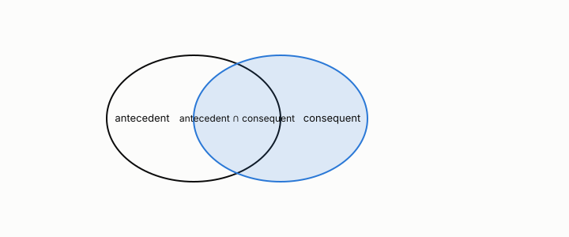

# lift

**id.** lift
**kind.** concept

## definition

Confidence divided by the consequent's support, so that lift one is the independence baseline. It fails at low support. Chapter 5.

**Example.** Confidence 0.8 for bread implies butter against a butter base rate of 0.4 is lift 2.

## equation

Book equation 5.2.

    \mathrm{lift}(X\to Y)=\frac{c(X\to Y)}{s(Y)}=\frac{s(X\cup Y)}{s(X)\,s(Y)}.

## conditions

- Confidence over the consequent's support, the joint support over the product of the two supports. It is one under independence, symmetric in the two itemsets, and bounded by the reciprocal of the consequent's support.
- It fails at low support. One transaction in N containing both items, and neither elsewhere, gives lift N, which is why the rules with the highest lift are the ones chapter 8's multiple-comparison rule applies to.

Conditions are curated in `entries.toml` rather than read from a record.

## ledger

none

## first stated

TSK chapter 5 on objective measures, as chapter 5 section 5.1 of *Data Mining as Observation* states it.

## measurements

| Where the book states it | Numbers, as the book's sources table records them | Source |
|---|---|---|
| chapter 5 section 5.1 to 5.3, 5.5 | support, confidence, lift, the Apriori principle, FP-growth, closed and maximal itemsets, objective measures, Simpson's paradox, cross-support | TSK 2e chapter 5 |

## failures and corrections

none

## invariance envelope

none declared

## machine checked

[`lean/DataMiningAsObservation/Lift.lean`](https://github.com/ahb-sjsu/observation-data-mining/blob/95af30c/lean/DataMiningAsObservation/Lift.lean), theorems `lift_indep`, `lift_symm`, `lift_le_inv`, `lift_single`, at observation-data-mining 95af30c; what the check covers is stated in the book's [appendix C](https://github.com/ahb-sjsu/observation-data-mining/blob/95af30c/chapters/machine_checked.md).

## used in

*Data Mining as Observation* chapters 5.

## related

apriori, multiple-comparisons, safe-pruning, harness

## see also

Book equations stated beside the entry's terms, not defining it: 5.1.

## status

Generated 2026-09-08 by `encyclopedia/generate.py`; book at observation-data-mining 95af30c; the commit of every record is listed in the encyclopedia's provenance.
