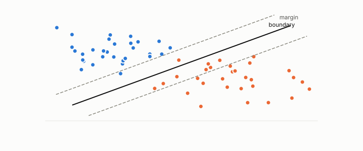

# linear classifier

**id.** linear-classifier
**kind.** instrument

## definition

A classifier that scores by a weighted sum, logistic regression or a linear support vector machine. Its read subspace is the one direction of its weight vector. Chapter 6.

## equation

Book equation 6.1.

    s(x)=w\cdot x+b,\qquad P_C=\mathbb E\big[\sigma'(s)^{2}\big]\,w\,w^{\top},\qquad \operatorname{rank}P_C=1.

## conditions

- A classifier that scores by a weighted sum, logistic regression or a linear support vector machine. Its decision boundary is the hyperplane where the weighted sum is zero, its read subspace is the one direction of its weight vector, and its read operator is the outer product of that vector with itself, scaled by the score's slope.
- Its nuisance is everything orthogonal to the weight vector, and a planted linear consumer is the case a probe is tested against before it is trusted on a real model.

Conditions are curated in `entries.toml` rather than read from a record.

## ledger

none

## first stated

Chapter 6 section 6.1 of *Data Mining as Observation*, with the planted affine consumer in `geometric-observation/claims/LEDGER.md` row GO-1.

## measurements

none

## failures and corrections

none

## machine checked

`lean/DataMiningAsObservation/Logistic.lean`, theorems `sigmoid_pos`, `sigmoid_lt_one`, `sigmoid_zero`, `sigmoid_neg`, `sigmoid_strictMono`, `decision_iff`, `decision_linear`, at observation-data-mining 08b4794.

`lean/DataMiningAsObservation/ReadOperator.lean`, theorems `rank_one_reads_one_direction`, `readOp_mulVec`, `quad_readOp`, `quad_readOp_nonneg`, `readOp_mulVec_eq_zero_iff`, `readOp_diag`, `readOp_offdiag`, `readOp_symm`, `readOp_neg`, `affine_const_along_nuisance`, `readOp_affine`, `readOp_sqLength_basis`, at observation-data-mining 08b4794.

## used in

*Data Mining as Observation* chapters 0, 2, 6, 7, 11.

## related

logistic-regression, decision-boundary, read-subspace, margin, planted

## see also

Book equations stated beside the entry's terms, not defining it: 0.9, 0.28.

Ledger rows that cite the entry's records without naming it: GO-1.

Sources-table rows that share a record with the entry without naming it: chapter 6 section 6.1, chapter 6 section 6.2, chapter 11 section 11.7.

## status

Generated 2026-09-06 by `encyclopedia/generate.py`; book at observation-data-mining 08b4794; the commit of every record is listed in the encyclopedia's provenance.
