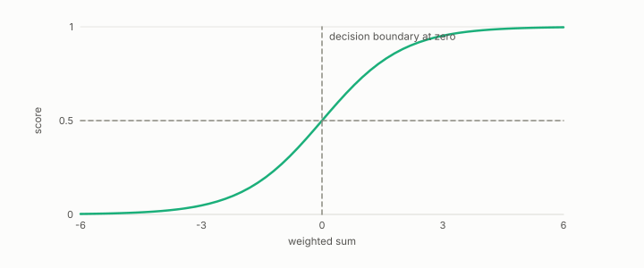

# logistic regression

**id.** logistic-regression
**kind.** instrument

## definition

A linear classifier whose score is the sigmoid of a weighted sum, strictly between zero and one, above one half exactly on one side of the hyperplane. Chapter 6.

**Example.** A weighted sum of 0 gives score 0.5, of 2 gives 0.881, and of −2 gives 0.119.

## equation

Book equation 6.1.

    s(x)=w\cdot x+b,\qquad P_C=\mathbb E\big[\sigma'(s)^{2}\big]\,w\,w^{\top},\qquad \operatorname{rank}P_C=1.

## conditions

- A linear classifier whose score is the sigmoid of a weighted sum. The sigmoid lies strictly between zero and one, is one half at zero, is symmetric about one half, and is strictly increasing, so the decision at threshold one half is the sign of the weighted sum and the decision boundary is the hyperplane.
- Its score moves only along its weight vector, so its read subspace is one direction and its nuisance is everything orthogonal, and its read operator is the outer product of the weight vector with itself scaled by how steep the sigmoid is at each row.

Conditions are curated in `entries.toml` rather than read from a record.

## ledger

- *measures.* GO-B-optim-D4 (034 · D4) `[predicted]`. Optimization — gradient compression, curvature (Hessian) read operator, on a REAL model (logistic regression); optional stretch [`geometric-observation/claims/LEDGER.md:122`](https://github.com/ahb-sjsu/geometric-observation/blob/fc6b378/claims/LEDGER.md#L122).

## first stated

Cox, the regression analysis of binary sequences, 1958, as chapter 6 section 6.1 of *Data Mining as Observation* reads it, with the real logistic model's Hessian in `geometric-observation/claims/LEDGER.md` row GO-B-optim-D4.

## measurements

| Where the book states it | Numbers, as the book's sources table records them | Source |
|---|---|---|
| chapter 7 section 7.2 | real logistic model, exact Hessian, anti 300 of 300, flip 82 of 300, coupling diagnosis, bound not refutation | [`geometric-observation/claims/LEDGER.md`](https://github.com/ahb-sjsu/geometric-observation/blob/fc6b378/claims/LEDGER.md) row GO-B-optim-D4 |

## failures and corrections

none

## invariance envelope

none declared

## machine checked

[`lean/DataMiningAsObservation/Logistic.lean`](https://github.com/ahb-sjsu/observation-data-mining/blob/6aebdf3/lean/DataMiningAsObservation/Logistic.lean), theorems `sigmoid_pos`, `sigmoid_lt_one`, `sigmoid_zero`, `sigmoid_neg`, `sigmoid_strictMono`, `decision_iff`, `decision_linear`, at observation-data-mining 6aebdf3; what the check covers is stated in the book's [appendix C](https://github.com/ahb-sjsu/observation-data-mining/blob/6aebdf3/chapters/machine_checked.md).

## used in

*Data Mining as Observation* chapters 0, 6, 7, 11, 12.

## related

classifier, decision-boundary, threshold, read-subspace, hessian

## see also

Book equations stated beside the entry's terms, not defining it: 0.9, 0.28.

Ledger rows that cite the entry's records without naming it: GO-1.

Sources-table rows that share a record with the entry without naming it: chapter 6 section 6.1.

## status

Generated 2026-09-09 by `encyclopedia/generate.py`; book at observation-data-mining 6aebdf3; the commit of every record is listed in the encyclopedia's provenance.
