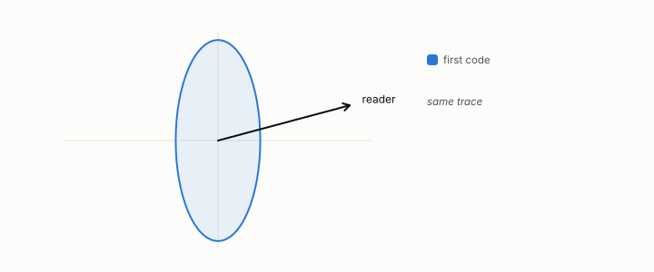

# Mahalanobis distance

**id.** mahalanobis-distance
**kind.** concept

## definition

The Euclidean distance of a row from the mean after whitening, which needs a positive-definite covariance or a pseudoinverse on its support. Equation 0.33.

**Example.** With covariance diag(1, 4), the row (3, 4) has Euclidean distance 5 from the mean and Mahalanobis distance the square root of 13, or 3.61.

## equation

Book equation 0.33.

    d_M(x)=\sqrt{(x-\mu)^{\top}\Sigma^{-1}(x-\mu)}.

Book equation 10.1.

    z(x)=\frac{x-\mu}{\sigma},\qquad d_M(x)^{2}=(x-\mu)^{\top}\Sigma^{-1}(x-\mu)=\sum_i\frac{(v_i\cdot(x-\mu))^{2}}{\lambda_i}.

## conditions

- The Euclidean distance of a row from the mean after whitening. In the eigenbasis its square is the sum of the squared centred coordinates over the eigenvalues, nonnegative, zero at the mean, unchanged when data and covariance are rescaled together, and a deviation along a direction of larger variance counts for less.
- The detector that scores by it treats every whitened direction equally, so it is the identity reader on whitened data, and a consumer that reads a subspace calls different rows outliers.
- It needs a positive-definite covariance, or a pseudoinverse restricted to the covariance's support, and it equals the Euclidean distance after whitening.

Conditions are curated in `entries.toml` rather than read from a record.

## ledger

none

## first stated

Mahalanobis, on the generalised distance in statistics, 1936, as chapter 0 section 0.16 states it, and chapter 10 section 10.1 of *Data Mining as Observation*, where the statistical detector is the identity reader on whitened data.

## measurements

none

## failures and corrections

none

## invariance envelope

none declared

## machine checked

[`lean/DataMiningAsObservation/Mahalanobis.lean`](https://github.com/ahb-sjsu/observation-data-mining/blob/c149a10/lean/DataMiningAsObservation/Mahalanobis.lean), theorems `dM2_nonneg`, `dM2_mean`, `dM2_scale`, `dM2_eq_whitened`, `dM2_antitone_in_variance`, at observation-data-mining c149a10; what the check covers is stated in the book's [appendix C](https://github.com/ahb-sjsu/observation-data-mining/blob/c149a10/chapters/machine_checked.md).

## used in

*Data Mining as Observation* chapters 0, 10.

## related

whitening, identity-reader, hubness, abstention

## see also

none

## status

Generated 2026-09-09 by `encyclopedia/generate.py`; book at observation-data-mining c149a10; the commit of every record is listed in the encyclopedia's provenance.
