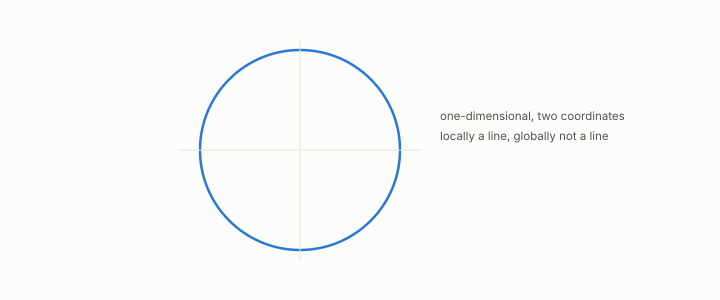

# manifold

**id.** manifold
**kind.** concept

## definition

A curved surface of some dimension that looks flat when viewed closely. A dataset lies on one when it is locally low-dimensional, which is not the same as varying along fewer covariance directions, since a circle is one-dimensional and uses two coordinates. Chapter 0 section 0.10.

**Example.** A circle in the plane is a one-dimensional manifold that uses both coordinates.

## equation

none

## conditions

- A space that is locally like flat space of some dimension. A dataset lies on a manifold when it is locally low-dimensional, which does not mean it varies globally along fewer covariance directions. A circle in the plane is one-dimensional and uses both coordinates, so no linear projection recovers it.
- Convergence of the graph Laplacian to the manifold's holds under stated conditions on sampling density, graph construction, kernel bandwidth, normalization, and scaling, after Belkin and Niyogi, and a finite graph spectrum names a shape only against a finite list of candidates, which is the recognizer's limitation and applies here.

Conditions are curated in `entries.toml` rather than read from a record.

## ledger

none

## first stated

Chapter 0 section 0.10 and chapter 9 section 9.2 of *Data Mining as Observation*, with the recognizer of Volume 14 chapter 11 and its battery in the-angular-observer.

## measurements

| Where the book states it | Numbers, as the book's sources table records them | Source |
|---|---|---|
| chapter 3 section 3.3 | hyperbolic rejected, curvature negative 0.98 to negative 0.14, trend 1.09 minus 0.157 d across 20 manifolds and 5 families | `the-angular-observer\README.md:111-147,183-185` |

## failures and corrections

none

## invariance envelope

none declared

## machine checked

[`lean/DataMiningAsObservation/IntrinsicDimension.lean`](https://github.com/ahb-sjsu/observation-data-mining/blob/f3914f0/lean/DataMiningAsObservation/IntrinsicDimension.lean), theorems `log_weyl`, `dimension_from_slope`, `weyl_double`, at observation-data-mining f3914f0; what the check covers is stated in the book's [appendix C](https://github.com/ahb-sjsu/observation-data-mining/blob/f3914f0/chapters/machine_checked.md).

## used in

*Data Mining as Observation* chapters 0, 3, 9.

## related

intrinsic-dimension, recognizer, graph, laplacian, template-match

## see also

Book equations stated beside the entry's terms, not defining it: 0.31, 9.2, 0.32.

Ledger rows that cite the entry's records without naming it: GO-3.

Sources-table rows that share a record with the entry without naming it: chapter 3 section 3.3, chapter 9 section 9.1, chapter 9 section 9.2, chapter 11 section 11.1.

## status

Generated 2026-09-09 by `encyclopedia/generate.py`; book at observation-data-mining f3914f0; the commit of every record is listed in the encyclopedia's provenance.
