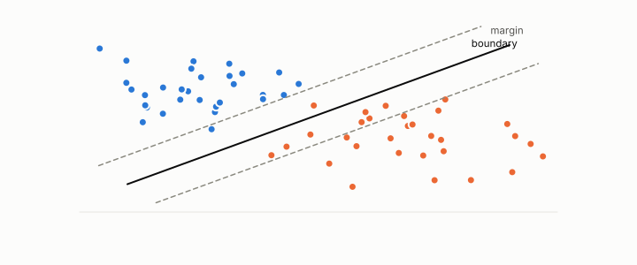

# margin

**id.** margin
**kind.** concept

## definition

How far a row's score sits from the threshold. Chapter 6.

**Example.** Points at distance 0.5 and 0.8 from the boundary on either side give a margin of 0.5.

## equation

Book equation 9.3.

    \hat\mu=\frac{\bar s_{\mathrm{true}}-\bar s_{\mathrm{distr}}}{\sigma_{\mathrm{distr}}},\qquad \mu_{\mathrm{crit}}=\mathbb E\Big[\max_{N-1}\mathcal N(0,1)\Big],\qquad \rho=\frac{\hat\mu}{\mu_{\mathrm{crit}}},\qquad \rho=1\ \text{vacuous}.

## conditions

- How far a row's score sits from the threshold. A perturbation whose length times the weight length is smaller than the margin cannot move a linear classifier's score across the threshold, by Cauchy–Schwarz, and a step along the weights of exactly that size reaches the boundary.
- The margin is therefore a certificate on a decision, and chapter 9's margin certificate is the same idea with a noise model in place of a perturbation bound and a vacuity threshold derived from it.

Conditions are curated in `entries.toml` rather than read from a record.

## ledger

none

## first stated

Chapter 6 section 6.1 of *Data Mining as Observation*, with the margin certificate of chapter 9 section 9.3 and the neighbour margins of chapter 11.

## measurements

none

## failures and corrections

none

## invariance envelope

none declared

## machine checked

[`lean/DataMiningAsObservation/Margin.lean`](https://github.com/ahb-sjsu/observation-data-mining/blob/f3914f0/lean/DataMiningAsObservation/Margin.lean), theorems `score_add`, `decision_stable`, `tight_along_weights`, at observation-data-mining f3914f0; what the check covers is stated in the book's [appendix C](https://github.com/ahb-sjsu/observation-data-mining/blob/f3914f0/chapters/machine_checked.md).

## used in

*Data Mining as Observation* chapters 0, 6, 7, 9, 11, 12, 14.

## related

classifier, decision-boundary, vacuity-threshold, rank-certificate, escalation

## see also

Book equations stated beside the entry's terms, not defining it: 11.2.

Ledger rows that cite the entry's records without naming it: GO-3.

## status

Generated 2026-09-09 by `encyclopedia/generate.py`; book at observation-data-mining f3914f0; the commit of every record is listed in the encyclopedia's provenance.
