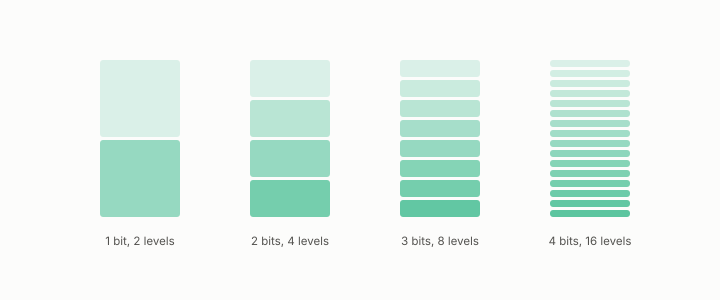

# matched bits

**id.** matched-bits
**kind.** instrument

## definition

The rule that two codes are compared only at the same bit count. At matched bits two codes with equal reconstruction error can still differ for a reader, which is the flip. Chapter 4 section 4.3.

## equation

none

## conditions

- The rule that two codes are compared only at the same bit count, since each added bit halves the step and quarters the squared error. At matched bits two codes with equal reconstruction error can still differ for a reader, and the flip is that difference.
- A comparison that was not bit-matched was refuted by the twenty-five percent codebook confound, and the redesign matched bits before any verdict was read.

Conditions are curated in `entries.toml` rather than read from a record.

## ledger

- *measures.* GO-2 (neg. half: not reconstruction) `[demonstrated]`. At matched bits, downstream preservation is not controlled by reconstruction error. [`geometric-observation/claims/LEDGER.md:63`](https://github.com/ahb-sjsu/geometric-observation/blob/d1f8988/claims/LEDGER.md#L63).

## first stated

Chapter 4 section 4.3 of *Data Mining as Observation*, with the bit-matched redesign in `geometric-observation/chapters/ch08_value.md:1-30`.

## measurements

none

## failures and corrections

none

## machine checked

`lean/DataMiningAsObservation/Bit.lean`, theorems `levels_succ`, `levels_add`, `step_succ`, `sqError_succ`, `sqError_antitone`, `levels_zero`, at observation-data-mining 08b4794.

`lean/DataMiningAsObservation/Isotropy.lean`, theorems `isotropic_reads_same`, `isotropic_no_flip`, `anisotropic_readers_differ`, `flip_iff_anisotropic`, at observation-data-mining 08b4794.

## used in

*Data Mining as Observation* chapters 4, 6, 12.

## related

bit, flip-the, budget, quantization, control

## see also

Book equations stated beside the entry's terms, not defining it: 4.2, 4.6, 0.15.

Ledger rows that cite the entry's records without naming it: GO-2 (pos. half: consumer-projected covariance *controls*), NEG-4.

Sources-table rows that share a record with the entry without naming it: chapter 1 section 1.4, chapter 3 section 3.3, chapter 4 section 4.3, chapter 4 section 4.6, chapter 6 section 6.2, chapter 8 section 8.2.

## status

Generated 2026-09-06 by `encyclopedia/generate.py`; book at observation-data-mining 08b4794; the commit of every record is listed in the encyclopedia's provenance.
