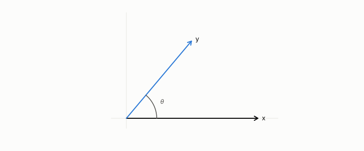

# metric

**id.** metric
**kind.** concept

## definition

A rule for the distance between two rows or two outputs. A distance is a choice of what to ignore, and a local metric on an output is a positive semidefinite matrix, a pseudometric until its kernel is quotiented out, which the book calls a metric by convention. Chapter 3 section 3.1 and chapter 0 section 0.5.

**Example.** Euclidean distance between (0, 0) and (3, 4) is 5, and a metric that ignores the second coordinate reads 3.

## equation

Book equation 3.1.

    \begin{gathered} d_O(u)=u^{\top}\Sigma\,u, \qquad u=(\cos15^\circ,\ \sin15^\circ), \\ \Sigma_1=\operatorname{diag}(0.3,1.7),\ \Sigma_2=\operatorname{diag}(1.7,0.3), \qquad d_O=0.394\ \text{vs}\ 1.606. \end{gathered}

Book equation 0.11.

    P_C(x)=J(x)^{\top}G\big(C(x)\big)\,J(x),\qquad J(x)=\frac{\partial C}{\partial x}(x),\qquad \bar P_{C,\mu}=\mathbb E_{\mu}\!\left[P_C(x)\right].

## conditions

- A rule for the distance between two rows, or between two outputs. A distance function is a choice of what to ignore, and the local metric on a consumer's output is the positive semidefinite matrix that says how a small change is scored. The squared Euclidean distance is symmetric and zero exactly between equal rows.
- A dataset-level loss, accuracy, F1, or a rank correlation is not a local metric and cannot be inserted into the read-operator formula, and the same two codes get opposite verdicts from two metrics.
- A positive semidefinite read form is a pseudometric until the directions in its kernel are quotiented out. The book calls it a metric by convention, on the quotient.

Conditions are curated in `entries.toml` rather than read from a record.

## ledger

none

## first stated

Chapter 3 section 3.1 and chapter 0 section 0.5 of *Data Mining as Observation*, with the read metric in `geometric-observation/chapters/ch05_the_read_metric_and_the_quotient.md:7-48`.

## measurements

none

## failures and corrections

none

## machine checked

[`lean/DataMiningAsObservation/EuclideanDistance.lean`](https://github.com/ahb-sjsu/observation-data-mining/blob/08b4794/lean/DataMiningAsObservation/EuclideanDistance.lean), theorems `distSq_eq_quad_one`, `distSq_comm`, `distSq_eq_zero_iff`, `ranking_flips`, at observation-data-mining 08b4794; what the check covers is stated in the book's [appendix C](https://github.com/ahb-sjsu/observation-data-mining/blob/08b4794/chapters/machine_checked.md).

[`lean/DataMiningAsObservation/OutputMetric.lean`](https://github.com/ahb-sjsu/observation-data-mining/blob/08b4794/lean/DataMiningAsObservation/OutputMetric.lean), theorems `neg_reverses`, `readOp_of_neg`, `cost_flips`, at observation-data-mining 08b4794; what the check covers is stated in the book's [appendix C](https://github.com/ahb-sjsu/observation-data-mining/blob/08b4794/chapters/machine_checked.md).

## used in

*Data Mining as Observation* chapters 0, 1, 2, 3, 4, 5, 6, 7, 8, 9, 10, 11, 12, 13, 14.

## related

output-metric, euclidean-distance, read-operator, quotient, geodesic-distance

## see also

Book equations stated beside the entry's terms, not defining it: 1.1.

Ledger rows that cite the entry's records without naming it: GO-EC-3.

Sources-table rows that share a record with the entry without naming it: chapter 2 section 2.2, chapter 3 section 3.2.

## status

Generated 2026-09-06 by `encyclopedia/generate.py`; book at observation-data-mining 08b4794; the commit of every record is listed in the encyclopedia's provenance.
