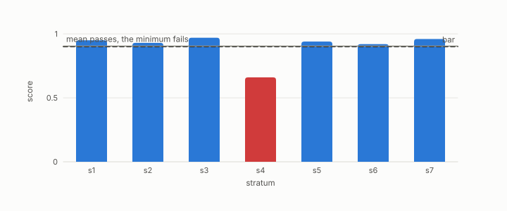

# min-over-strata

**id.** min-over-strata
**kind.** concept

## definition

The rule that a verdict over several groups is the worst group's verdict, with abstention counted as a verdict, never the average. Chapter 10.

## equation

Book equation 10.7.

    \text{verdict}=\min_{i:\ n_i\ge n_{\min},\ |Q_i|\ge q_{\min}}\ \mathrm{score}_i,\qquad \text{ABSTAIN otherwise}.

Book equation 14.5.

    \mathrm{FC}_g=\Pr\big[y=\text{violation}\ \big|\ \hat y=\text{clear},\ g\big],\qquad \text{verdict}=\max_{g:\ n_g\ge n_{\min}}\mathrm{FC}_g,\qquad \text{ABSTAIN otherwise}.

## conditions

- A verdict over several groups is the worst group's verdict, with a group too small to score counted as an abstention and reported, never averaged away.
- The first stratified run made two wrong predictions, and the record carries them at the size of the result.

Conditions are curated in `entries.toml` rather than read from a record.

## ledger

none

## first stated

The compression program's stratified evaluation, STRATA, in turboquant-pro, DOI 10.5281/zenodo.20660087, and chapter 10 section 10.4 of *Data Mining as Observation*.

## measurements

| Where the book states it | Numbers, as the book's sources table records them | Source |
|---|---|---|
| chapter 10 section 10.4 | area map, boundary rule, hash, refuse not warn, intra and transit counts, area classes, abstention rule | [`turboquant-pro/docs/STRATA_RFC.md:24-98`](https://github.com/ahb-sjsu/turboquant-pro/blob/856c4cb/docs/STRATA_RFC.md#L24-L98) |
| chapter 10 section 10.4 | first run, 350000 of 2391361 rows, 7 of 14 eligible, abstentions with 2 and 1 rows, Robin Hood 0.3447 to 0.4469 ratio 1.30 against 1.5, skew 2.68 to 4.40 ratio 1.64 against 3, 63 times sample range | [`turboquant-pro/docs/RESULTS_multilingual_strata.md:1-55`](https://github.com/ahb-sjsu/turboquant-pro/blob/856c4cb/docs/RESULTS_multilingual_strata.md#L1-L55) |

## failures and corrections

none

## machine checked

`lean/DataMiningAsObservation/Certificate.lean`, theorems `falseClear_mul_coverage`, `coverage_empty`, `falseClear_mem_unit`, `minOverStrata_passes_iff`, `minOverStrata_le_weighted_mean`, at observation-data-mining 08b4794.

## used in

*Data Mining as Observation* chapters 0, 10, 11, 14.

## related

false-clear-rate, coverage, hubness, certificate

## see also

Ledger rows that cite the entry's records without naming it: NEG-14.

Sources-table rows that share a record with the entry without naming it: chapter 2 section 2.6, chapter 3 section 3.5, chapter 8 section 8.1, chapter 8 section 8.4, chapter 8 section 8.7, chapter 8 section 8.10, chapter 10 section 10.2, chapter 10 section 10.4, chapter 10 section 10.5, chapter 11 section 11.4, chapter 11 section 11.6, chapter 12 section 12.2, chapter 12 section 12.4, chapter 13 section 13.1.

## status

Generated 2026-09-06 by `encyclopedia/generate.py`; book at observation-data-mining 08b4794; the commit of every record is listed in the encyclopedia's provenance.
