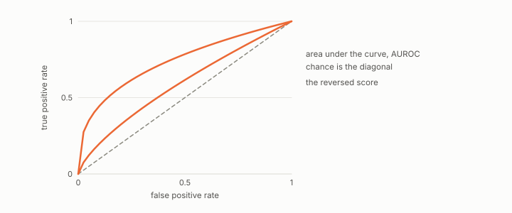

# Monotone Invariance Theorem

**id.** monotone-invariance
**kind.** result

## definition

A strictly monotone transform of a score in either direction cannot change its optimal thresholded F1, because the sweep tries thresholds both ways. A strictly increasing transform leaves the AUROC unchanged, and a strictly decreasing one sends it to one minus itself. Equation 6.2.

**Example.** Squaring a positive score keeps every ranking, so its AUROC and its optimal F1 are unchanged, and negating it sends AUROC 0.75 to 0.25.

## equation

Book equation 6.2.

    \begin{gathered} \max_{\tau,\ \mathrm{dir}}F_1\!\Big(\mathbf 1\big[\mathrm{dir}\big(g(f(X)),\tau\big)\big],\,y\Big)=\max_{\tau,\ \mathrm{dir}}F_1\!\Big(\mathbf 1\big[\mathrm{dir}\big(f(X),\tau\big)\big],\,y\Big) \\ \text{for every strictly monotone } g. \end{gathered}

## conditions

- Two statements with different scope. A strictly monotone transform of a score in either direction cannot change its optimal thresholded F1, because the sweep tries thresholds in both directions and so reaches every partition the transform can. A strictly increasing transform leaves the AUROC unchanged, and a strictly decreasing one sends it to 1 minus A.
- The F1 half licenses the pruning of monotone unary nodes in the formula search. The AUROC half licenses nothing about decreasing transforms. The Lean file states the increasing case, and the AUROC file states the reversal.

Conditions are curated in `entries.toml` rather than read from a record.

## ledger

none

## first stated

theory-radar, `theory-radar/paper/theory_radar_paper.tex:290-304` and `theory-radar/paper/astar_paper.tex:94-110`, DOI 10.5281/zenodo.20660206, and chapter 6 section 6.3 of *Data Mining as Observation*.

## measurements

| Where the book states it | Numbers, as the book's sources table records them | Source |
|---|---|---|
| chapter 5 section 5.4 | Monotone Invariance and AUROC invariance theorems, the AUROC to F1 bound via the Youden index, stated in the source for every ROC curve and corrected in the book to concave curves, with the counterexample at AUROC 0.75 and F1 0.857 | [`theory-radar/paper/astar_paper.tex:94-170`](https://github.com/ahb-sjsu/theory-radar/blob/37c4e6c/paper/astar_paper.tex#L94-L170); [`theory-radar/paper/theory_radar_paper.tex:290-304`](https://github.com/ahb-sjsu/theory-radar/blob/37c4e6c/paper/theory_radar_paper.tex#L290-L304) |
| chapter 6 section 6.3 | Monotone Invariance Theorem and its proof | [`theory-radar/paper/theory_radar_paper.tex:290-304`](https://github.com/ahb-sjsu/theory-radar/blob/37c4e6c/paper/theory_radar_paper.tex#L290-L304); [`theory-radar/paper/astar_paper.tex:94-110`](https://github.com/ahb-sjsu/theory-radar/blob/37c4e6c/paper/astar_paper.tex#L94-L110) |

## failures and corrections

none

## invariance envelope

none declared

## machine checked

[`lean/DataMiningAsObservation/MonotoneInvariance.lean`](https://github.com/ahb-sjsu/observation-data-mining/blob/95af30c/lean/DataMiningAsObservation/MonotoneInvariance.lean), theorems `aurocNum_comp`, `auroc_comp`, `predicted_comp`, `predictedBelow_comp`, `sweptF1_comp`, `sweptF1Below_comp`, `optF1_comp`, at observation-data-mining 95af30c; what the check covers is stated in the book's [appendix C](https://github.com/ahb-sjsu/observation-data-mining/blob/95af30c/chapters/machine_checked.md).

## used in

*Data Mining as Observation* chapters 0, 5, 6, 12.

## related

formula-search, safe-pruning, youden-f1-bound

## see also

none

## status

Generated 2026-09-09 by `encyclopedia/generate.py`; book at observation-data-mining 95af30c; the commit of every record is listed in the encyclopedia's provenance.
