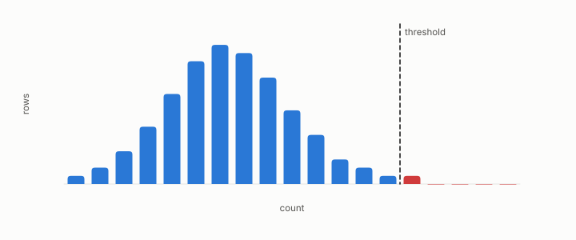

# multiple comparisons

**id.** multiple-comparisons
**kind.** concept

## definition

The inflation of false positives when many hypotheses are tested and the best is reported. The rate one minus one minus alpha to the m assumes independent tests, and the Bonferroni bound, which divides the threshold by the number of tests, holds under any dependence. Chapter 0 section 0.9.

**Example.** Forty independent tests at 5 percent pass at least one by chance 87 percent of the time, and Bonferroni tests each at 0.125 percent.

## equation

Book equation 8.3.

    \Pr[\text{at least one of } m\text{ null tests passes}]=1-(1-\alpha)^{m},\qquad \alpha_{\mathrm{Bonferroni}}=\frac{\alpha}{m}.

## conditions

- The inflation of false positives when many hypotheses are tested and the best is reported. The chance that at least one of m independent tests at level alpha is a false positive is one minus one minus alpha to the m, which needs the tests to be independent. The Bonferroni bound, m times alpha, is a union bound and holds under any dependence, and dividing the level by m keeps the family-wise rate at alpha.
- Five hundred of ten thousand null hypotheses pass at five percent, and a harness that searches many formulas or thresholds and reports the best has run that many tests.

Conditions are curated in `entries.toml` rather than read from a record.

## ledger

none

## first stated

Chapter 0 section 0.9 and chapter 8 section 8.5 of *Data Mining as Observation*, with the program's own case in `constraint-gap/review/FINDINGS.md:1-35`.

## measurements

none

## failures and corrections

none

## machine checked

[`lean/DataMiningAsObservation/MultipleComparisons.lean`](https://github.com/ahb-sjsu/observation-data-mining/blob/95af30c/lean/DataMiningAsObservation/MultipleComparisons.lean), theorems `max_ge_each`, `book_numbers`, `corrected_family_rate`, `expectedPasses_unbounded`, at observation-data-mining 95af30c; what the check covers is stated in the book's [appendix C](https://github.com/ahb-sjsu/observation-data-mining/blob/95af30c/chapters/machine_checked.md).

## used in

*Data Mining as Observation* chapters 0, 5, 8.

## related

harness, nadeau-and-bengio-correction, preregistration, formula-search

## see also

Sources-table rows that share a record with the entry without naming it: chapter 6 section 6.4, chapter 7 section 7.3, chapter 7 section 7.4, chapter 8 section 8.5.

## status

Generated 2026-09-07 by `encyclopedia/generate.py`; book at observation-data-mining 95af30c; the commit of every record is listed in the encyclopedia's provenance.
