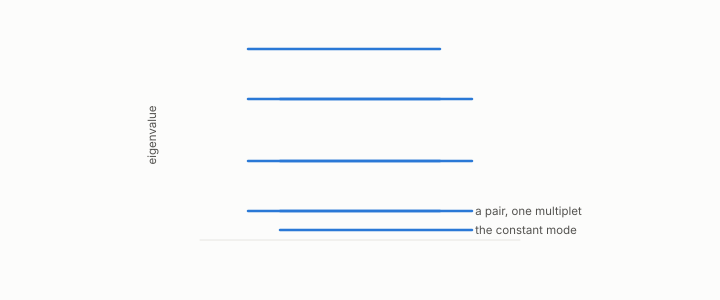

# multiplet

**id.** multiplet
**kind.** concept

## definition

A group of eigenvalues that are equal or nearly so, whose pattern names the shape a dataset lies on against a finite list of templates. On a finite graph the groups are approximate. Chapter 9.

**Example.** The cycle on 8 nodes has eigenvalues 0, 0.586, 0.586, 2, 2, 3.414, 3.414, and 4.

## equation

none

## conditions

- A group of eigenvalues that are equal or nearly so. The cycle's Laplacian eigenvalue at k equals the one at n minus k, so every eigenvalue of the discrete circle other than the constant mode and, for even n, the alternating mode appears twice.
- Symmetric shapes produce multiplets in the continuum, the sphere in groups of three, five, seven. On a finite neighbourhood graph the multiplets are approximate, their spacing depends on sampling and graph construction, and the recognizer reads them against a finite list of templates and refuses when none matches.

Conditions are curated in `entries.toml` rather than read from a record.

## ledger

none

## first stated

Chapter 0 section 0.15 and chapter 9 section 9.2 of *Data Mining as Observation*, with the program's recognizer in `geometric-observation/chapters/ch11_the_recognizer.md:1-95`.

## measurements

| Where the book states it | Numbers, as the book's sources table records them | Source |
|---|---|---|
| chapter 9 section 9.2 | the recognizer's mechanism, low multiplets and angular distances, dimension before shape by Weyl's law, refusal, the growth gotcha | [`geometric-observation/chapters/ch11_the_recognizer.md:1-95`](https://github.com/ahb-sjsu/geometric-observation/blob/fc6b378/chapters/ch11_the_recognizer.md#L1-L95) |

## failures and corrections

none

## invariance envelope

none declared

## machine checked

[`lean/DataMiningAsObservation/Multiplet.lean`](https://github.com/ahb-sjsu/observation-data-mining/blob/6aebdf3/lean/DataMiningAsObservation/Multiplet.lean), theorems `cycleEig_zero`, `cycleEig_nonneg`, `cycleEig_le_four`, `cycleEig_pair`, `pair_distinct`, at observation-data-mining 6aebdf3; what the check covers is stated in the book's [appendix C](https://github.com/ahb-sjsu/observation-data-mining/blob/6aebdf3/chapters/machine_checked.md).

## used in

*Data Mining as Observation* chapters 0, 9.

## related

laplacian, recognizer, manifold, weyls-law, eigenvalue-eigenvector

## see also

Book equations stated beside the entry's terms, not defining it: 0.19, 0.31, 9.2.

Sources-table rows that share a record with the entry without naming it: chapter 9 section 9.2.

## status

Generated 2026-09-09 by `encyclopedia/generate.py`; book at observation-data-mining 6aebdf3; the commit of every record is listed in the encyclopedia's provenance.
