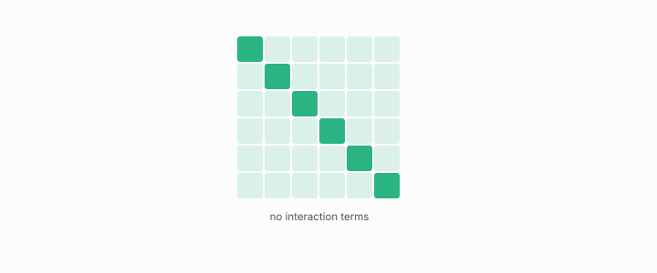

# naive Bayes

**id.** naive-bayes
**kind.** instrument

## definition

A classifier that multiplies one-dimensional likelihoods and adds their logs, so that each feature's contribution is the same whatever the others are and it cannot read an interaction. Chapter 6.

**Example.** Two features with likelihood ratios 3 and 2 give a combined ratio of 6, whatever the other features are.

## equation

none

## conditions

- A classifier that multiplies one-dimensional likelihoods and adds their logs. The log of the product is the sum of the logs, the log odds add across features, and one feature's contribution is the same whatever the others are, so the score has no interaction terms and its Hessian is diagonal.
- What naive Bayes cannot read is the interaction, which is a limit of the model class rather than a direction in its kernel, and its read operator is still not diagonal in general because two sensitivities can rise and fall together across rows.

Conditions are curated in `entries.toml` rather than read from a record.

## ledger

none

## first stated

Chapter 6 section 6.1 of *Data Mining as Observation*, after TSK chapter 4.

## measurements

none

## failures and corrections

none

## invariance envelope

none declared

## machine checked

[`lean/DataMiningAsObservation/NaiveBayes.lean`](https://github.com/ahb-sjsu/observation-data-mining/blob/95af30c/lean/DataMiningAsObservation/NaiveBayes.lean), theorems `log_likelihood_sum`, `log_odds_sum`, `contribution_independent`, at observation-data-mining 95af30c; what the check covers is stated in the book's [appendix C](https://github.com/ahb-sjsu/observation-data-mining/blob/95af30c/chapters/machine_checked.md).

## used in

*Data Mining as Observation* chapters 6.

## related

classifier, hessian, confidence, logistic-regression

## see also

Book equations stated beside the entry's terms, not defining it: 6.1, 0.9.

Sources-table rows that share a record with the entry without naming it: chapter 2 section 2.3, chapter 6 section 6.1.

## status

Generated 2026-09-08 by `encyclopedia/generate.py`; book at observation-data-mining 95af30c; the commit of every record is listed in the encyclopedia's provenance.
