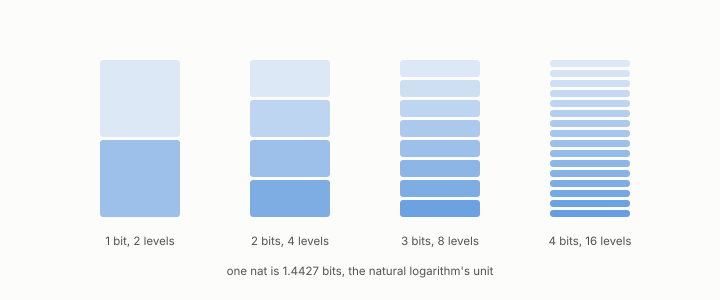

# nat

**id.** nat
**kind.** concept

## definition

The unit of information measured with the natural logarithm, between 1.4426 and 1.4427 bits. Chapter 0 section 0.7.

**Example.** 0.10 nats is 0.144 bits, and 1 bit is 0.693 nats.

## equation

none

## conditions

- The unit of information measured with the natural logarithm, as a bit is measured with the logarithm to base two. The two conversions undo each other, the conversion is monotone, and one nat is between 1.4426 and 1.4427 bits.
- The omission floor was measured at 0.10 nats against about six in ten million on sixteen of sixteen heads, and Landauer's bound is stated per nat as kT and per bit as kT times the log of two.

Conditions are curated in `entries.toml` rather than read from a record.

## ledger

none

## first stated

Chapter 0 section 0.7 of *Data Mining as Observation*, with the omission floor in nats in `geometric-observation/chapters/ch07_cost.md`.

## measurements

| Where the book states it | Numbers, as the book's sources table records them | Source |
|---|---|---|
| chapter 2 section 2.4 | C-7, sixteen points in 128 dimensions, rank fifteen, near ten to the eleventh nats, refuses when samples do not exceed dimension, warns below five per dimension, loading is a property of two distributions | [`readscope/SPEC.md:653-680`](https://github.com/ahb-sjsu/readscope/blob/856e678/SPEC.md#L653-L680) |
| chapter 4 section 4.2 | floor measured on 16 of 16 heads, naive assumption off 20 to 60 percent, about 100000 times, 0.10 nats against about 6e-7, first gate missed 0 of 16, NEG-13 | [`geometric-observation/chapters/ch07_cost.md`](https://github.com/ahb-sjsu/geometric-observation/blob/aec4c97/chapters/ch07_cost.md); [`geometric-observation/claims/LEDGER.md`](https://github.com/ahb-sjsu/geometric-observation/blob/aec4c97/claims/LEDGER.md) GO-P-2026-027 and NEG-13 |

## failures and corrections

none

## invariance envelope

none declared

## machine checked

[`lean/DataMiningAsObservation/NatUnit.lean`](https://github.com/ahb-sjsu/observation-data-mining/blob/95af30c/lean/DataMiningAsObservation/NatUnit.lean), theorems `log_two_pos`, `nats_bits`, `bits_nats`, `bitsOfNats_mono`, `one_nat_in_bits`, at observation-data-mining 95af30c; what the check covers is stated in the book's [appendix C](https://github.com/ahb-sjsu/observation-data-mining/blob/95af30c/chapters/machine_checked.md).

[`lean/DataMiningAsObservation/Bit.lean`](https://github.com/ahb-sjsu/observation-data-mining/blob/95af30c/lean/DataMiningAsObservation/Bit.lean), theorems `levels_succ`, `levels_add`, `step_succ`, `sqError_succ`, `sqError_antitone`, `levels_zero`, at observation-data-mining 95af30c; what the check covers is stated in the book's [appendix C](https://github.com/ahb-sjsu/observation-data-mining/blob/95af30c/chapters/machine_checked.md).

## used in

*Data Mining as Observation* chapters 0, 2, 4.

## related

bit, budget, landauers-principle, perplexity, kl-divergence

## see also

Book equations stated beside the entry's terms, not defining it: 0.15, 4.2, 0.16.

Ledger rows that cite the entry's records without naming it: GO-7, NEG-13 → resolved.

Sources-table rows that share a record with the entry without naming it: chapter 2 section 2.4, chapter 2 section 2.6, chapter 4 section 4.2, chapter 8 section 8.4, chapter 11 section 11.3, chapter 11 section 11.7, chapter 11 section 11.9.

## status

Generated 2026-09-09 by `encyclopedia/generate.py`; book at observation-data-mining 95af30c; the commit of every record is listed in the encyclopedia's provenance.
