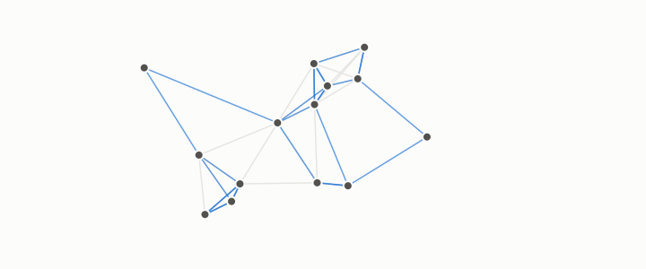

# nearest neighbour

**id.** nearest-neighbour
**kind.** concept

## definition

A row at minimal distance from a query. A strictly increasing transform of the distance names the same nearest neighbours, so the classifier reads the distance's order and nothing else. Chapter 6.

**Example.** Among rows at distances 0.9, 0.4, and 1.2 from a query, the second is the nearest, under any increasing rescaling of the distances.

## equation

none

## conditions

- A row at minimal distance from a query under a chosen distance. A strictly increasing transform of the distance names the same nearest neighbours, so a nearest-neighbour classifier reads the distance's order and nothing else, a row is its own nearest neighbour, and two nearest neighbours sit at the same distance.
- Under Euclidean distance the classifier reads every standardized coordinate equally and under cosine it reads the angle, so it inherits the distance's quotient, and the rows that appear in many neighbour lists are the hubs.

Conditions are curated in `entries.toml` rather than read from a record.

## ledger

none

## first stated

Cover and Hart, nearest neighbor pattern classification, 1967, as chapter 6 section 6.1 of *Data Mining as Observation* reads it, with the neighbour lists of `openvector-bench/openvector_bench/hubness.py:41-100`.

## measurements

none

## failures and corrections

none

## invariance envelope

none declared

## machine checked

[`lean/DataMiningAsObservation/NearestNeighbour.lean`](https://github.com/ahb-sjsu/observation-data-mining/blob/a0db6a8/lean/DataMiningAsObservation/NearestNeighbour.lean), theorems `nearest_comp`, `nearest_smul`, `self_nearest`, `nearest_same_distance`, at observation-data-mining a0db6a8; what the check covers is stated in the book's [appendix C](https://github.com/ahb-sjsu/observation-data-mining/blob/a0db6a8/chapters/machine_checked.md).

[`lean/DataMiningAsObservation/Graph.lean`](https://github.com/ahb-sjsu/observation-data-mining/blob/a0db6a8/lean/DataMiningAsObservation/Graph.lean), theorems `outDegree`, `mutual_symm`, `mutual_sub`, `mutualNbrs_card_le`, `mem_mutualNbrs`, at observation-data-mining a0db6a8; what the check covers is stated in the book's [appendix C](https://github.com/ahb-sjsu/observation-data-mining/blob/a0db6a8/chapters/machine_checked.md).

## used in

*Data Mining as Observation* primer S, chapters 0, 3, 6, 8, 10, 11, 12.

## related

neighbourhood-graph, hub, recall-at-k, euclidean-distance, cosine

## see also

Book equations stated beside the entry's terms, not defining it: 3.1, 0.19, 10.3.

Ledger rows that cite the entry's records without naming it: NEG-11.

Sources-table rows that share a record with the entry without naming it: chapter 3 section 3.5.

## status

Generated 2026-09-09 by `encyclopedia/generate.py`; book at observation-data-mining a0db6a8; the commit of every record is listed in the encyclopedia's provenance.
