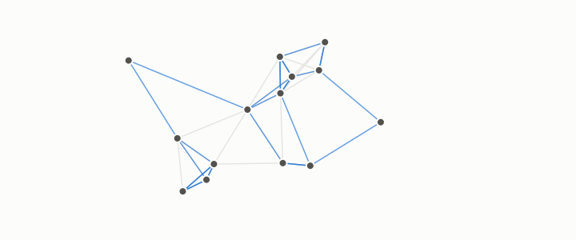

# neighbourhood graph

**id.** neighbourhood-graph
**kind.** concept

## definition

A graph on a dataset that joins each row to its k nearest rows, or to every row within a radius. Chapter 0 section 0.10.

**Example.** A 5-nearest-neighbour graph on 1000 rows has 5000 out-edges, five from each row.

## equation

Book equation 0.20.

    \Psi_i=\left(\frac{u_k(i)}{\sqrt{\lambda_k\,d_i}}\right)_{k\ge2},\qquad \|\Psi_i-\Psi_j\|^{2}=R(i,j)=\frac{C(i,j)}{\operatorname{vol}(G)}.

## conditions

- A graph on a dataset that joins each row to its k nearest rows, or to every row within a radius. Every node of a k-nearest graph has out-degree k, the mutual neighbours of a node are at most k, and being mutual neighbours is symmetric.
- As the graph grows on a manifold its low Laplacian eigenvectors converge to the smoothest functions on the manifold, so the embedding becomes a picture of the manifold, and the hubs of the graph are a property of the queries that built it.

Conditions are curated in `entries.toml` rather than read from a record.

## ledger

none

## first stated

Chapter 0 section 0.10 of *Data Mining as Observation*, with the substrate table in `the-angular-observer/README.md:99-109`.

## measurements

none

## failures and corrections

none

## invariance envelope

none declared

## machine checked

[`lean/DataMiningAsObservation/Graph.lean`](https://github.com/ahb-sjsu/observation-data-mining/blob/c149a10/lean/DataMiningAsObservation/Graph.lean), theorems `outDegree`, `mutual_symm`, `mutual_sub`, `mutualNbrs_card_le`, `mem_mutualNbrs`, at observation-data-mining c149a10; what the check covers is stated in the book's [appendix C](https://github.com/ahb-sjsu/observation-data-mining/blob/c149a10/chapters/machine_checked.md).

## used in

*Data Mining as Observation* chapters 0, 3, 9, 11.

## related

graph, degree, laplacian, spectral-embedding, geodesic-distance, hub

## see also

Book equations stated beside the entry's terms, not defining it: 0.19, 3.3.

Ledger rows that cite the entry's records without naming it: NEG-1.

Sources-table rows that share a record with the entry without naming it: chapter 3 section 3.3, chapter 9 section 9.1, chapter 9 section 9.2.

## status

Generated 2026-09-09 by `encyclopedia/generate.py`; book at observation-data-mining c149a10; the commit of every record is listed in the encyclopedia's provenance.
