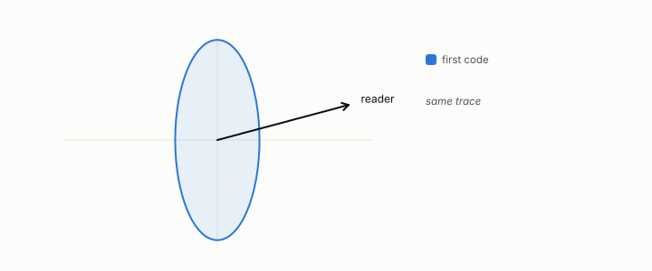

# nuisance

**id.** nuisance
**kind.** concept

## definition

The directions of the data a consumer cannot distinguish, the kernel of its read operator. Chapter 1.

**Example.** For the consumer x1 + x2, the direction (1, −1) is nuisance: moving along it changes nothing.

## equation

none

## conditions

- The nuisance is the kernel of the workload-averaged read operator, the set of directions unread at almost every row of that workload, since the kernel of the average is the intersection of the local kernels.
- For a nonlinear consumer a null direction can turn with the row, so the nuisance of the average is not a global equivalence of inputs, and cosine similarity's radial direction is the case.
- A transform is safe when the reader it produces still resolves the read subspace, and discretization is safe only when the values it merges differ in nuisance directions.

Conditions are curated in `entries.toml` rather than read from a record.

## ledger

- *measures.* GO-1 `[predicted]`. The consumer's invariant/nuisance split is identifiable ex ante from the consumer functional. [`geometric-observation/claims/LEDGER.md:62`](https://github.com/ahb-sjsu/geometric-observation/blob/fc6b378/claims/LEDGER.md#L62).

## first stated

Volume 14, chapter 5, `geometric-observation/chapters/ch05_the_read_metric_and_the_quotient.md:7-48`, DOI 10.5281/zenodo.21776291, where the nuisance is the kernel of the read operator.

## measurements

none

## failures and corrections

none

## invariance envelope

**Survived.**

- OD:observer-family, change of observer within a declared family: read operators of declared spectrum, coordinate subsets, coarsenings, and learned consumers' recovered read operators. Claim: An observer with a kernel reads a smaller exponent than the classical one when an unread direction grows faster (World K, mu = 2), the same when it grows slower (mu = 1/2), and a kernel-started perturbation reads a transiently larger exponent that converges. `experiments/OD/D3/grade.json K1, K1c, K2, K3`. Witness: gap 0.82 to 1.25 in 64 of 64 starts at mu = 2 with the classical exponent at its predicted 1.965; control equal within 0.0072; kernel starts larger on the first window in 83 to 98 percent of starts with median excess +1.5 to +3.5 falling to 0.09 to 0.17 by T = 20; generic starts under every projection within 0.035 of the classical exponent at T = 20. Absorbed by: .

## machine checked

[`lean/DataMiningAsObservation/ReadOperator.lean`](https://github.com/ahb-sjsu/observation-data-mining/blob/6aebdf3/lean/DataMiningAsObservation/ReadOperator.lean), theorems `rank_one_reads_one_direction`, `readOp_mulVec`, `quad_readOp`, `quad_readOp_nonneg`, `readOp_mulVec_eq_zero_iff`, `readOp_diag`, `readOp_offdiag`, `readOp_symm`, `readOp_neg`, `affine_const_along_nuisance`, `readOp_affine`, `readOp_sqLength_basis`, at observation-data-mining 6aebdf3; what the check covers is stated in the book's [appendix C](https://github.com/ahb-sjsu/observation-data-mining/blob/6aebdf3/chapters/machine_checked.md).

## used in

*Data Mining as Observation* chapters 1, 2, 3, 6, 9, 11, 12, 13.

## related

read-subspace, read-operator, quotient, identity-reader

## see also

Book equations stated beside the entry's terms, not defining it: 0.12a, 0.12b.

Ledger rows that cite the entry's records without naming it: NEG-6, NEG-7.

Sources-table rows that share a record with the entry without naming it: chapter 2 section 2.2, chapter 6 section 6.2, chapter 11 section 11.7.

## status

Generated 2026-09-09 by `encyclopedia/generate.py`; book at observation-data-mining 6aebdf3; the commit of every record is listed in the encyclopedia's provenance.
