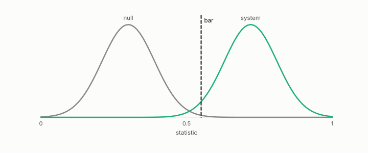

# null model

**id.** null-model
**kind.** instrument

## definition

A version of the data with the structure under test removed and everything else kept, the right comparison for any measured statistic. Chapter 0 section 0.9.

**Example.** Shuffling the labels 1000 times and rescoring gives the null distribution the measured score is compared against.

## equation

Book equation 0.17.

    \Pr[X\ge c]=1-\sum_{i<c}e^{-\mu}\frac{\mu^{i}}{i!},\qquad c^{\star}=\max\{c:\ n\Pr[X\ge c]\ge 1\},\qquad \mu=\frac{n_q\,k}{n}.

Book equation 8.3.

    \Pr[\text{at least one of } m\text{ null tests passes}]=1-(1-\alpha)^{m},\qquad \alpha_{\mathrm{Bonferroni}}=\frac{\alpha}{m}.

## conditions

- A version of the data with the structure under test removed and everything else kept. A label permutation keeps every class size and the bag of scores, so any statistic that reads only class sizes or only scores is unchanged by it, and only a statistic that reads the pairing between score and label can move.
- That is what makes the permuted statistic the right comparison, and the excess over the null mean is the number a chapter reports. A number without its null is not yet a finding, and the drift claim that lost half its size to a paired null is the ledger's case.

Conditions are curated in `entries.toml` rather than read from a record.

## ledger

none

## first stated

Chapter 0 section 0.9 and chapter 8 section 8.4 of *Data Mining as Observation*, with the program's Poisson, paired, and permutation nulls in openvector-bench, readscope, and the encoder gate.

## measurements

none

## failures and corrections

none

## invariance envelope

none declared

## machine checked

[`lean/DataMiningAsObservation/NullModel.lean`](https://github.com/ahb-sjsu/observation-data-mining/blob/f3914f0/lean/DataMiningAsObservation/NullModel.lean), theorems `card_pos_perm`, `scores_perm`, `stat_of_counts_const`, `excess_eq_zero_iff`, at observation-data-mining f3914f0; what the check covers is stated in the book's [appendix C](https://github.com/ahb-sjsu/observation-data-mining/blob/f3914f0/chapters/machine_checked.md).

## used in

*Data Mining as Observation* primers L and S, chapters 0, 2, 3, 4, 5, 8, 9, 10, 11, 12, 14.

## related

poisson-ceiling, chance-level, cross-corpus-gate, p-value, harness

## see also

Ledger rows that cite the entry's records without naming it: OT-4, NEG-15 (Bell boundary).

## status

Generated 2026-09-12 by `encyclopedia/generate.py`; book at observation-data-mining f3914f0; the commit of every record is listed in the encyclopedia's provenance.
