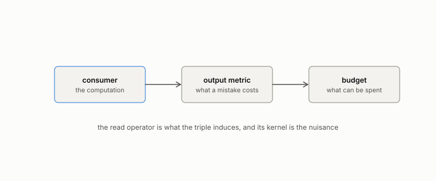

# observer

**id.** observer
**kind.** concept

## definition

A consumer, its output metric, and its budget, written as the triple in equation 1.1. Naming all three is what every later chapter checks.

**Example.** A cosine ranker with rank order as its metric and 1000 candidates as its budget is one observer.

**Known as, or related to prior art.** The observer triple extends the active-subspace matrix with an output metric, a budget, and an audit discipline.

## equation

Book equation 1.1.

    O=(C,\ G,\ B).

Book equation 0.11.

    P_C(x)=J(x)^{\top}G\big(C(x)\big)\,J(x),\qquad J(x)=\frac{\partial C}{\partial x}(x),\qquad \bar P_{C,\mu}=\mathbb E_{\mu}\!\left[P_C(x)\right].

## conditions

- An observer is a consumer, its output metric, and its budget. The consumer and the local geometry of its output metric determine the read operator. The budget bounds what of it can be measured and used and changes it only by changing the consumer.
- Two consumers with the same read operator on the same workload share a read geometry and are not thereby the same observer, since the consumer stays part of the triple and a sign change reverses every ranking.
- The output metric is a loss on the consumer's output. Where it has a local quadratic representation, that local geometry enters the read operator. A dataset-level loss has none, and the read operator is then taken on the score with the identity geometry.

Conditions are curated in `entries.toml` rather than read from a record.

## ledger

none

## first stated

Volume 14, chapter 4, `geometric-observation/chapters/ch04_the_observer_triple.md:9-60`, and `geometric-observation/OBSERVATION.md:1-10`, DOI 10.5281/zenodo.21776291. Version 1.0 of the theory was declared on 2026-08-18 in `geometric-observation/crucible/DECLARATION-V1.md`.

## measurements

| Where the book states it | Numbers, as the book's sources table records them | Source |
|---|---|---|
| chapter 1 section 1.2 | the observer triple, read subspace, nuisance, same read operator means same read geometry | [`geometric-observation/chapters/ch04_the_observer_triple.md:9-60`](https://github.com/ahb-sjsu/geometric-observation/blob/fc6b378/chapters/ch04_the_observer_triple.md#L9-L60); [`geometric-observation/OBSERVATION.md:1-10`](https://github.com/ahb-sjsu/geometric-observation/blob/fc6b378/OBSERVATION.md#L1-L10) |
| chapter 6 section 6.1 | the classifier row of the consumer table, the output metric makes a different observer | [`geometric-observation/chapters/ch04_the_observer_triple.md:60-135`](https://github.com/ahb-sjsu/geometric-observation/blob/fc6b378/chapters/ch04_the_observer_triple.md#L60-L135) |

## failures and corrections

none

## invariance envelope

**Survived.**

- OD:observer-family, change of observer within a declared family: read operators of declared spectrum, coordinate subsets, coarsenings, and learned consumers' recovered read operators. Claim: For a positive definite read operator with spectrum in [a, b] the observational and classical window exponents differ by at most log(b / a) / (2 (T - t0)) (article Proposition 1, lean/GET/Horizon.lean). `experiments/DISCOVERY-TRACK.md, D3 record; experiments/OD/D3/grade.json exact E1`. Witness: 3,200 of 3,200 windows on Lorenz-63 and Lorenz-96 under an anisotropic observer with b / a = 16 and 4; the worst ratio to the bound 0.96 in the pilot, so the bound is nearly attained. Absorbed by: .
- OD:observer-family, change of observer within a declared family: read operators of declared spectrum, coordinate subsets, coarsenings, and learned consumers' recovered read operators. Claim: An observer with a kernel reads a smaller exponent than the classical one when an unread direction grows faster (World K, mu = 2), the same when it grows slower (mu = 1/2), and a kernel-started perturbation reads a transiently larger exponent that converges. `experiments/OD/D3/grade.json K1, K1c, K2, K3`. Witness: gap 0.82 to 1.25 in 64 of 64 starts at mu = 2 with the classical exponent at its predicted 1.965; control equal within 0.0072; kernel starts larger on the first window in 83 to 98 percent of starts with median excess +1.5 to +3.5 falling to 0.09 to 0.17 by T = 20; generic starts under every projection within 0.035 of the classical exponent at T = 20. Absorbed by: .
- OD:observer-family, change of observer within a declared family: read operators of declared spectrum, coordinate subsets, coarsenings, and learned consumers' recovered read operators. Claim: A change of the observer's spectrum changes the hub sets more than a change of its orientation at a fixed spectrum (hub-set Jaccard overlap across orientations above that across spectra). `experiments/OD/D2/grade.json P1`. Witness: in all 26 worlds, Gaussian, uniform, heavy-tailed, mixture, Wikipedia and SIFT, at N from 2000 to 16000: overlap 0.19 to 0.45 across orientations against 0.03 to 0.29 across spectra. Absorbed by: .
- OD:observer-family, change of observer within a declared family: read operators of declared spectrum, coordinate subsets, coarsenings, and learned consumers' recovered read operators. Claim: An observer's horizon offset from the full reader at budget B equals the first-passage time Delta_O(B) = E_s[inf{t >= s : L(t) - L(s) + g_O(t) >= log B} - inf{t >= s : L(t) - L(s) >= log B}] of its read-fraction process along the leading Lyapunov direction, computed on an independent long trajectory (the horizon offset law). `experiments/DISCOVERY-TRACK.md, D3v2 record; experiments/OD/D3v2/grade.json`. Witness: all 22 cells (eleven observers of Lorenz-63 and Lorenz-96 at B = 1000 and 10000) within 0.259 time units, largest error 0.149; signs and the Lorenz-63 order exact; the symmetric site blocks of Lorenz-96 equal within 0.07; anisotropic offsets inside the D3 bracket; the constant-fraction approximation -E[log f_O] / lambda_1, refuted by the first probe, wrong by 0.09 to 1.0 on the same rows. Absorbed by: . Revision: the law replaced the constant-fraction statement before any pilot; recorded in the registration's Section 7.
- OD:simulation-resolution, change of the simulation resolution N at fixed observation budget B, for dynamical systems. Claim: The horizon offset law holds across a change of dynamical system, from Lorenz-63 (exponent 0.906) to Lorenz-96 at N = 40 (exponent 1.699). `experiments/OD/D3v2/grade.json O1 by world`. Witness: Lorenz-96 errors 0.001 to 0.138 over four observers and two budgets, Lorenz-63 0.014 to 0.149 over seven. Absorbed by: .
- OD:observer-family, change of observer within a declared family: read operators of declared spectrum, coordinate subsets, coarsenings, and learned consumers' recovered read operators. Claim: Hub sets overlap more across orientations than across spectra, and the cross-observer matrix is low-rank against its shuffled null, in every family, corpus and size. `experiments/OD/D2v2/grade.json P1, X1`. Witness: 44 of 44 worlds for both: overlap gap at least 0.08; rank ratios 0.09 to 0.69, the largest on the sphere and the balls. Absorbed by: .
- OD:world-transfer, transfer of a law frozen on synthetic worlds to embedding corpora, ANN corpora, and dynamical state spaces without retuning. Claim: Across three registrations with one declared feature family and one search, the law discovered depends on the discovery set alone: Gaussian clouds give a concentration law, seven full-dimensional families give a shape-blind spectral law, manifold worlds give an intrinsic-dimension law that fits real embeddings. `experiments/OD/D2/law.json, experiments/OD/D2v2/law.json, experiments/OD/D2v3/law.json`. Witness: the frozen laws of D2, D2v2 and D2v3 and their errors on the same real corpora: 5.3 and 4.1 (D2), 2.5 and 2.3 (D2v2), 1.0 and 0.2 (D2v3) on the two Wikipedia slices of each run. Absorbed by: .

**Boundary measured.**

- OD:observer-family, change of observer within a declared family: read operators of declared spectrum, coordinate subsets, coarsenings, and learned consumers' recovered read operators. Claim: At fixed budget the horizon depends on the observer where no symmetry of the flow relates the observers (Lorenz-63, x against z) and not where one does (Lorenz-96, one block of ten sites against the next). `experiments/DISCOVERY-TRACK.md, D3 record; experiments/OD/D3/grade.json H2`. Boundary: x later than z for the same perturbation in 77, 78, 70 and 64 percent of pairs at B = 10, 100, 1000, 10000 with sign-test p 0.0000, 0.0000, 0.0022 and 0.033 against the registered 0.01 at every budget; the Lorenz-96 control at p 0.11 to 0.86. Witness: the paired effect weakens as the budget grows and the perturbation aligns with the leading direction for longer, so a fixed per-budget level over the ladder was the wrong registration, not the wrong claim; the pilot at the same budget had 77 percent and p below 0.0001. Absorbed by: declaration. Revision: none for the claim; for later gates, declare the level per budget or grade the ladder as a whole.
- OD:observer-family, change of observer within a declared family: read operators of declared spectrum, coordinate subsets, coarsenings, and learned consumers' recovered read operators. Claim: The cross-observer hubness matrix has effective rank at most 0.48 of its column-shuffled null. `experiments/OD/D2/grade.json X1`. Boundary: ratios 0.10 to 0.30 in 23 of 26 worlds; 0.44 and 0.59 for the 64- and 128-dimensional uniform balls and 0.42 for the Wikipedia scale cell, the least concentrated clouds. Witness: the limit was fixed from Gaussian pilots (largest ratio 0.31 times 1.5); the latent structure is present everywhere and weakest where the cloud is roundest. Absorbed by: declaration.
- OD:world-transfer, transfer of a law frozen on synthetic worlds to embedding corpora, ANN corpora, and dynamical state spaces without retuning. Claim: The hubness law frozen on seven synthetic families, log(1 + skew) = 2.811 + 0.0047 d_ent - 0.0928 / cv_d - 2.461 sqrt(top_share), predicts hubness on families it was not discovered on, on real embeddings and at larger N within declared multiples of its pilot error, and beats the nominal-dimension formula and the frozen D2 law. `experiments/DISCOVERY-TRACK.md, D2v2 record; experiments/OD/D2v2/grade.json`. Boundary: survives on all eight unseen synthetic families (0.37 to 1.41 against 1.84), on SIFT base and queries (1.27, 0.75) and within 3 REF on Wikipedia (2.54, 2.37 against 2.77); misses the heavy-tail and Wikipedia scale cells (2.26, 2.55 against 1.84) and loses to a constant in k and N on the Wikipedia slices (1.41, 1.29); beats the D2 law in 14 of 16 transfer worlds and both competitors pooled (1.45 against 2.20 and 2.85). Witness: Wikipedia embeddings have TwoNN intrinsic dimension 8 to 20 at entropy dimension up to 320 and skewness at most 1.5; the intrinsic dimension was in the declared pool and the search dropped it, since on full-dimensional discovery families it duplicates the spectral dimension. Absorbed by: declaration. Revision: D2v3 would put clouds on embedded manifolds into the discovery families so that the intrinsic dimension becomes informative; not registered here.
- OD:world-transfer, transfer of a law frozen on synthetic worlds to embedding corpora, ANN corpora, and dynamical state spaces without retuning. Claim: The hubness law frozen on eleven families including four manifold families, log(1 + skew) = -1.463 - 0.013 / cv_knn + 0.748 log(id_twonn) + 0.069 sqrt(d_eff), predicts hubness on unseen families and manifolds, on real embeddings and at larger N within declared multiples of its pilot error, and beats the nominal formula and the frozen D2 and D2v2 laws. `experiments/DISCOVERY-TRACK.md, D2v3 record; experiments/OD/D2v3/grade.json`. Boundary: real corpora within REF for the first time (Wikipedia 1.00 and 0.21, SIFT 0.44 and 0.37 against 2.24); eight of ten unseen worlds within 1.49 and the group pooled at 1.18 against 1.12; Laplace (1.93) and the 256-dimensional cube (2.69) outside; heavy tails at N = 16000 at 1.91 against 1.49; beats all three competitors pooled (1.05 against 3.58, 2.77, 1.69) and within every group. Witness: the intrinsic dimension became the law's main term once the discovery set held clouds whose intrinsic dimension sits below their spectral one; the misses are where TwoNN leaves its calibrated regime (125 on a 4,000-point cube in 256 dimensions) or where tails outrun every training family. Absorbed by: declaration. Revision: a D2v4 would bound the intrinsic-dimension term or add full-dimensional worlds at d = 256 and heavier tails to the discovery set; not registered here.
- OD:world-transfer, transfer of a law frozen on synthetic worlds to embedding corpora, ANN corpora, and dynamical state spaces without retuning. Claim: The hubness law frozen with full-dimensional clouds at d = 256 and heavy tails in the discovery set, log(1 + skew) = -1.094 + 0.169 cv_r sqrt(d_eff) - 0.032 log(d_nom) log(k) + 0.701 log(id_twonn), predicts hubness at d = 512, on heavier tails, on fresh real slices and at larger N, and beats the nominal formula and the frozen D2, D2v2 and D2v3 laws. `experiments/DISCOVERY-TRACK.md, D2v4 record; experiments/OD/D2v4/grade.json`. Boundary: clouds at d = 512 within the limit (1.30, 1.79 against 2.13); real slices 0.16 to 0.64 against 3.20; Student t with 3 degrees at N = 16000 at 0.47; ten of twelve unseen worlds within 2.13; Student t with 4 degrees at d = 256 (3.52) and Laplace at d = 192 (4.75) outside, the unseen group pooled at 1.95 against 1.60; Student t with 5 degrees at N = 16000 at 2.19 against 2.13; beats all four competitors pooled (1.62 against 3.18, 3.47, 2.38, 1.77) and within every group. Witness: what the discovery set holds, the law extrapolates from: d = 256 carried to d = 512, t with 3 degrees carried to N = 16000; what it lacks, heavier tails at higher dimension, no law of this feature family reaches, since the family's only tail variable is a coordinate kurtosis the observer rescales and the search never chose. Absorbed by: declaration. Revision: a D2v5 would add a tail variable measured on the neighbour distances, or place heavy tails at the transfer dimensions in the discovery set; not registered here.
- OD:world-transfer, transfer of a law frozen on synthetic worlds to embedding corpora, ANN corpora, and dynamical state spaces without retuning. Claim: With four scale-free tail variables measured on the neighbour distances in the feature pool and heavy tails at d = 128 and 192 in the discovery set, the search chooses a tail variable and the frozen law predicts hubness on heavier tails at d = 192 and 256, on fresh real slices and at larger N, beating the nominal formula and the frozen D2, D2v2, D2v3 and D2v4 laws. `experiments/DISCOVERY-TRACK.md, D2v5 record; experiments/OD/D2v5/grade.json; experiments/OD/D2v5/tail_check.json`. Boundary: the search declined every tail variable (best model with one 0.75 held-out against 0.71, worse on five of eight heavy-tailed pilot worlds) and froze skew = -2.80 - 0.51 / cv_d + 1.19 log(id_twonn) + 1.07 sqrt(d_eff); on the run the law halves D2v4's misses (t with 4 degrees at d = 256 2.28, Laplace at d = 192 2.36 against 3.52, 4.75) but stays outside 1.76 there and on t with 2.5 degrees at d = 128 (2.30) and the log-normal at d = 192 (3.24); real slices 0.19 to 0.70 against 2.64; d = 512 clouds 1.75, 1.69; heavy tails at N = 12000 to 16000 outside (2.49 to 3.13); beats all five competitors pooled (1.55 against 12.01, 4.15, 2.17, 2.25, 1.99) and within the unseen and scale groups, the D2v3 law edging it on the real slices (0.47 against 0.50). Witness: the tail of the neighbour distances, measured scale-free, rises with the observer's exponent in every world, so it carries the reader as much as the family and adds nothing to a linear law that already holds the concentration and dimension terms; the family's largest errors sit where the target skewness exceeds 12, where a linear law in either transform is the wrong shape. Absorbed by: declaration. Revision: D2v6 registers the second repair named by D2v4's record, heavy tails placed at the transfer dimensions in the discovery set, bracketing the unseen heavy-tailed worlds.
- OD:world-transfer, transfer of a law frozen on synthetic worlds to embedding corpora, ANN corpora, and dynamical state spaces without retuning. Claim: With the log Poisson hub excess as the target on D2v6's world, the frozen law log(excess) = -1.103 - 0.025 / cv_knn + 0.167 log(d_eff) + 0.434 sqrt(id_twonn) predicts hubness on the bracketed heavy tails, on the d = 512 clouds, on fresh real slices and at larger N, and beats the nominal-only law and the chance level. `experiments/DISCOVERY-TRACK.md, D2v7 record; experiments/OD/D2v7/grade.json`. Boundary: every heavy-tailed unseen world inside the limit (t with 4 degrees at d = 256 0.18, Laplace at d = 224 0.19, t with 2.5 degrees at d = 128 0.11, log-normal at d = 192 0.14, t with 6 degrees at d = 192 0.18, RMS log ratios against 0.66); the Gaussian at d = 512 0.58 inside, the cube at d = 512 0.82 outside; real slices 0.19 to 0.45 against 0.98; seven of eight scale cells inside, Laplace at N = 12000 at 0.656 against 0.655; fresh seeds 0.29 against 0.49; the law at 0.35 pooled on the transfer groups against 1.64 (nominal) and 1.70 (chance) and inside every group. Witness: the same family, pool, search and worlds that put the heavy tails at d = 256 and the clouds at d = 512 on opposite sides of a limit in skewness hold both in log excess, because the skewness saturates where the excess keeps counting; the target, not the family and not the set, was the limit the skew registrations met. Absorbed by: declaration. Revision: the cube at d = 512 remains the one world beyond the training dimensions the law over-predicts (a factor of 2.3); a D2v8 would add full-dimensional worlds at d = 384 to 512 to the discovery set under this target, and is the coverage repair that D2v6 showed does not work for the skewness.

**Failed, with witness.**

- OD:world-transfer, transfer of a law frozen on synthetic worlds to embedding corpora, ANN corpora, and dynamical state spaces without retuning. Claim: The hubness law frozen on Gaussian clouds, skew = -0.026 + 0.421 / cv_d + 0.817 sqrt(d_eff) / k, predicts hubness on distributions it was not discovered on, on real embeddings and at larger N, within declared multiples of its pilot error. `experiments/DISCOVERY-TRACK.md, D2 record; experiments/OD/D2/grade.json`. Witness: fresh seeds of the discovery family replicate (0.93 against 1.19) but uniform balls (error up to 4.5, the law over-predicting by up to 2.8), Student t (under-predicting by up to 2.4) and Wikipedia embeddings (5.3, measured skewness at most 1.1 at effective dimension 156 where the law says 10) fail; the nominal-dimension competitor is worse pooled (14.8 against 2.9) and better on the unseen synthetic group alone (1.74 against 2.45). Absorbed by: none. Revision: not proposed here: a successor would need a shape variable that separates tails and roundness from the spectrum and a discovery set of more than one family.
- OD:world-transfer, transfer of a law frozen on synthetic worlds to embedding corpora, ANN corpora, and dynamical state spaces without retuning. Claim: With heavy-tailed clouds placed in the discovery set at the transfer dimensions (Student t with 3 and 5 degrees at d = 256, Laplace at d = 192 and 256) bracketing the unseen worlds, the frozen law predicts hubness on the bracketed heavy tails, on D2v5's other unseen families, on fresh real slices and at larger N, and beats the nominal formula and the frozen D2 to D2v5 laws. `experiments/DISCOVERY-TRACK.md, D2v6 record; experiments/OD/D2v6/grade.json`. Boundary: every bracketed heavy-tailed unseen world inside the limit and below every competitor (t with 4 degrees at d = 256 1.64, Laplace at d = 224 1.18, t with 6 degrees at d = 192 1.04, t with 2.5 degrees at d = 128 0.74, log-normal at d = 192 0.68); real slices 0.21 to 0.63; the d = 512 clouds lost relative to D2v5 (cube 4.65 outside the per-world limit of 2.91, Gaussian 2.64 inside it, against D2v5's 1.09 and 2.54); t with 4 degrees at d = 128 and N = 12000 at 3.31; pooled over the transfer groups the frozen D2v5 law at 1.45 beats the law's 1.51, the fail clause. Witness: coverage moves the family's error between the heavy tails at d = 256 and the light-tailed clouds at d = 512 and does not remove it; the pilot recorded before the run that the family, not the set, is the limit, and the run confirmed it; the largest errors of every law of the track sit where the hubness skewness exceeds 12. Absorbed by: declaration. Revision: not another discovery set: a D2v7 changes the target (Poisson hub excess or tail share instead of skewness) or the functional shape, and is a new family and a new registration.
- OD:world-transfer, transfer of a law frozen on synthetic worlds to embedding corpora, ANN corpora, and dynamical state spaces without retuning. Claim: With full-dimensional clouds at d = 384 and 512 in the discovery set under the log hub-excess target, the frozen law log(excess) = -0.950 - 0.010 / hill_rk + 0.219 log(d_eff) + 0.366 sqrt(id_twonn) predicts hubness on the bracketed clouds, on a cube one step beyond, on the heavy tails, on fresh real slices and at larger N, and beats the nominal law, the chance level and the frozen D2v7 law. `experiments/DISCOVERY-TRACK.md, D2v8 record; experiments/OD/D2v8/grade.json`. Boundary: the clouds beyond d = 256 all inside the limit and better than D2v7 (cube at d = 448 0.53, Gaussian at d = 512 0.50, cube at d = 640 0.65 against 0.73); real slices 0.14 to 0.24, the best of the track; heavy tails inside the limit but worse than D2v7 on every world (t with 4 degrees at d = 256 0.25 against 0.14); Laplace at N = 12000 at 0.96 outside 0.73; the unseen ball at d = 384 at 1.44, outside and worse than chance; pooled over the transfer groups the frozen D2v7 law at 0.44 beats the law's 0.47, the fail clause. Witness: coverage of the clouds beyond d = 256 moves the excess family's error onto the heavy tails and the ball, the sign D2v6 found for the skewness family at about a third of the size; the first law to take a neighbour-distance tail variable misreads the lightest-tailed family, the uniform ball, where the reciprocal Hill term is largest; the D2v7 law, frozen without the clouds, stands as the track's law. Absorbed by: declaration. Revision: not registered: a change of shape, a term carrying the dimension and the neighbour-distance tail together rather than either alone, is the one repair of D2v6's list not yet tried; D2v7's law is the standing law until a registration beats it on the transfer groups.

## machine checked

[`lean/DataMiningAsObservation/ReadOperator.lean`](https://github.com/ahb-sjsu/observation-data-mining/blob/c149a10/lean/DataMiningAsObservation/ReadOperator.lean), theorems `rank_one_reads_one_direction`, `readOp_mulVec`, `quad_readOp`, `quad_readOp_nonneg`, `readOp_mulVec_eq_zero_iff`, `readOp_diag`, `readOp_offdiag`, `readOp_symm`, `readOp_neg`, `affine_const_along_nuisance`, `readOp_affine`, `readOp_sqLength_basis`, at observation-data-mining c149a10; what the check covers is stated in the book's [appendix C](https://github.com/ahb-sjsu/observation-data-mining/blob/c149a10/chapters/machine_checked.md).

## used in

*Data Mining as Observation* chapters 0, 1, 2, 3, 4, 5, 6, 8, 9, 10, 11, 12, 13.

## related

read-operator, quotient, read-distortion, certificate

## see also

Book equations stated beside the entry's terms, not defining it: 0.9.

Ledger rows that cite the entry's records without naming it: OT-7, GO-1.

Sources-table rows that share a record with the entry without naming it: chapter 1 section 1.2, chapter 1 section 1.3, chapter 1 section 1.5, chapter 8 section 8.8, chapter 8 section 8.10, chapter 11 section 11.7, chapter 11 section 11.9.

## status

Generated 2026-09-09 by `encyclopedia/generate.py`; book at observation-data-mining c149a10; the commit of every record is listed in the encyclopedia's provenance.
