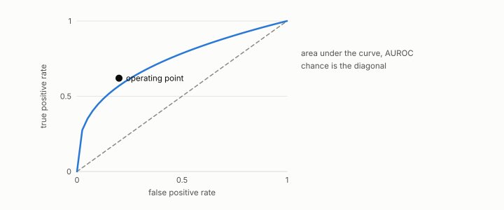

# operating point

**id.** operating-point
**kind.** concept

## definition

The row at which a consumer is read, or the threshold at which a classifier is scored. A probe pays 2d evaluations for one. Chapter 0 section 0.5 and chapter 11 section 11.7.

**Example.** A probe at one row with 16 directions spends 32 calls at that one operating point.

## equation

Book equation 0.8.

    g_j\;\approx\;\frac{C(x+h\,e_j)-C(x-h\,e_j)}{2h},\qquad j=1,\dots,d.

Book equation 11.4.

    \text{directions resolved}(k)=\begin{cases}1\ \text{or}\ 2,& k<d\\[2pt] \operatorname{rank}P_C,& k\ge d\end{cases}\qquad \text{cost}=2d\ \text{consumer calls per operating point}.

## conditions

- The row at which a consumer is read, or the threshold at which a classifier is scored. A central-difference probe pays two evaluations per coordinate for one operating point, and raising a classifier's threshold can only shrink the set it calls positive.
- Whether many cheaper operating points can average their way back to the population operator was measured within a budget range and not proved, and the cliff at k equal to d does not soften for a probe confined to the directions it chooses.

Conditions are curated in `entries.toml` rather than read from a record.

## ledger

none

## first stated

Chapter 0 section 0.5 and chapter 11 section 11.7 of *Data Mining as Observation*, with the budget law in `readscope/README.md:118-141`.

## measurements

none

## failures and corrections

none

## invariance envelope

none declared

## machine checked

[`lean/DataMiningAsObservation/FiniteDifference.lean`](https://github.com/ahb-sjsu/observation-data-mining/blob/f3914f0/lean/DataMiningAsObservation/FiniteDifference.lean), theorems `central_quad`, `forward_quad`, `forward_error`, `central_cost`, at observation-data-mining f3914f0; what the check covers is stated in the book's [appendix C](https://github.com/ahb-sjsu/observation-data-mining/blob/f3914f0/chapters/machine_checked.md).

[`lean/DataMiningAsObservation/Threshold.lean`](https://github.com/ahb-sjsu/observation-data-mining/blob/f3914f0/lean/DataMiningAsObservation/Threshold.lean), theorems `predicted_anti`, `tp_anti`, `fp_anti`, `decision_comp`, `predicted_extremes`, at observation-data-mining f3914f0; what the check covers is stated in the book's [appendix C](https://github.com/ahb-sjsu/observation-data-mining/blob/f3914f0/chapters/machine_checked.md).

## used in

*Data Mining as Observation* chapters 0, 2, 5, 6, 11, 14.

## related

finite-difference, budget, budget-cliff, threshold, blind-probe

## see also

Book equations stated beside the entry's terms, not defining it: 0.28.

Ledger rows that cite the entry's records without naming it: OT-3, GO-4.

Sources-table rows that share a record with the entry without naming it: chapter 11 section 11.7.

## status

Generated 2026-09-12 by `encyclopedia/generate.py`; book at observation-data-mining f3914f0; the commit of every record is listed in the encyclopedia's provenance.
