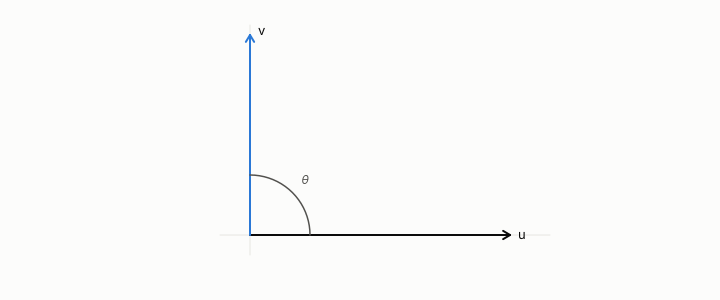

# orthogonal

**id.** orthogonal
**kind.** concept

## definition

Of two vectors, having dot product zero. The squared length of a sum of orthogonal vectors is the sum of the squared lengths. Chapter 0 section 0.1.

**Example.** (1, 0) and (0, 1) are orthogonal, and the squared length of their sum is 1 + 1 = 2.

## equation

Book equation 0.1.

    x\cdot y=\sum_{i=1}^{d}x_i y_i,\qquad \|x\|=\sqrt{x\cdot x},\qquad \cos\theta=\frac{x\cdot y}{\|x\|\,\|y\|}.

## conditions

- Of two vectors, having dot product zero. The relation is symmetric, survives rescaling, holds between any vector and zero, the squared length of a sum of orthogonal vectors is the sum of the squared lengths, and the residual of a projection is orthogonal to the direction projected on.
- A linear classifier's nuisance is everything orthogonal to its weight vector, and the eigenvectors of a symmetric matrix with distinct eigenvalues are orthogonal, so the read subspace and the nuisance split every row.

Conditions are curated in `entries.toml` rather than read from a record.

## ledger

none

## first stated

Chapter 0 section 0.1 and section 0.2 of *Data Mining as Observation*.

## measurements

none

## failures and corrections

none

## invariance envelope

none declared

## machine checked

[`lean/DataMiningAsObservation/Orthogonal.lean`](https://github.com/ahb-sjsu/observation-data-mining/blob/6aebdf3/lean/DataMiningAsObservation/Orthogonal.lean), theorems `orth_symm`, `pythagoras`, `orth_smul`, `orth_zero`, `residual_orth`, at observation-data-mining 6aebdf3; what the check covers is stated in the book's [appendix C](https://github.com/ahb-sjsu/observation-data-mining/blob/6aebdf3/chapters/machine_checked.md).

## used in

*Data Mining as Observation* chapters 0, 3, 4, 6, 9, 11, 12.

## related

dot-product, projection, eigenvalue-eigenvector, nuisance, read-subspace

## see also

Book equations stated beside the entry's terms, not defining it: 0.3, 0.9.

Ledger rows that cite the entry's records without naming it: OT-7.

Sources-table rows that share a record with the entry without naming it: chapter 2 section 2.2.

## status

Generated 2026-09-09 by `encyclopedia/generate.py`; book at observation-data-mining 6aebdf3; the commit of every record is listed in the encyclopedia's provenance.
