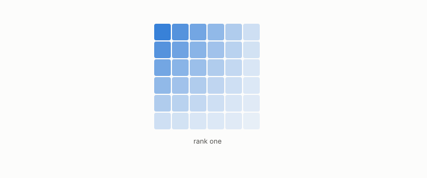

# outer product

**id.** outer-product
**kind.** concept

## definition

The matrix whose entry in row i and column j is the product of a vector's i-th and j-th coordinates, of rank at most one and positive semidefinite for a vector with itself. Chapter 0 section 0.5.

**Example.** (1, 2) with itself gives the matrix with rows (1, 2) and (2, 4), which has rank one.

## equation

Book equation 0.9.

    P_C=\mathbb E\!\left[g\,g^{\top}\right],\qquad g=\nabla C(x).

Book equation 6.1.

    s(x)=w\cdot x+b,\qquad P_C=\mathbb E\big[\sigma'(s)^{2}\big]\,w\,w^{\top},\qquad \operatorname{rank}P_C=1.

Book equation 0.3.

    \Sigma_{ij}=\mathbb E\big[(x_i-\mu_i)(x_j-\mu_j)\big],\qquad \operatorname{tr}\Sigma=\sum_{i}\Sigma_{ii}.

## conditions

- The matrix whose entry in row i and column j is the product of the i-th and j-th coordinates of a vector. Its action on any vector is a multiple of the vector it was built from, it has rank at most one, and the outer product of a vector with itself is positive semidefinite.
- The read operator is the weighted mean of the outer product of the sensitivity with itself, and a linear classifier's read operator is one outer product scaled by how steep the score is.

Conditions are curated in `entries.toml` rather than read from a record.

## ledger

none

## first stated

Chapter 0 section 0.5 of *Data Mining as Observation*.

## measurements

none

## failures and corrections

none

## invariance envelope

none declared

## machine checked

[`lean/DataMiningAsObservation/PositiveSemidefinite.lean`](https://github.com/ahb-sjsu/observation-data-mining/blob/f3914f0/lean/DataMiningAsObservation/PositiveSemidefinite.lean), theorems `psd_add`, `psd_smul`, `psd_outer`, `psd_readOp`, `psd_diag_nonneg`, at observation-data-mining f3914f0; what the check covers is stated in the book's [appendix C](https://github.com/ahb-sjsu/observation-data-mining/blob/f3914f0/chapters/machine_checked.md).

[`lean/DataMiningAsObservation/ReadOperator.lean`](https://github.com/ahb-sjsu/observation-data-mining/blob/f3914f0/lean/DataMiningAsObservation/ReadOperator.lean), theorems `rank_one_reads_one_direction`, `readOp_mulVec`, `quad_readOp`, `quad_readOp_nonneg`, `readOp_mulVec_eq_zero_iff`, `readOp_diag`, `readOp_offdiag`, `readOp_symm`, `readOp_neg`, `affine_const_along_nuisance`, `readOp_affine`, `readOp_sqLength_basis`, at observation-data-mining f3914f0; what the check covers is stated in the book's [appendix C](https://github.com/ahb-sjsu/observation-data-mining/blob/f3914f0/chapters/machine_checked.md).

[`lean/DataMiningAsObservation/Rank.lean`](https://github.com/ahb-sjsu/observation-data-mining/blob/f3914f0/lean/DataMiningAsObservation/Rank.lean), theorems `rank_le_width`, `rank_le_height`, `rank_outer_le_one`, `rank_mul_le`, `rank_zero`, `rank_transpose`, at observation-data-mining f3914f0; what the check covers is stated in the book's [appendix C](https://github.com/ahb-sjsu/observation-data-mining/blob/f3914f0/chapters/machine_checked.md).

## used in

*Data Mining as Observation* primer L, chapters 0, 2, 6.

## related

read-operator, rank, positive-semidefinite, covariance-matrix, sensitivity

## see also

Ledger rows that cite the entry's records without naming it: OT-7.

Sources-table rows that share a record with the entry without naming it: chapter 2 section 2.2, chapter 6 section 6.1.

## status

Generated 2026-09-10 by `encyclopedia/generate.py`; book at observation-data-mining f3914f0; the commit of every record is listed in the encyclopedia's provenance.
