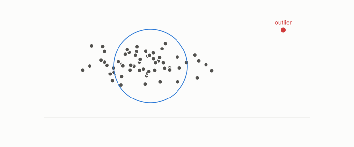

# outlier

**id.** outlier
**kind.** concept

## definition

A row the reader cannot place. The statistical detector calls a row an outlier when its distance from the mean in units of spread passes a threshold, and no more than one over the threshold squared of the weight can. Chapter 10.

**Example.** A row 3.6 spreads from the mean is an outlier at threshold 3, and by Chebyshev at most one ninth of the weight lies past 3 spreads.

## equation

none

## conditions

- A row the reader cannot place. The statistical detector scores a row by its distance from the mean in units of spread, which is zero at the mean, unchanged when data, mean, and spread are rescaled and shifted together, and past a threshold t exactly when the row lies more than t spreads from the mean. By Chebyshev the weight of rows beyond t is at most the mean squared score over t squared.
- The four detector families read different coordinates, distance from the mean, distance to neighbours, density relative to neighbours, and cluster membership, and the observer's outliers, the anti-hubs, are the rows no detector of the data alone can see.

Conditions are curated in `entries.toml` rather than read from a record.

## ledger

none

## first stated

Chapter 0 section 0.16 and chapter 10 section 10.1 of *Data Mining as Observation*, after TSK chapter 9, with the hierarchical typing in `turboquant-pro/turboquant_pro/anatomy.py:98-170`.

## measurements

none

## failures and corrections

none

## invariance envelope

none declared

## machine checked

[`lean/DataMiningAsObservation/Outlier.lean`](https://github.com/ahb-sjsu/observation-data-mining/blob/f3914f0/lean/DataMiningAsObservation/Outlier.lean), theorems `zscore_mean`, `zscore_affine`, `outlier_iff`, `zscore_reflect`, `chebyshev`, at observation-data-mining f3914f0; what the check covers is stated in the book's [appendix C](https://github.com/ahb-sjsu/observation-data-mining/blob/f3914f0/chapters/machine_checked.md).

[`lean/DataMiningAsObservation/Mahalanobis.lean`](https://github.com/ahb-sjsu/observation-data-mining/blob/f3914f0/lean/DataMiningAsObservation/Mahalanobis.lean), theorems `dM2_nonneg`, `dM2_mean`, `dM2_scale`, `dM2_eq_whitened`, `dM2_antitone_in_variance`, at observation-data-mining f3914f0; what the check covers is stated in the book's [appendix C](https://github.com/ahb-sjsu/observation-data-mining/blob/f3914f0/chapters/machine_checked.md).

## used in

*Data Mining as Observation* primer S, chapters 0, 2, 3, 10.

## related

mahalanobis-distance, anti-hub, abstention, whitening, density

## see also

Book equations stated beside the entry's terms, not defining it: 0.33, 10.3, 0.6.

Ledger rows that cite the entry's records without naming it: NEG-14.

Sources-table rows that share a record with the entry without naming it: chapter 10 section 10.1, chapter 10 section 10.3.

## status

Generated 2026-09-09 by `encyclopedia/generate.py`; book at observation-data-mining f3914f0; the commit of every record is listed in the encyclopedia's provenance.
