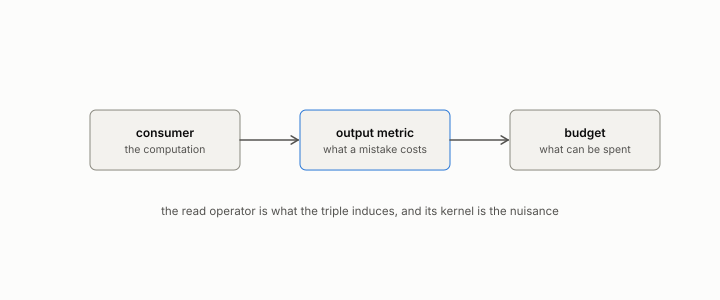

# output metric

**id.** output-metric
**kind.** concept

## definition

The rule by which a consumer's mistakes are scored, the second element of an observer. Chapter 1.

**Example.** Classifiers with one and three false positives against three and one false negatives tie on accuracy and split on any cost matrix.

## equation

none

## conditions

- The rule by which a consumer's mistakes are scored, the second element of an observer. A consumer and its negation have the same read operator and reverse every comparison, so the read operator alone does not fix the observer, and two cost matrices score the same pair of classifiers in opposite orders, so naming the output metric is naming what a downstream mistake is.
- A dataset-level loss, accuracy, F1, a rank correlation, or dollars lost is not a local geometry on the score and cannot be inserted into the read-operator formula. Each interestingness measure of chapter 5 and each fairness metric of chapter 14 is an output metric, right for some consumer and wrong for others.

Conditions are curated in `entries.toml` rather than read from a record.

## ledger

none

## first stated

Chapter 1 section 1.2 of *Data Mining as Observation*, with the flip's verdict inversion in `geometric-observation/chapters/ch08_value.md:1-30`.

## measurements

none

## failures and corrections

none

## invariance envelope

none declared

## machine checked

[`lean/DataMiningAsObservation/OutputMetric.lean`](https://github.com/ahb-sjsu/observation-data-mining/blob/f3914f0/lean/DataMiningAsObservation/OutputMetric.lean), theorems `neg_reverses`, `readOp_of_neg`, `cost_flips`, at observation-data-mining f3914f0; what the check covers is stated in the book's [appendix C](https://github.com/ahb-sjsu/observation-data-mining/blob/f3914f0/chapters/machine_checked.md).

## used in

*Data Mining as Observation* chapters 0, 1, 3, 5, 6, 8, 9, 11, 14.

## related

observer, consumer, read-operator, budget, flip-the

## see also

Book equations stated beside the entry's terms, not defining it: 1.1, 0.9, 6.1.

Ledger rows that cite the entry's records without naming it: GO-2 (neg. half: not reconstruction), GO-2 (pos. half: consumer-projected covariance *controls*).

Sources-table rows that share a record with the entry without naming it: chapter 3 section 3.2, chapter 4 section 4.3.

## status

Generated 2026-09-12 by `encyclopedia/generate.py`; book at observation-data-mining f3914f0; the commit of every record is listed in the encyclopedia's provenance.
