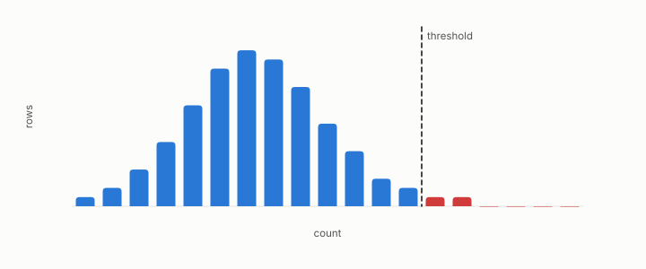

# p-value

**id.** p-value
**kind.** concept

## definition

The probability of seeing a difference at least as large as the one observed if the true difference were zero. Chapter 0 section 0.9.

**Example.** A score more extreme than 970 of 1000 null scores has p-value 0.03.

## equation

none

## conditions

- Against a finite null sample, the fraction of null draws at least as large as the observation. It lies in the unit interval, never rises as the observation grows, and under the null the fraction of draws with p-value at or below a level is at most that level, which is what makes a threshold on it a false-positive rate.
- A p-value counts one look. Forty looks at five percent pass two by chance, and the book's rule is to count every comparison made and correct for it.

Conditions are curated in `entries.toml` rather than read from a record.

## ledger

none

## first stated

Chapter 0 section 0.9 of *Data Mining as Observation*, with the program's own p-values in the ensemble comparison of chapter 7 and the C-12 record in readscope.

## measurements

none

## failures and corrections

none

## invariance envelope

none declared

## machine checked

[`lean/DataMiningAsObservation/PValue.lean`](https://github.com/ahb-sjsu/observation-data-mining/blob/6aebdf3/lean/DataMiningAsObservation/PValue.lean), theorems `pvalue_mem_unit`, `pvalue_antitone`, `uniform_bound`, at observation-data-mining 6aebdf3; what the check covers is stated in the book's [appendix C](https://github.com/ahb-sjsu/observation-data-mining/blob/6aebdf3/chapters/machine_checked.md).

## used in

*Data Mining as Observation* chapters 0, 11.

## related

multiple-comparisons, confidence-interval, harness, preregistration

## see also

Book equations stated beside the entry's terms, not defining it: 8.3.

Sources-table rows that share a record with the entry without naming it: chapter 6 section 6.4, chapter 8 section 8.5.

## status

Generated 2026-09-09 by `encyclopedia/generate.py`; book at observation-data-mining 6aebdf3; the commit of every record is listed in the encyclopedia's provenance.
