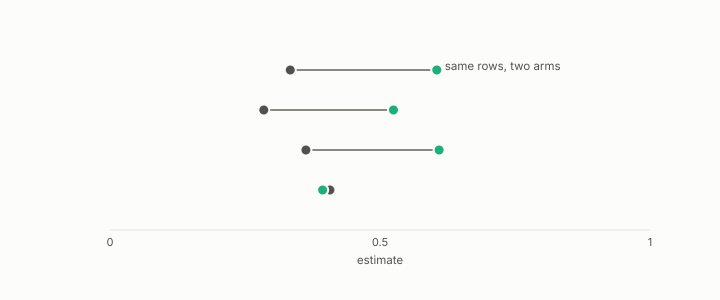

# paired

**id.** paired
**kind.** instrument

## definition

Of a comparison, made on the same rows or seeds for both arms. Pairing helps exactly when the two arms covary. Chapter 0 section 0.9.

**Example.** Scoring both arms on the same 40 documents pairs the comparison, and the difference's variance drops when the arms covary.

## equation

none

## conditions

- Of a comparison, made on the same rows or the same seeds for both arms, so that the difference is scored row by row. The variance of the difference is the sum of the variances less twice the covariance, so pairing helps exactly when the two arms covary.
- The paired null at rank two read 0.385 against 0.572 on fourteen of sixteen cells, and the encoder comparisons carry a paired bootstrap interval on each relation.

Conditions are curated in `entries.toml` rather than read from a record.

## ledger

none

## first stated

Chapter 0 section 0.9 and chapter 8 section 8.4 of *Data Mining as Observation*, with the paired null in `readscope/SPEC.md:806-857`.

## measurements

| Where the book states it | Numbers, as the book's sources table records them | Source |
|---|---|---|
| chapter 8 section 8.4 | C-11c paired null, rank 2 positional 0.385 vs null 0.572, 0.615 vs 0.224, 14 of 16 cells, scope 16 cells one 3B model 192 positions | [`readscope/SPEC.md:806-857`](https://github.com/ahb-sjsu/readscope/blob/856e678/SPEC.md#L806-L857); [`readscope/calibration/records/c11c-operator-drift.json`](https://github.com/ahb-sjsu/readscope/blob/856e678/calibration/records/c11c-operator-drift.json) |

## failures and corrections

none

## invariance envelope

none declared

## machine checked

[`lean/DataMiningAsObservation/Bootstrap.lean`](https://github.com/ahb-sjsu/observation-data-mining/blob/f3914f0/lean/DataMiningAsObservation/Bootstrap.lean), theorems `mean_sub`, `var_sub`, `paired_lt_iff`, `cov_comm`, at observation-data-mining f3914f0; what the check covers is stated in the book's [appendix C](https://github.com/ahb-sjsu/observation-data-mining/blob/f3914f0/chapters/machine_checked.md).

## used in

*Data Mining as Observation* primer S, chapters 0, 4, 6, 8, 11, 12.

## related

bootstrap, confidence-interval, seed, standard-error, control

## see also

Book equations stated beside the entry's terms, not defining it: 0.18, 8.2, 0.29.

Ledger rows that cite the entry's records without naming it: NEG-14, GO-B-Llama, GO-B-Llama-rematch.

Sources-table rows that share a record with the entry without naming it: chapter 11 section 11.8, chapter 12 section 12.4.

## status

Generated 2026-09-12 by `encyclopedia/generate.py`; book at observation-data-mining f3914f0; the commit of every record is listed in the encyclopedia's provenance.
