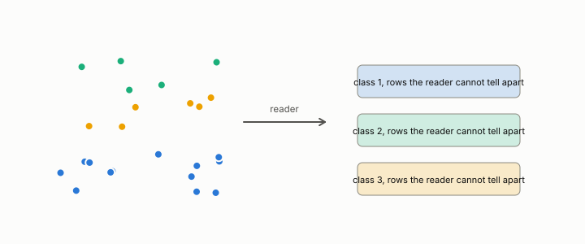

# paraphrase class

**id.** paraphrase-class
**kind.** concept

## definition

A set of rewordings of one input that preserve its meaning. A decision is invariant to re-description when it does not move across the class. Chapter 14.

**Example.** The sentences 'the row is stale' and 'the row is out of date' land in one paraphrase class for the encoder.

## equation

Book equation 14.3.

    \theta_d=\frac{\operatorname{mean}_i\ \big|S_A(i)-S_B(i)\big|}{\operatorname{mean}_{i\ne j}\ \big|S_A(i)-S_A(j)\big|},\qquad \text{bar}\ \theta_d\le0.5.

## conditions

- A set of rewordings of one input that preserve its meaning. A verdict is invariant to re-description when it does not move across the class, and the ratio of equation 14.3 measures the movement under rewording over the spread between inputs. It is nonnegative, zero exactly when no item's score moves, and at most one half exactly when the movement is at most half the spread.
- The measured ratios, 0.407 falling to 0.219 on sixty items and 0.482 to 0.301 under back-translation, with three of six gold items still flipping, are the program's numbers, and the items that flip are routed to escalation.

Conditions are curated in `entries.toml` rather than read from a record.

## ledger

none

## first stated

Chapter 14 section 14.4 of *Data Mining as Observation*, with the program's re-description test in `gtc-prototype/docs/REGATE.md:1-70` and the back-translation run.

## measurements

none

## failures and corrections

none

## invariance envelope

none declared

## machine checked

[`lean/DataMiningAsObservation/ParaphraseClass.lean`](https://github.com/ahb-sjsu/observation-data-mining/blob/f3914f0/lean/DataMiningAsObservation/ParaphraseClass.lean), theorems `movement_nonneg`, `ratio_nonneg`, `movement_eq_zero_iff`, `ratio_invariant`, `bar_iff`, at observation-data-mining f3914f0; what the check covers is stated in the book's [appendix C](https://github.com/ahb-sjsu/observation-data-mining/blob/f3914f0/chapters/machine_checked.md).

## used in

*Data Mining as Observation* chapters 0, 12, 14.

## related

quotient, escalation, certificate, deployment-mismatch

## see also

none

## status

Generated 2026-09-12 by `encyclopedia/generate.py`; book at observation-data-mining f3914f0; the commit of every record is listed in the encyclopedia's provenance.
